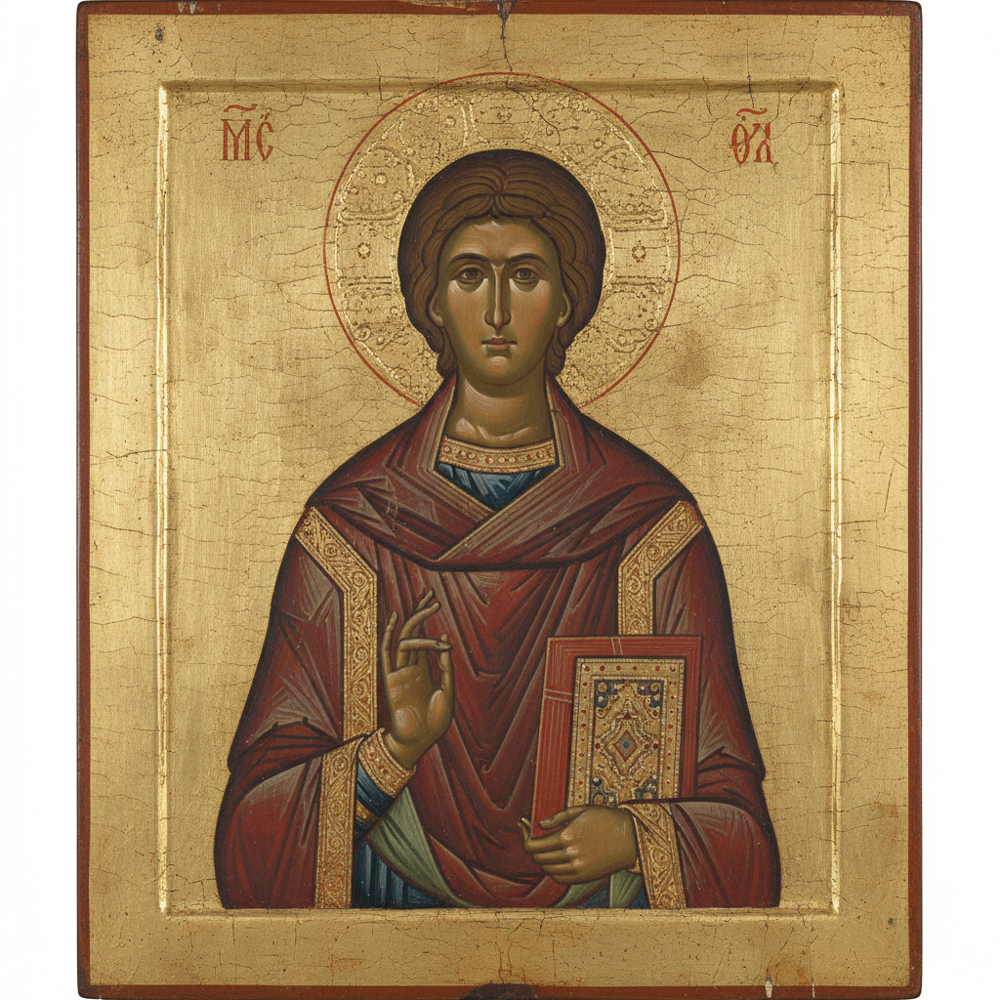

# Russian Icon Art 俄罗斯圣像画艺术

> "The icon is not a painting — it is a window into heaven, a theology in color and gold." — Orthodox tradition

## 概述

俄罗斯圣像画艺术（Russian Icon Art）是东正教传统中以宗教图像为核心的绘画艺术——从拜占庭帝国传入俄罗斯后，经过数百年的本土化发展，形成了独特的俄罗斯圣像画传统。俄罗斯圣像画是俄罗斯艺术史上最古老、最持久的艺术传统——从10世纪基辅罗斯接受东正教开始，直到今天仍在延续。

俄罗斯圣像画的黄金时代是14-15世纪——以安德烈·鲁布廖夫（Andrei Rublev）为代表的大师们将圣像画提升到了前所未有的精神高度。鲁布廖夫的《三位一体》被认为是俄罗斯艺术史上最伟大的作品——其和谐的构图、宁静的色彩和深邃的精神内涵达到了圣像画艺术的巅峰。俄罗斯圣像画不同于西方宗教绘画——它不追求自然主义的写实，而是通过程式化的形式、象征性的色彩和反透视的空间来表达超越性的精神世界。

俄罗斯圣像画艺术的核心要素包括：1）神学表达——以视觉形式表达东正教神学；2）程式化形式——严格的图像程式和传统；3）金色背景——象征神圣光芒的金色；4）反透视——不使用西方透视法；5）象征色彩——每种颜色都有神学含义；6）木板蛋彩——木板上的蛋彩画技法；7）精神功能——作为祈祷和冥想的媒介。

## 核心特征

| 特征 | 描述 |
|------|------|
| 神学表达 | 视觉形式表达东正教神学 |
| 程式化形式 | 严格图像程式和传统 |
| 金色背景 | 象征神圣光芒金色 |
| 反透视 | 不使用西方透视法 |
| 象征色彩 | 每种颜色有神学含义 |
| 精神功能 | 祈祷冥想的媒介 |

## 视觉特征

- **金色背景**：闪耀的金箔背景
- **正面形象**：圣人的正面或四分之三面
- **细长比例**：拉长的人物比例
- **平面空间**：没有深度的平面空间
- **红蓝主调**：红色和蓝色的象征搭配
- **精细线条**：精细的衣纹和面部线条

## 代表作品

| 作品 | 画家 | 意义 |
|------|------|------|
| *三位一体* | 鲁布廖夫 | 俄罗斯艺术巅峰 |
| *弗拉基米尔圣母* | 拜占庭 | 俄罗斯最神圣圣像 |
| *基督变容* | 费奥凡·格列克 | 拜占庭大师在俄 |
| *诺夫哥罗德圣像* | 各时期 | 地方风格 |
| *莫斯科画派圣像* | 15世纪 | 莫斯科风格 |
| *当代圣像* | 21世纪 | 传统延续 |

## 历史时间线

| 时期 | 事件 |
|------|------|
| 988年 | 基辅罗斯受洗，圣像传入 |
| 11-12世纪 | 拜占庭风格主导 |
| 14世纪 | 费奥凡·格列克活跃 |
| 15世纪初 | 鲁布廖夫黄金时代 |
| 16-17世纪 | 各地方画派发展 |
| 18世纪 | 彼得大帝西化改革冲击 |
| 20世纪初 | 圣像画被重新发现为艺术 |

## 中国语境

俄罗斯圣像画与中国宗教绘画（特别是佛教绘画）有着深层的平行关系。两者都是宗教功能性艺术——不以"美"为最终目的，而是服务于宗教修行和精神体验。中国敦煌壁画中的佛像与俄罗斯圣像画在功能上极为相似——都是通过程式化的视觉形式引导信徒进入精神世界。两者都有严格的图像程式——圣像画有"原型"（prototype）传统，敦煌壁画有"粉本"传统。两者都使用象征性的色彩——金色在两种传统中都象征神圣和超越。圣像画的"反透视"与中国画的"散点透视"都拒绝了西方单点透视的空间观念——体现了不同文明对空间和精神的独特理解。

## 概念图

## 与其他风格的关系

- **Byzantine Art** → 拜占庭艺术（来源）
- **Orthodox Theology** → 东正教神学
- **Rublev** → 鲁布廖夫（巅峰大师）
- **Dunhuang Murals** → 敦煌壁画（平行传统）
- **Medieval Art** → 中世纪艺术
- **Russian Avant-Garde** → 俄罗斯先锋派（受其影响）

---

*浮光艺志 | Chronicle of Artistry*
