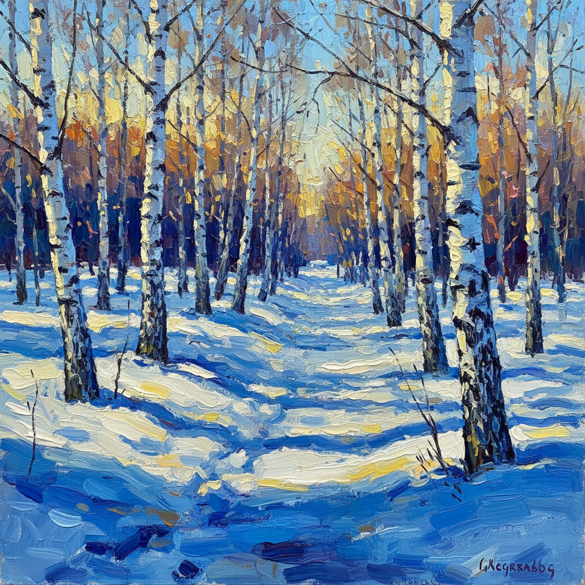

# 俄罗斯印象主义 · Russian Impressionism Art

> "我们不模仿巴黎，我们用俄罗斯的光线重新发现色彩。" —— 康斯坦丁·科罗文

## 概述

俄罗斯印象主义（Russian Impressionism）是19世纪末至20世纪初俄罗斯画家在法国印象派影响下发展出的独特绘画风格。与法国印象派追求瞬间光影不同，俄罗斯印象主义保留了更强的叙事性和情感深度，将外光写生技法与俄罗斯广袤自然的诗意相结合。代表画家包括科罗文、格拉巴尔、尤恩等，他们在保持印象派色彩解放的同时，融入了斯拉夫民族对大地和季节的深沉情感。

## 核心特征

| 特征 | 描述 |
|------|------|
| 时期 | 1880年代–1930年代 |
| 地域 | 莫斯科、圣彼得堡、俄罗斯乡村 |
| 媒介 | 油画、水彩、粉彩 |
| 核心理念 | 以印象派技法表达俄罗斯自然的诗意与情感 |
| 色彩 | 冷暖对比强烈，冬季蓝紫调、夏季金绿调 |

## 视觉特征

- **外光写生**：强调户外直接观察，捕捉自然光线变化
- **厚涂笔触**：比法国印象派更粗犷有力的笔触表现
- **季节主题**：大量描绘俄罗斯四季，尤其是雪景与春融
- **情感叙事**：画面保留故事性和情绪氛围，不纯粹追求光学效果
- **装饰性色彩**：受俄罗斯民间艺术影响的浓烈色彩倾向

## 代表作品

| 作品 | 艺术家 | 年代 | 类型 |
|------|--------|------|------|
| 《巴黎咖啡馆》 | 康斯坦丁·科罗文 | 1890s | 油画 |
| 《二月的蓝天》 | 伊戈尔·格拉巴尔 | 1904 | 油画 |
| 《三月的太阳》 | 康斯坦丁·尤恩 | 1915 | 油画 |
| 《丁香花》 | 彼得·康恰洛夫斯基 | 1933 | 油画 |
| 《莫斯科庭院》 | 瓦西里·波列诺夫 | 1878 | 油画 |

## 发展时间线

| 时期 | 事件 |
|------|------|
| 1874 | 法国印象派首展，消息传入俄罗斯 |
| 1880s | 波列诺夫、科罗文开始外光写生实验 |
| 1890s | 科罗文赴巴黎学习，带回印象派技法 |
| 1900s | 格拉巴尔、尤恩等形成俄罗斯印象主义群体 |
| 1903 | 俄罗斯画家联盟成立，印象主义成为主流之一 |
| 1910s | 与先锋派并行发展，保持写实传统 |
| 苏联时期 | 印象主义技法融入社会主义现实主义 |

## 中国语境

俄罗斯印象主义对中国油画影响深远。1950年代马克西莫夫油画训练班将俄罗斯外光写生传统引入中国，培养了靳尚谊、侯一民等一代画家。中国风景油画中对光色的处理、对季节氛围的表达，很大程度上继承了俄罗斯印象主义而非法国印象派的传统。

## AI 概念图

*AI 生成概念图：俄罗斯印象主义风格*

## 关联词条

- [[russian-landscape-art]] - 俄罗斯风景画
- [[shishkin-art]] - 希施金
- [[peredvizhniki-art]] - 巡回展览画派
- [[russian-realism-art]] - 俄罗斯现实主义

---

*浮光艺志 · Chronicle of Artistry*
