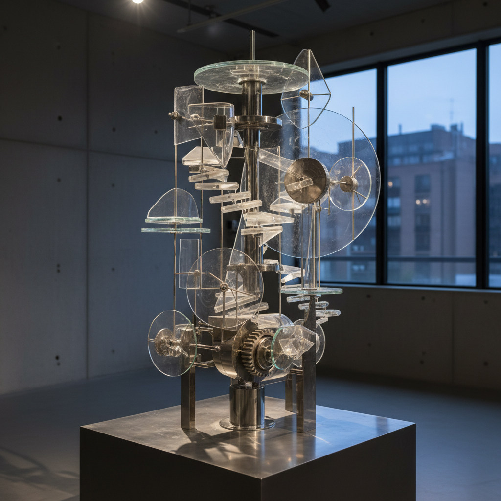

# 俄罗斯动力艺术 · Russian Kinetic Art

> "艺术必须运动，因为宇宙本身就是永恒的运动。" —— 纳乌姆·加博

## 概述

俄罗斯动力艺术（Russian Kinetic Art）是从1920年代构成主义运动中萌芽、在1960年代达到成熟的艺术形式，以实际的物理运动或光学运动效果为核心表达手段。从纳乌姆·加博1920年的《动力雕塑》（被认为是第一件真正的动力艺术作品）到1960年代列夫·努斯贝格的"运动"小组（Dvizhenie Group），俄罗斯艺术家在将科学、技术与艺术融合方面始终走在前沿。

## 核心特征

| 特征 | 描述 |
|------|------|
| 时期 | 1920年代–至今 |
| 地域 | 莫斯科、列宁格勒、巴黎（流亡） |
| 媒介 | 雕塑、装置、光学装置、机械结构 |
| 核心理念 | 以真实或视觉运动取代静态再现 |
| 色彩 | 金属银、透明材料、光谱色彩 |

## 视觉特征

- **实际运动**：作品包含电机驱动或风力驱动的运动部件
- **光学效应**：利用莫尔纹、频闪、透明叠加产生视觉运动
- **工业材料**：金属、玻璃、塑料、电子元件
- **科技美学**：将工程结构暴露为审美对象
- **环境互动**：作品随环境（风、光、观众）变化而变化

## 代表作品

| 作品 | 艺术家 | 年代 | 类型 |
|------|--------|------|------|
| 《动力雕塑（驻波）》 | 纳乌姆·加博 | 1920 | 动力雕塑 |
| 《第三国际纪念塔模型》 | 塔特林 | 1920 | 建筑/动力模型 |
| 《宇宙》系列 | 弗朗西斯科·因凡特 | 1960s | 光学装置 |
| 《人造生物圈》 | 列夫·努斯贝格 | 1966 | 环境装置 |
| 《光之森林》 | 布拉托夫/因凡特 | 1960s | 光学/动力装置 |

## 发展时间线

| 时期 | 事件 |
|------|------|
| 1920 | 加博创作《动力雕塑》，动力艺术诞生 |
| 1920 | 加博和佩夫斯纳发表《现实主义宣言》 |
| 1922 | 塔特林的第三国际塔设计（含旋转结构） |
| 1920s-30s | 加博流亡西方，将动力艺术理念传播至国际 |
| 1962 | 努斯贝格在莫斯科成立"运动"小组 |
| 1960s | 因凡特发展光学动力艺术 |
| 1967 | "运动"小组参加蒙特利尔世博会 |
| 当代 | 俄罗斯新媒体艺术继承动力艺术传统 |

## 中国语境

俄罗斯动力艺术对中国当代艺术的影响主要体现在新媒体和科技艺术领域。中国当代艺术家如王郁洋、徐文恺（aaajiao）等在动力装置和数字艺术方面的探索，可追溯到构成主义和动力艺术的传统。中央美术学院实验艺术学院的教学中，加博和塔特林的动力实验是重要的历史参照。中国各地涌现的科技艺术节和新媒体展览也延续了动力艺术将科技与美学融合的精神。

## AI 概念图

*AI 生成概念图：俄罗斯动力艺术风格*

## 关联词条

- [[russian-constructivism-art]] - 俄罗斯构成主义
- [[russian-avant-garde-art]] - 俄罗斯先锋派
- [[russian-suprematism-art]] - 俄罗斯至上主义
- [[moscow-conceptualism-art]] - 莫斯科概念主义

---

*浮光艺志 · Chronicle of Artistry*
