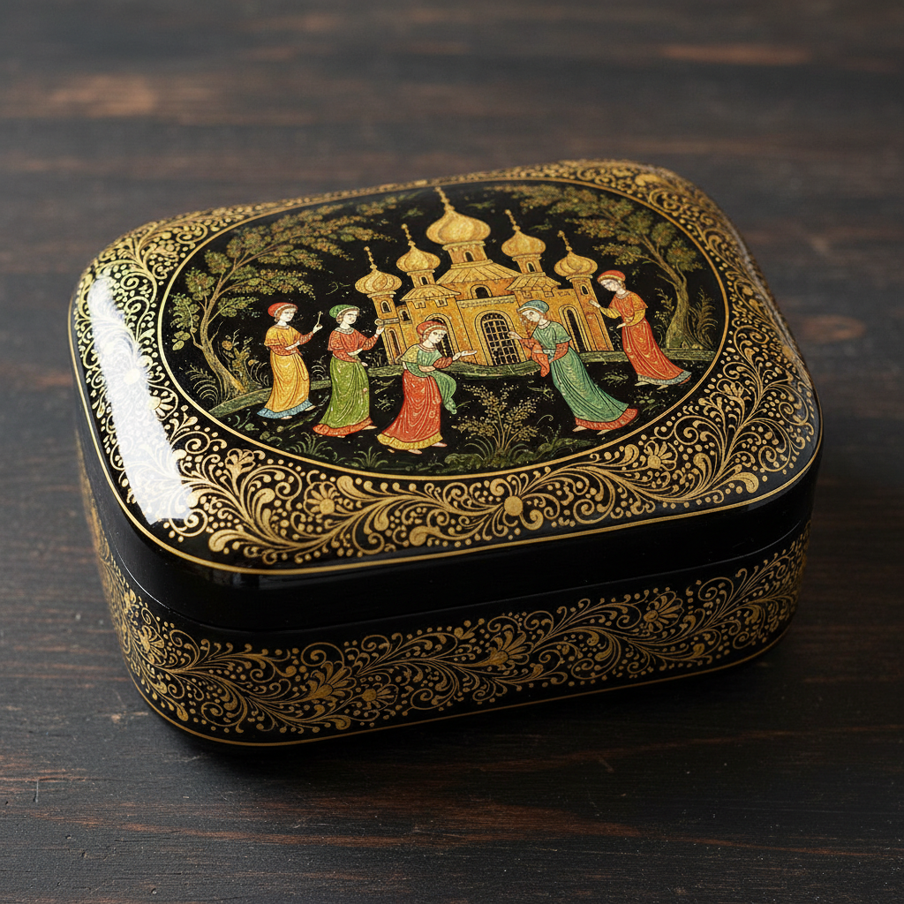

# Russian Lacquer Art 俄罗斯漆器艺术

> "In the darkness of lacquer, Russian fairy tales come alive — painted with brushes finer than a single hair." — Palekh tradition

## 概述

俄罗斯漆器艺术（Russian Lacquer Art）是俄罗斯独特的漆器细密画传统——以帕列赫（Palekh）、姆斯焦拉（Mstyora）、费多斯基诺（Fedoskino）和霍卢伊（Kholui）四大产区为代表。俄罗斯漆器以其在黑色漆面上绘制的精美细密画闻名于世——画面通常描绘俄罗斯民间故事、童话、历史场景和自然风景，色彩鲜艳、细节精微、金色装饰华丽。

俄罗斯漆器的历史可追溯至18世纪末——费多斯基诺是最早的产区（1795年建立），最初模仿德国和法国的漆器鼻烟盒。但最著名的帕列赫漆器则诞生于1924年——帕列赫原本是俄罗斯圣像画的重要产区，十月革命后宗教艺术失去了市场，圣像画师们将精湛的蛋彩画技艺转移到漆器上——用绘制圣像的技法来描绘民间故事和苏联新生活，创造了独特的帕列赫风格。

俄罗斯漆器艺术的核心要素包括：1）细密画——极其精细的微型绘画；2）黑色漆面——以黑色漆面为背景；3）金色装饰——大量使用金粉装饰；4）叙事性——讲述故事的叙事画面；5）圣像画传承——从圣像画技法演变而来；6）四大产区——帕列赫、姆斯焦拉、费多斯基诺、霍卢伊；7）纸浆胎体——以纸浆（papier-mâché）为胎体。

## 核心特征

| 特征 | 描述 |
|------|------|
| 细密画 | 极其精细微型绘画 |
| 黑色漆面 | 以黑色漆面为背景 |
| 金色装饰 | 大量使用金粉装饰 |
| 叙事性 | 讲述故事叙事画面 |
| 圣像画传承 | 从圣像画技法演变 |
| 四大产区 | 帕列赫姆斯焦拉费多斯基诺霍卢伊 |

## 视觉特征

- **黑色背景**：深沉的黑色漆面背景
- **金色线条**：精细的金色线条和装饰
- **鲜艳色彩**：红、蓝、绿的鲜艳色彩
- **细密人物**：极小尺寸的精细人物
- **童话场景**：俄罗斯童话和民间故事
- **装饰边框**：精美的金色装饰边框

## 代表作品

| 作品 | 产区 | 意义 |
|------|------|------|
| *费多斯基诺鼻烟盒* | 费多斯基诺 | 最早的传统 |
| *帕列赫童话盒* | 帕列赫 | 最著名的风格 |
| *姆斯焦拉风景盒* | 姆斯焦拉 | 风景传统 |
| *霍卢伊历史盒* | 霍卢伊 | 历史题材 |
| *帕列赫首饰盒* | 帕列赫 | 精品工艺 |
| *当代俄罗斯漆器* | 各产区 | 传统延续 |

## 历史时间线

| 时期 | 事件 |
|------|------|
| 1795年 | 费多斯基诺漆器工坊建立 |
| 19世纪 | 费多斯基诺风格成熟 |
| 1924年 | 帕列赫漆器诞生 |
| 1930年代 | 姆斯焦拉和霍卢伊发展 |
| 苏联时期 | 获得国家支持和推广 |
| 当代 | 传统延续，面临挑战 |

## 中国语境

俄罗斯漆器与中国漆器有着深层的比较意义。中国是世界漆器的发源地——拥有七千年以上的漆器历史，从战国的彩绘漆器到明清的雕漆、螺钿，中国漆器传统极为丰富。俄罗斯漆器虽然历史较短，但发展出了独特的细密画风格——这在世界漆器传统中是独一无二的。帕列赫漆器从圣像画到漆器的转型是一个极具启发性的案例——它展示了传统技艺如何在社会变革中找到新的生存方式。这对中国传统工艺在现代化进程中的转型有重要的参考意义。中俄两国的漆器传统虽然在技术和美学上有很大差异——中国漆器使用天然大漆，俄罗斯漆器使用合成漆——但两者都体现了"在漆面上创造微观世界"的共同追求。

## 概念图

## 与其他风格的关系

- **Russian Icon** → 俄罗斯圣像画（技法来源）
- **Russian Folk Art** → 俄罗斯民间艺术
- **Chinese Lacquer** → 中国漆器（平行传统）
- **Japanese Lacquer** → 日本漆器（�的绘）
- **Miniature Painting** → 细密画（波斯传统）
- **Palekh** → 帕列赫（最著名产区）

---

*浮光艺志 | Chronicle of Artistry*
