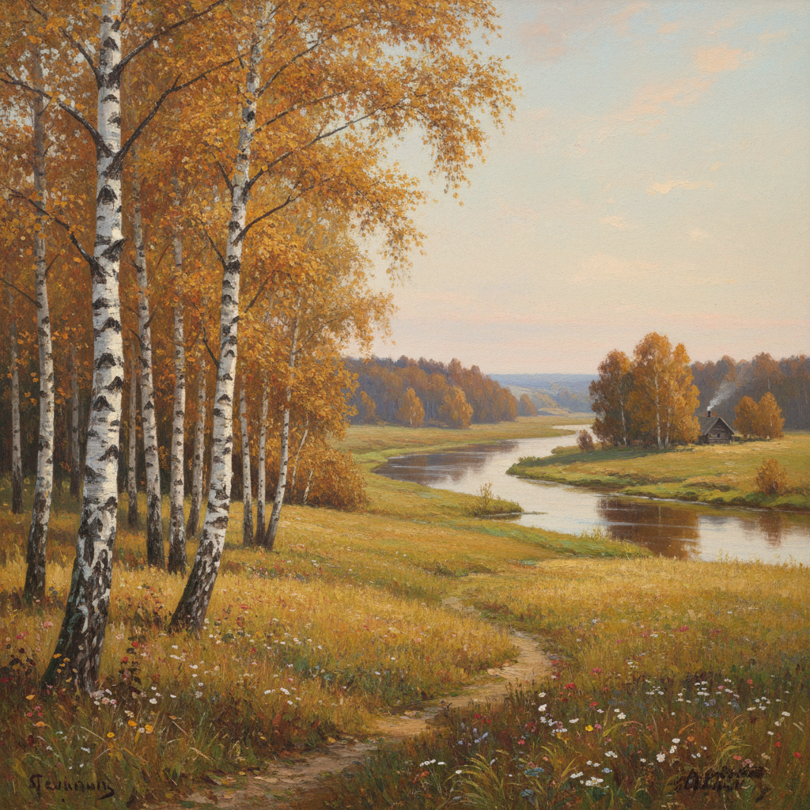

# Russian Landscape Art 俄罗斯风景画艺术

> "Russian landscape painting is not merely about nature — it is about the Russian soul reflected in the vastness of the land." — Russian art tradition

## 概述

俄罗斯风景画艺术（Russian Landscape Art）是19世纪下半叶至20世纪初俄罗斯画家创造的独特风景画传统。俄罗斯风景画是世界风景画史上最重要的流派之一——它不仅记录了俄罗斯广袤大地的自然之美，更深刻地表达了俄罗斯民族的精神气质和情感世界。

俄罗斯风景画的黄金时代与巡回展览画派密切相关。在巡回派之前，俄罗斯学院派风景画主要模仿意大利和法国的风格——描绘理想化的南方风景。巡回派画家们将目光转向俄罗斯本土——发现了俄罗斯大地独特的美：无边的森林、广阔的草原、宁静的河流、忧郁的秋天、银装素裹的冬天。希施金描绘了俄罗斯森林的雄伟壮丽；列维坦捕捉了俄罗斯大地的抒情诗意；库因芝探索了光影的戏剧性效果；萨夫拉索夫发现了早春的微妙之美。

俄罗斯风景画艺术的核心要素包括：1）民族风景——俄罗斯本土自然的发现；2）抒情性——深沉的情感和诗意；3）光影探索——对自然光线的精确研究；4）季节变化——四季变化的细腻表现；5）广袤空间——俄罗斯大地的辽阔感；6）情景交融——自然与人类情感的融合；7）写实技法——精湛的写实绘画技巧。

## 核心特征

| 特征 | 描述 |
|------|------|
| 民族风景 | 俄罗斯本土自然发现 |
| 抒情性 | 深沉情感和诗意 |
| 光影探索 | 自然光线精确研究 |
| 季节变化 | 四季变化细腻表现 |
| 广袤空间 | 俄罗斯大地辽阔感 |
| 情景交融 | 自然与人类情感融合 |

## 视觉特征

- **森林深处**：茂密松林和白桦林
- **河流蜿蜒**：伏尔加河等大河风景
- **秋色金黄**：俄罗斯秋天的金色
- **冬雪皑皑**：银装素裹的冬季风景
- **晨光暮色**：黎明和黄昏的光线
- **广阔天空**：占据画面大部分的天空

## 代表作品

| 作品 | 画家 | 意义 |
|------|------|------|
| *松树林的清晨* | 希施金 | 森林画巅峰 |
| *弗拉基米尔大道* | 列维坦 | 抒情风景 |
| *白嘴鸦飞来了* | 萨夫拉索夫 | 俄罗斯风景画开端 |
| *第聂伯河上的月夜* | 库因芝 | 光影革命 |
| *金色的秋天* | 列维坦 | 秋景经典 |
| *莫斯科庭院* | 波列诺夫 | 城市风景 |

## 历史时间线

| 时期 | 事件 |
|------|------|
| 1871年 | 萨夫拉索夫《白嘴鸦飞来了》标志开端 |
| 1870-80年代 | 希施金森林画系列 |
| 1880年代 | 库因芝光影实验 |
| 1880-1900年代 | 列维坦抒情风景巅峰 |
| 1890年代 | 波列诺夫、涅斯捷罗夫等 |
| 20世纪初 | 传统延续与新探索 |

## 中国语境

俄罗斯风景画对中国油画风景创作有着决定性的影响。20世纪50-60年代，中国画家大量学习俄罗斯风景画传统——希施金的森林、列维坦的抒情、库因芝的光影成为中国油画风景的重要参照。中国画家在学习俄罗斯风景画的过程中，逐渐将其与中国山水画的意境传统相结合——创造了具有中国特色的油画风景语言。俄罗斯风景画的"情景交融"理念与中国山水画的"借景抒情"有着深层的共鸣——两种传统都不满足于对自然的客观记录，而是追求自然与人类精神的深层对话。当代中国风景油画仍然可以看到俄罗斯风景画传统的深刻影响——特别是在东北、内蒙古等与俄罗斯有相似自然环境的地区。

## 概念图

## 与其他风格的关系

- **Peredvizhniki** → 巡回展览画派（艺术运动）
- **Shishkin** → 希施金（森林大师）
- **Levitan** → 列维坦（抒情大师）
- **Kuindzhi** → 库因芝（光影大师）
- **Barbizon School** → 巴比松画派（法国平行）
- **Impressionism** → 印象派（光影探索）

---

*浮光艺志 | Chronicle of Artistry*
