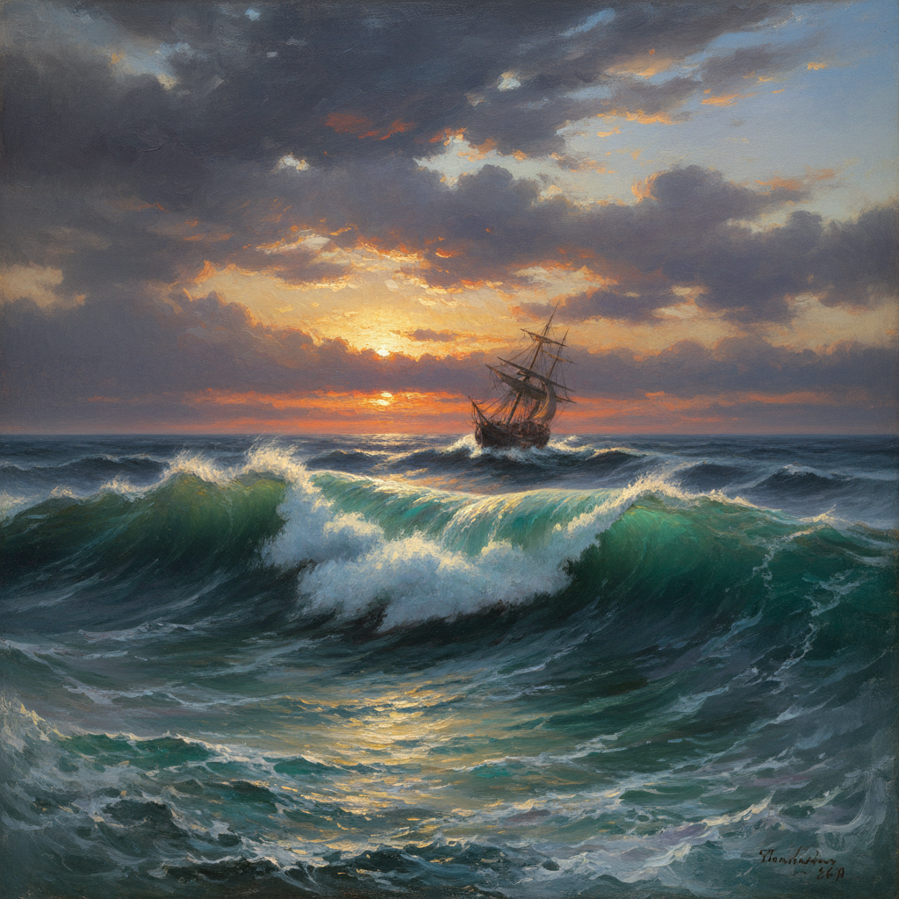

# 俄罗斯海景绘画 · Russian Marine Art

> "大海是自由的象征，每一道浪花都在诉说永恒的力量。" —— 伊万·艾瓦佐夫斯基

## 概述

俄罗斯海景绘画（Russian Marine Art）是19世纪俄罗斯风景画中独具魅力的分支，以艾瓦佐夫斯基为最高代表。作为世界艺术史上最伟大的海景画家之一，艾瓦佐夫斯基一生创作了约6000幅作品，以其对海浪透明质感、风暴戏剧性和月光海面的超凡表现力著称。俄罗斯海景画传统还包括博戈柳博夫的军事海景、拉格里奥的地中海风光，以及后来苏联时期的北冰洋题材，形成了从浪漫主义到写实主义的完整谱系。

## 核心特征

| 特征 | 描述 |
|------|------|
| 时期 | 1840s–1910s（巅峰期） |
| 地域 | 黑海、波罗的海、北冰洋、地中海 |
| 媒介 | 油画 |
| 核心理念 | 以海洋表达自然的崇高力量与人类的渺小 |
| 色彩 | 翡翠绿、深蓝、银白、琥珀金（日落） |

## 视觉特征

- **透明海浪**：阳光穿透浪尖的翡翠色透明效果
- **戏剧性天空**：风暴云层与光线的强烈对比
- **月光反射**：月光在海面形成的银色光路
- **动态构图**：巨浪的运动感和冲击力
- **薄涂技法**：多层薄涂营造水的透明质感
- **人与海的对峙**：船只在风暴中的渺小与坚韧

## 代表作品

| 作品 | 作者 | 年代 | 特点 |
|------|------|------|------|
| 《九级浪》 | 艾瓦佐夫斯基 | 1850 | 风暴中的求生者 |
| 《黑海》 | 艾瓦佐夫斯基 | 1881 | 纯粹的海面力量 |
| 《月夜》 | 艾瓦佐夫斯基 | 1849 | 宁静的月光海景 |
| 《彩虹》 | 艾瓦佐夫斯基 | 1873 | 风暴后的希望 |
| 《锡诺普海战》 | 博戈柳博夫 | 1860 | 军事海景画 |

## 发展时间线

| 时期 | 事件 |
|------|------|
| 1840s | 艾瓦佐夫斯基在意大利学习后确立海景画风格 |
| 1850 | 《九级浪》奠定其世界级海景画家地位 |
| 1860s | 博戈柳博夫发展军事海景画传统 |
| 1870s | 艾瓦佐夫斯基技法达到巅峰 |
| 1880s | 《黑海》标志着从浪漫主义向写实主义的转变 |
| 1900 | 艾瓦佐夫斯基去世，海景画传统由学生延续 |
| 苏联时期 | 北极探险和海军题材延续海景画传统 |

## 中国语境

俄罗斯海景画对中国海洋题材绘画有重要影响。中国海军画家如李铁夫早期接触过艾瓦佐夫斯基的作品。1950年代后，中国海军美术创作借鉴了俄罗斯军事海景画的构图和氛围营造方法。当代中国海景画家如郭润文等人的作品中，仍可见艾瓦佐夫斯基式的海浪透明效果和戏剧性光线处理的影响。

## AI 概念图

*AI 生成概念图：俄罗斯海景绘画风格*

## 关联词条

- [[aivazovsky-art]] - 艾瓦佐夫斯基艺术
- [[russian-landscape-art]] - 俄罗斯风景画
- [[russian-romanticism-art]] - 俄罗斯浪漫主义
- [[russian-plein-air-art]] - 俄罗斯外光派

---

*浮光艺志 · Chronicle of Artistry*
