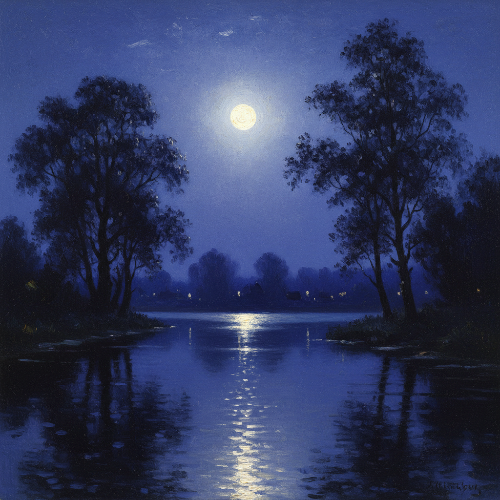

# 俄罗斯月光绘画 · Russian Moonlight Art

> "月光是画家的魔法——它将平凡的风景变为梦境。" —— 阿尔希普·库因芝

## 概述

俄罗斯月光绘画（Russian Moonlight Art）是俄罗斯风景画中以月夜场景为核心表现对象的绘画传统。库因芝是这一领域无可争议的大师——他1880年展出的《第聂伯河上的月夜》以其超自然的光辉效果轰动彼得堡，观众甚至怀疑画布背后藏有灯光。艾瓦佐夫斯基的月光海景、列维坦的月夜村庄，以及萨夫拉索夫的月下教堂，共同构成了俄罗斯月光绘画的丰富谱系。月光主题在俄罗斯文化中与浪漫、神秘和精神超越紧密相连。

## 核心特征

| 特征 | 描述 |
|------|------|
| 时期 | 1870s–1910s |
| 地域 | 乌克兰草原、黑海沿岸、俄罗斯中部 |
| 媒介 | 油画 |
| 核心理念 | 以月光营造超越日常的神秘与崇高感 |
| 色彩 | 银白（月光）、深蓝（夜空）、墨绿（暗影）、银灰（水面） |

## 视觉特征

- **月光路径**：月光在水面或草地上形成的银色光带
- **极端明暗对比**：月光照亮的区域与深沉暗影的强烈反差
- **发光效果**：库因芝标志性的"自发光"月亮
- **冷色调主导**：蓝绿色调营造夜晚的清冷氛围
- **简化形体**：月光下物体失去细节，化为概括的形状
- **宁静感**：月夜的静谧与白天的喧嚣形成对比

## 代表作品

| 作品 | 作者 | 年代 | 特点 |
|------|------|------|------|
| 《第聂伯河上的月夜》 | 库因芝 | 1880 | 超自然的月光效果 |
| 《月夜》 | 艾瓦佐夫斯基 | 1849 | 月光海景 |
| 《月夜·大村庄》 | 列维坦 | 1897 | 月下乡村的诗意 |
| 《乌克兰之夜》 | 库因芝 | 1876 | 月光下的白色小屋 |
| 《月夜·冬》 | 萨夫拉索夫 | 1870s | 月下雪景 |

## 发展时间线

| 时期 | 事件 |
|------|------|
| 1849 | 艾瓦佐夫斯基创作经典月光海景 |
| 1876 | 库因芝《乌克兰之夜》初探月光表现 |
| 1880 | 《第聂伯河上的月夜》单幅画展轰动彼得堡 |
| 1880s | 库因芝隐退后继续研究月光色彩 |
| 1890s | 列维坦将月光主题融入抒情风景体系 |
| 1900s | 库因芝晚期月光作品色彩更加大胆 |

## 中国语境

月光在中国文化中有极其深厚的诗意传统——"床前明月光""明月几时有"。俄罗斯月光画的视觉表现方法为中国油画家提供了描绘月夜的技法参照。库因芝式的月光效果——强烈的明暗对比和"发光"感——影响了中国画家对夜景的处理方式。当代中国油画中的月夜题材，在光色处理上仍可追溯到俄罗斯月光绘画传统。

## AI 概念图

*AI 生成概念图：俄罗斯月光绘画风格*

## 关联词条

- [[kuindzhi-art]] - 库因芝艺术
- [[aivazovsky-art]] - 艾瓦佐夫斯基艺术
- [[russian-twilight-art]] - 俄罗斯黄昏绘画
- [[russian-landscape-art]] - 俄罗斯风景画
- [[russian-steppe-art]] - 俄罗斯草原绘画

---

*浮光艺志 · Chronicle of Artistry*
