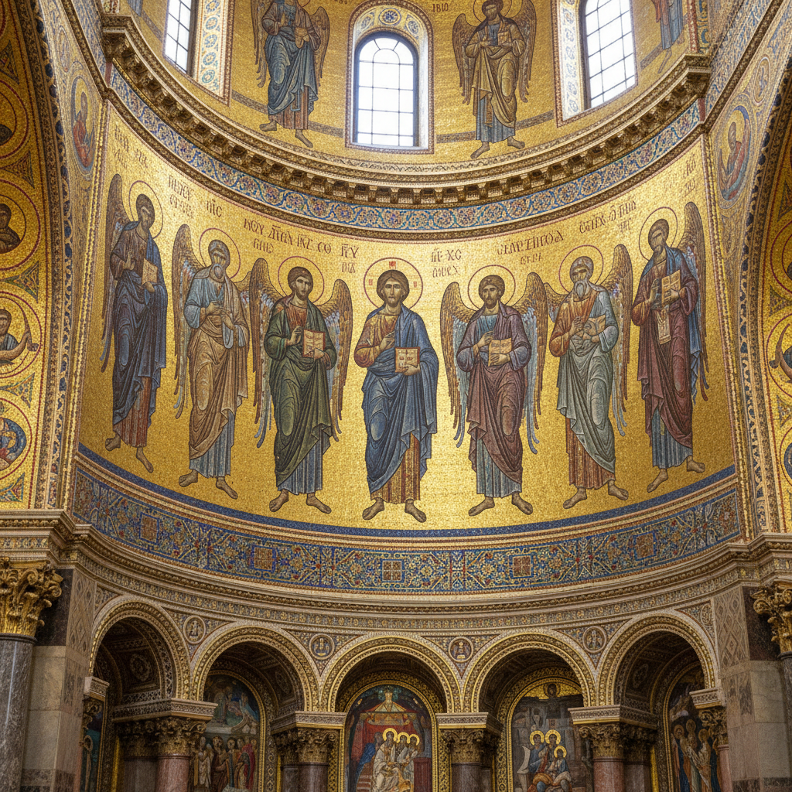

# 俄罗斯马赛克艺术 · Russian Mosaic Art

> "每一块石片都是大地的碎语，拼合在一起便是永恒的诗篇。" —— 米哈伊尔·罗蒙诺索夫

## 概述

俄罗斯马赛克艺术（Russian Mosaic Art）是一种以天然宝石、半宝石、彩色玻璃及大理石为材料的镶嵌装饰艺术，在俄罗斯拥有从拜占庭传统到帝国辉煌再到苏联纪念性建筑的悠久历史。从基辅罗斯时期的教堂金底马赛克，到18世纪罗蒙诺索夫复兴的玻璃马赛克，再到乌拉尔地区以孔雀石、青金石等宝石制作的"俄罗斯镶嵌"（Florentine mosaic的俄罗斯变体），形成了独特的民族风格。

## 核心特征

| 特征 | 描述 |
|------|------|
| 时期 | 11世纪至今 |
| 地域 | 基辅、圣彼得堡、叶卡捷琳堡、莫斯科 |
| 媒介 | 天然宝石、半宝石、彩色玻璃、金箔 |
| 核心理念 | 以永恒材料表达神圣与帝国荣耀 |
| 色彩 | 金色底色、孔雀石绿、青金石蓝、碧玉红 |

## 视觉特征

- **金底拜占庭传统**：早期教堂马赛克以金色玻璃为底，营造神圣光辉
- **宝石镶嵌技法**：乌拉尔工匠将孔雀石薄片拼接成无缝纹理面板
- **建筑尺度宏大**：圣以撒大教堂内部大量使用宝石马赛克装饰
- **苏联纪念风格**：莫斯科地铁站的社会主义现实主义马赛克壁画
- **微型精密工艺**：法贝热彩蛋中的微型马赛克镶嵌

## 代表作品

| 作品 | 创作者/地点 | 年代 | 类型 |
|------|-------------|------|------|
| 圣索菲亚大教堂马赛克 | 基辅 | 11世纪 | 宗教马赛克 |
| 波尔塔瓦战役马赛克画 | 罗蒙诺索夫 | 1762-1764 | 玻璃马赛克 |
| 圣以撒大教堂内部装饰 | 圣彼得堡 | 1818-1858 | 宝石马赛克 |
| 孔雀石厅 | 冬宫 | 1839 | 宝石镶嵌 |
| 莫斯科地铁马雅科夫斯基站 | 杰伊涅卡设计 | 1938 | 天花板马赛克 |

## 发展时间线

| 时期 | 事件 |
|------|------|
| 11世纪 | 基辅罗斯接受拜占庭马赛克传统 |
| 13-17世纪 | 蒙古入侵后马赛克传统中断 |
| 1750s | 罗蒙诺索夫复兴玻璃马赛克制作 |
| 1800s | 乌拉尔宝石镶嵌工艺达到巅峰 |
| 1818-1858 | 圣以撒大教堂建造，大规模宝石马赛克应用 |
| 1930s-1950s | 苏联地铁站马赛克装饰运动 |
| 当代 | 马赛克艺术在公共空间与当代艺术中复兴 |

## 中国语境

中国与俄罗斯马赛克艺术的交流主要体现在1950年代苏联援建时期。北京展览馆（原苏联展览馆）、中苏友好大厦等建筑中保留了苏联风格的马赛克装饰。中国传统的"百宝嵌"工艺与俄罗斯宝石镶嵌有异曲同工之妙，均以天然材料的色彩与纹理构成画面。

## AI 概念图

*AI 生成概念图：俄罗斯马赛克艺术风格*

## 关联词条

- [[russian-icon-art]] - 俄罗斯圣像画
- [[russian-porcelain-art]] - 俄罗斯瓷器艺术
- [[russian-folk-art]] - 俄罗斯民间艺术
- [[russian-enamel-art]] - 俄罗斯珐琅艺术

---

*浮光艺志 · Chronicle of Artistry*
