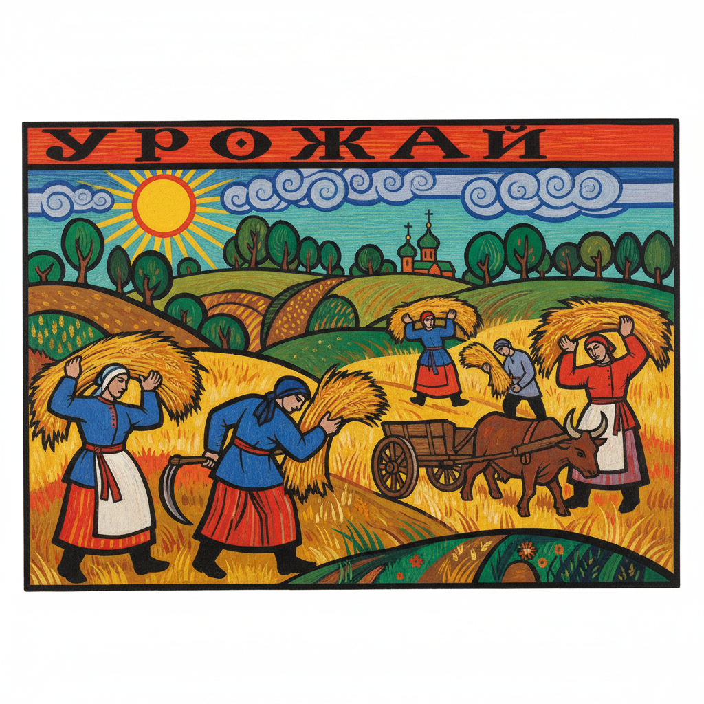

# 俄罗斯新原始主义 · Russian Neo-Primitivism Art

> "我们回到民间，回到原始的力量，那里有被文明遗忘的真理。" —— 娜塔莉亚·冈察洛娃

## 概述

俄罗斯新原始主义（Russian Neo-Primitivism / Неопримитивизм）是1907年至1914年间在俄罗斯兴起的艺术运动，以拉里奥诺夫、冈察洛娃、马列维奇早期作品为代表。这一运动从俄罗斯民间艺术——卢布克版画（lubok）、圣像画、民间刺绣、彩绘木器——以及非洲、大洋洲原始艺术中汲取灵感，以粗犷有力的造型、鲜明的色彩和故意的"笨拙"挑战学院派的精致传统，为俄罗斯先锋派的激进实验奠定了基础。

## 核心特征

| 特征 | 描述 |
|------|------|
| 时期 | 1907年–1914年 |
| 地域 | 莫斯科、圣彼得堡 |
| 媒介 | 油画、版画、书籍插图、舞台设计 |
| 核心理念 | 以民间和原始艺术的生命力对抗学院派的僵化 |
| 色彩 | 浓烈饱和、对比强烈，受民间彩绘影响 |

## 视觉特征

- **故意的粗拙**：简化造型，拒绝学院派的精确透视和解剖
- **民间图案**：卢布克版画的平面化构图和叙事方式
- **强烈轮廓线**：粗黑线条勾勒形体，类似民间木刻
- **平面化空间**：取消纵深感，回归二维装饰性
- **乡村主题**：农民、收割、节庆等俄罗斯乡村生活场景

## 代表作品

| 作品 | 艺术家 | 年代 | 类型 |
|------|--------|------|------|
| 《收割》 | 冈察洛娃 | 1911 | 油画 |
| 《士兵》系列 | 拉里奥诺夫 | 1908-1911 | 油画 |
| 《磨刀人》 | 马列维奇 | 1913 | 油画 |
| 《浴女》 | 冈察洛娃 | 1911 | 油画 |
| 《四季》系列 | 冈察洛娃 | 1911 | 油画 |

## 发展时间线

| 时期 | 事件 |
|------|------|
| 1907 | "蓝玫瑰"展览后，俄罗斯画家开始关注民间艺术 |
| 1908 | "金羊毛"展览引入法国野兽派和原始主义 |
| 1909 | 拉里奥诺夫组织"金羊毛"沙龙 |
| 1910 | "红方块骑士"展览，新原始主义集中亮相 |
| 1912 | "驴尾巴"展览，新原始主义达到高峰 |
| 1913 | "靶子"展览，开始向辐射主义和抽象过渡 |
| 1914 | 一战爆发，运动自然终结，艺术家转向更激进的抽象 |

## 中国语境

俄罗斯新原始主义与中国1980年代的"乡土美术"和"民间美术热"有精神上的共鸣。两者都试图从本土民间传统中寻找对抗学院体制的力量。吕胜中的剪纸艺术、徐冰早期的版画创作，都体现了从民间艺术中汲取现代性的策略。俄罗斯新原始主义对卢布克版画的挪用，与中国当代艺术家对年画、剪纸的再利用异曲同工。

## AI 概念图

*AI 生成概念图：俄罗斯新原始主义风格*

## 关联词条

- [[russian-folk-art]] - 俄罗斯民间艺术
- [[russian-avant-garde-art]] - 俄罗斯先锋派
- [[russian-rayonism-art]] - 俄罗斯辐射主义
- [[russian-futurism-art]] - 俄罗斯未来主义

---

*浮光艺志 · Chronicle of Artistry*
