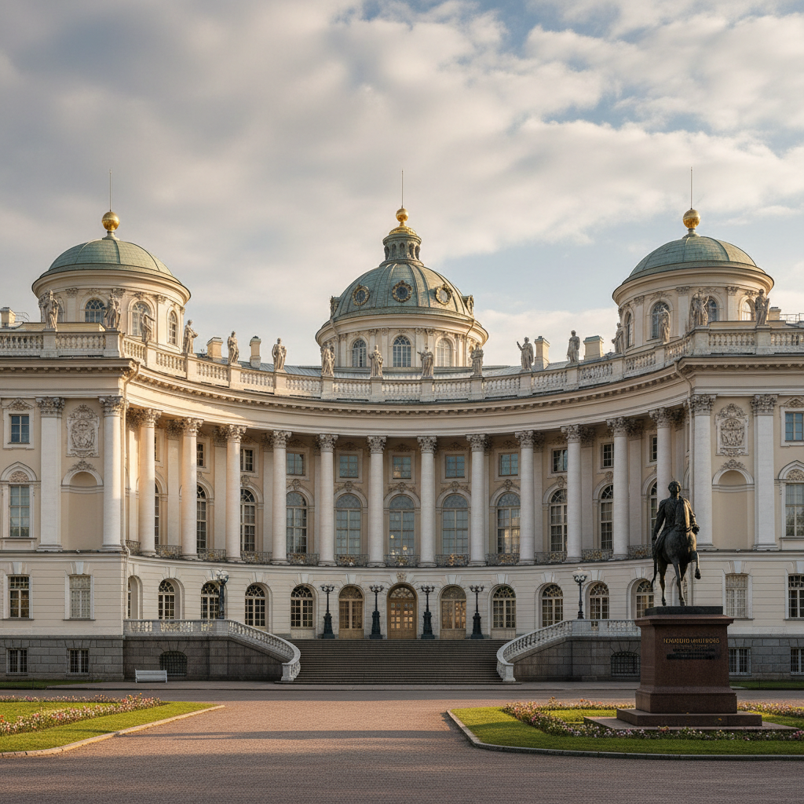

# Russian Neoclassicism Art 俄罗斯新古典主义艺术

> "In the columns of Petersburg, in the symmetry of its palaces, Russia found its place among the great civilizations." — Russian architectural tradition

## 概述

俄罗斯新古典主义艺术（Russian Neoclassicism Art）是18世纪下半叶至19世纪初俄罗斯在叶卡捷琳娜大帝和亚历山大一世时期发展的以古希腊罗马为典范的艺术风格。俄罗斯新古典主义是彼得大帝西化改革的艺术延续——它将古典主义的理性、秩序和宏伟与俄罗斯帝国的政治野心相结合，创造了圣彼得堡这座"北方的罗马"。

俄罗斯新古典主义在建筑领域最为辉煌——圣彼得堡的冬宫、喀山大教堂、海军部大厦、参议院广场等建筑群构成了世界上最完整的新古典主义城市景观之一。在绘画领域，新古典主义体现为学院派的古典题材和理想化风格。在雕塑领域，以法尔科内的"青铜骑士"（彼得大帝骑马像）为代表。在装饰艺术领域，新古典主义影响了家具、瓷器、金属工艺等各个方面。

俄罗斯新古典主义艺术的核心要素包括：1）帝国宏伟——表达俄罗斯帝国的权力和野心；2）古典秩序——柱式、对称、比例的古典原则；3）圣彼得堡——新古典主义的城市化身；4）叶卡捷琳娜——女皇的文化赞助；5）建筑主导——建筑是新古典主义的核心领域；6）西化象征——俄罗斯融入欧洲文明的象征；7）帝国风格——拿破仑战争后的帝国风格。

## 核心特征

| 特征 | 描述 |
|------|------|
| 帝国宏伟 | 表达俄罗斯帝国权力野心 |
| 古典秩序 | 柱式对称比例古典原则 |
| 圣彼得堡 | 新古典主义城市化身 |
| 叶卡捷琳娜 | 女皇文化赞助 |
| 建筑主导 | 建筑是核心领域 |
| 帝国风格 | 拿破仑战争后帝国风格 |

## 视觉特征

- **柱廊建筑**：宏伟的柱廊和三角楣
- **对称布局**：严格的对称和轴线
- **白色与金色**：白色墙面和金色装饰
- **古典雕塑**：希腊罗马风格的雕塑
- **几何花园**：法式几何花园
- **帝国符号**：鹰、月桂、胜利女神

## 代表作品

| 作品 | 建筑师/艺术家 | 意义 |
|------|------|------|
| *冬宫* | 拉斯特雷利 | 巴洛克到新古典过渡 |
| *喀山大教堂* | 沃罗尼欣 | 新古典建筑 |
| *海军部大厦* | 扎哈罗夫 | 帝国风格 |
| *青铜骑士* | 法尔科内 | 新古典雕塑 |
| *圣以撒大教堂* | 蒙费朗 | 晚期新古典 |
| *帕夫洛夫斯克宫* | 卡梅隆 | 宫殿建筑 |

## 历史时间线

| 时期 | 事件 |
|------|------|
| 1762年 | 叶卡捷琳娜即位，推动新古典主义 |
| 1770-80年代 | 早期新古典主义建筑 |
| 1800-10年代 | 帝国风格鼎盛 |
| 1812年后 | 卫国战争胜利纪念建筑 |
| 1830-40年代 | 晚期新古典主义 |
| 1850年代 | 折衷主义取代新古典主义 |

## 中国语境

俄罗斯新古典主义对中国建筑有着直接而深远的影响。1950年代中国大规模学习苏联建筑——而苏联建筑的"斯大林式"风格本身就是新古典主义的变体。北京的"十大建筑"（1959年）、各地的苏式建筑都带有明显的新古典主义特征——柱廊、对称、宏伟的尺度。中国许多城市的火车站、政府大楼、大学建筑都可以追溯到俄罗斯新古典主义的影响。圣彼得堡作为一座完整的新古典主义城市——其城市规划理念也影响了中国一些城市的规划思路。当代中国建筑中的"新古典"风格——虽然更多受到西欧和美国的影响——在某种程度上也与俄罗斯新古典主义传统有着间接的联系。

## 概念图

## 与其他风格的关系

- **French Neoclassicism** → 法国新古典主义（来源）
- **Russian Academic** → 俄罗斯学院派（绘画领域）
- **Empire Style** → 帝国风格（后续发展）
- **Palladianism** → 帕拉第奥主义（建筑影响）
- **Russian Romanticism** → 俄罗斯浪漫主义（后续）
- **Stalinist Architecture** → 斯大林建筑（苏联继承）

---

*浮光艺志 | Chronicle of Artistry*
