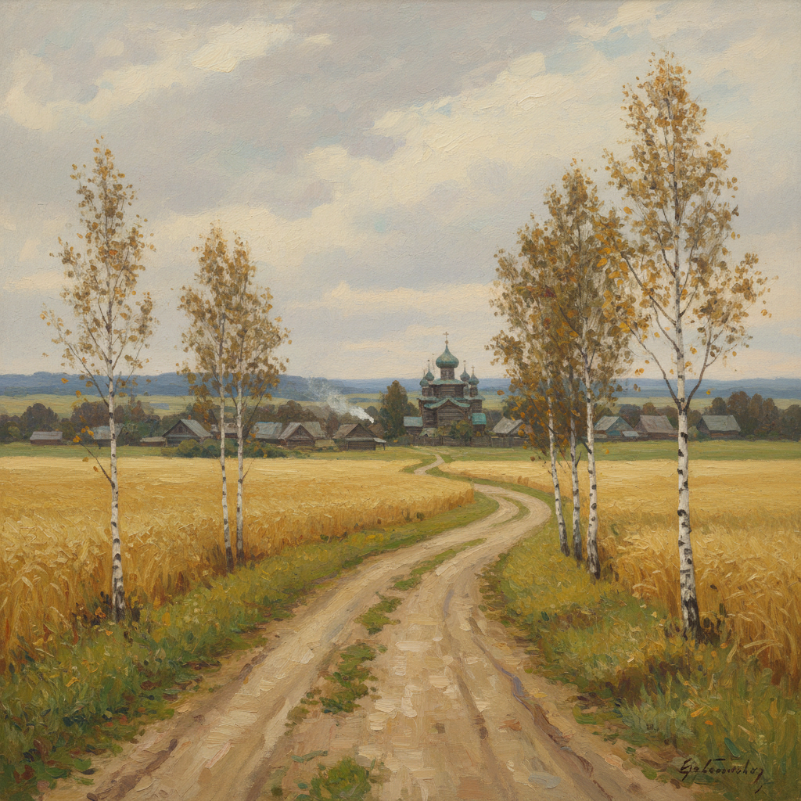

# 俄罗斯田园风景画 · Russian Pastoral Art

> "俄罗斯的田野不是风景，而是祈祷。" —— 阿列克谢·萨夫拉索夫

## 概述

俄罗斯田园风景画（Russian Pastoral Art）是19世纪俄罗斯风景画中以乡村生活、农田、牧场和河畔村庄为主题的绘画传统。与希施金的森林主题和艾瓦佐夫斯基的海景不同，田园风景画关注的是人与土地的亲密关系——收割的麦田、放牧的草地、炊烟袅袅的村庄。萨夫拉索夫的《白嘴鸦飞来了》开创了俄罗斯抒情田园风景的先河，列维坦将其推向诗意化的巅峰，而波列诺夫则赋予田园场景以温暖的人文气息。

## 核心特征

| 特征 | 描述 |
|------|------|
| 时期 | 1860s–1910s |
| 地域 | 俄罗斯中部平原、伏尔加河流域 |
| 媒介 | 油画 |
| 核心理念 | 以乡村景观表达对故土的深情与民族认同 |
| 色彩 | 金黄（麦田）、嫩绿（春草）、灰蓝（天空）、褐色（泥土） |

## 视觉特征

- **低平地平线**：广阔的天空占据画面大部分
- **季节叙事**：春播、夏长、秋收、冬藏的农事循环
- **乡村建筑**：木屋、教堂钟楼、篱笆作为点景
- **道路与河流**：蜿蜒的小路和河流引导视线
- **柔和光线**：阴天的散射光或黄昏的暖光
- **人物点缀**：农民、牧人作为风景的有机组成

## 代表作品

| 作品 | 作者 | 年代 | 特点 |
|------|------|------|------|
| 《白嘴鸦飞来了》 | 萨夫拉索夫 | 1871 | 早春乡村的抒情 |
| 《黑麦田》 | 希施金 | 1878 | 金色麦田的壮美 |
| 《莫斯科庭院》 | 波列诺夫 | 1878 | 温暖的城郊田园 |
| 《弗拉基米尔大道》 | 列维坦 | 1892 | 孤寂的乡间道路 |
| 《永恒的宁静》 | 列维坦 | 1894 | 河畔教堂的沉思 |

## 发展时间线

| 时期 | 事件 |
|------|------|
| 1860s | 萨夫拉索夫在莫斯科绘画学校教授风景画 |
| 1871 | 《白嘴鸦飞来了》确立俄罗斯抒情风景画范式 |
| 1878 | 波列诺夫《莫斯科庭院》展现温暖田园 |
| 1880s | 列维坦师从萨夫拉索夫，发展田园抒情传统 |
| 1890s | 列维坦将田园风景推向哲学化深度 |
| 1900s | 田园主题融入俄罗斯象征主义和现代主义 |

## 中国语境

俄罗斯田园风景画对中国乡土油画影响深远。1950年代以来，中国画家借鉴俄罗斯田园画的构图和情感表达方式，创作了大量反映中国农村生活的风景画。从罗工柳的《延安风景》到何多苓的《春风已经苏醒》，俄罗斯田园画的抒情传统在中国得到了本土化的延续。当代中国乡土风景画仍以萨夫拉索夫-列维坦的诗意化方法为重要参照。

## AI 概念图

*AI 生成概念图：俄罗斯田园风景画风格*

## 关联词条

- [[savrasov-art]] - 萨夫拉索夫艺术
- [[levitan-art]] - 列维坦艺术
- [[polenov-art]] - 波列诺夫艺术
- [[russian-landscape-art]] - 俄罗斯风景画
- [[russian-plein-air-art]] - 俄罗斯外光派

---

*浮光艺志 · Chronicle of Artistry*
