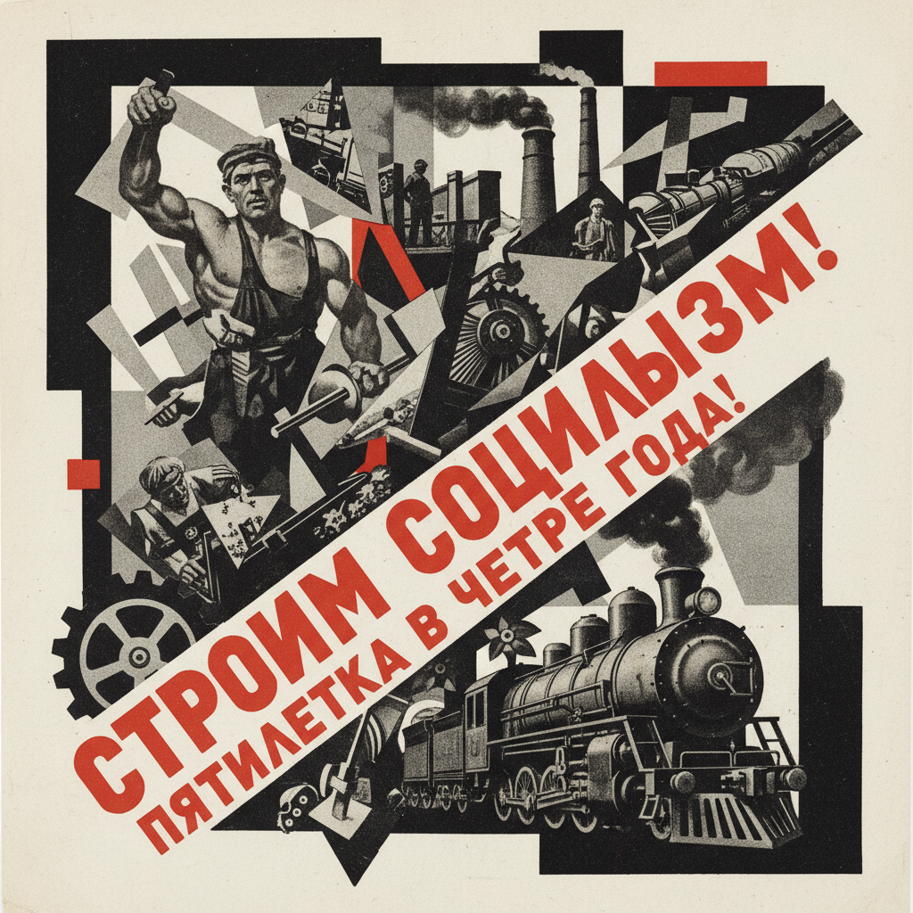

# 俄罗斯摄影蒙太奇 · Russian Photomontage Art

> "照片不是现实的镜子，而是重构现实的砖块。" —— 亚历山大·罗钦科

## 概述

俄罗斯摄影蒙太奇（Russian Photomontage Art）是1920年代苏联构成主义运动中发展出的革命性视觉传播手段，将摄影图像通过剪切、拼贴、叠加重新组合为具有强烈政治和美学冲击力的新画面。以罗钦科、利西茨基、克鲁齐斯、古斯塔夫·克鲁齐斯为代表，苏联摄影蒙太奇将先锋派的形式实验与革命宣传的功能需求完美结合，深刻影响了20世纪平面设计、广告和政治视觉传播。

## 核心特征

| 特征 | 描述 |
|------|------|
| 时期 | 1919年–1930年代 |
| 地域 | 莫斯科、列宁格勒 |
| 媒介 | 摄影拼贴、海报、书籍封面、杂志版式 |
| 核心理念 | 以摄影碎片的重组创造新的视觉现实 |
| 色彩 | 黑白摄影为主，配以红色文字和几何色块 |

## 视觉特征

- **尺度对比**：将不同比例的人物和物体并置，制造视觉冲击
- **斜线构图**：动态的对角线排列打破静态平衡
- **重复与节奏**：同一图像的多次重复创造韵律感
- **文字整合**：大胆的排版与图像融为一体
- **极端视角**：俯拍、仰拍等非常规摄影角度

## 代表作品

| 作品 | 艺术家 | 年代 | 类型 |
|------|--------|------|------|
| 《书籍给各领域》 | 罗钦科 | 1924 | 海报 |
| 《在建设中的苏联》 | 利西茨基 | 1930 | 展览设计/书籍 |
| 《五年计划完成》 | 克鲁齐斯 | 1930 | 海报 |
| 《列宁格勒》电影海报 | 斯坦贝格兄弟 | 1927 | 电影海报 |
| 《苏联在建设中》杂志 | 利西茨基 | 1930-1941 | 杂志设计 |

## 发展时间线

| 时期 | 事件 |
|------|------|
| 1919 | 早期达达式拼贴实验在俄罗斯出现 |
| 1922 | 罗钦科开始系统性摄影蒙太奇创作 |
| 1923 | 马雅科夫斯基与罗钦科合作广告海报 |
| 1924 | 罗钦科为《列夫》杂志创作经典蒙太奇封面 |
| 1928 | 克鲁齐斯发展政治宣传蒙太奇 |
| 1930 | 利西茨基设计《苏联在建设中》杂志 |
| 1930s | 摄影蒙太奇成为苏联官方宣传的主要视觉手段 |

## 中国语境

苏联摄影蒙太奇对中国视觉传播的影响深远。1950年代中国宣传画和画报设计直接借鉴了苏联蒙太奇手法。文革时期的政治宣传品中，照片拼贴与红色文字的组合方式明显受苏联影响。当代中国平面设计教育中，罗钦科和利西茨基的作品是构成主义设计的经典教材。中国当代艺术家如张大力的摄影拼贴作品也延续了这一传统。

## AI 概念图

*AI 生成概念图：俄罗斯摄影蒙太奇风格*

## 关联词条

- [[russian-constructivism-art]] - 俄罗斯构成主义
- [[russian-agitprop-art]] - 俄罗斯宣传鼓动艺术
- [[russian-productivism-art]] - 俄罗斯生产主义
- [[russian-avant-garde-art]] - 俄罗斯先锋派

---

*浮光艺志 · Chronicle of Artistry*
