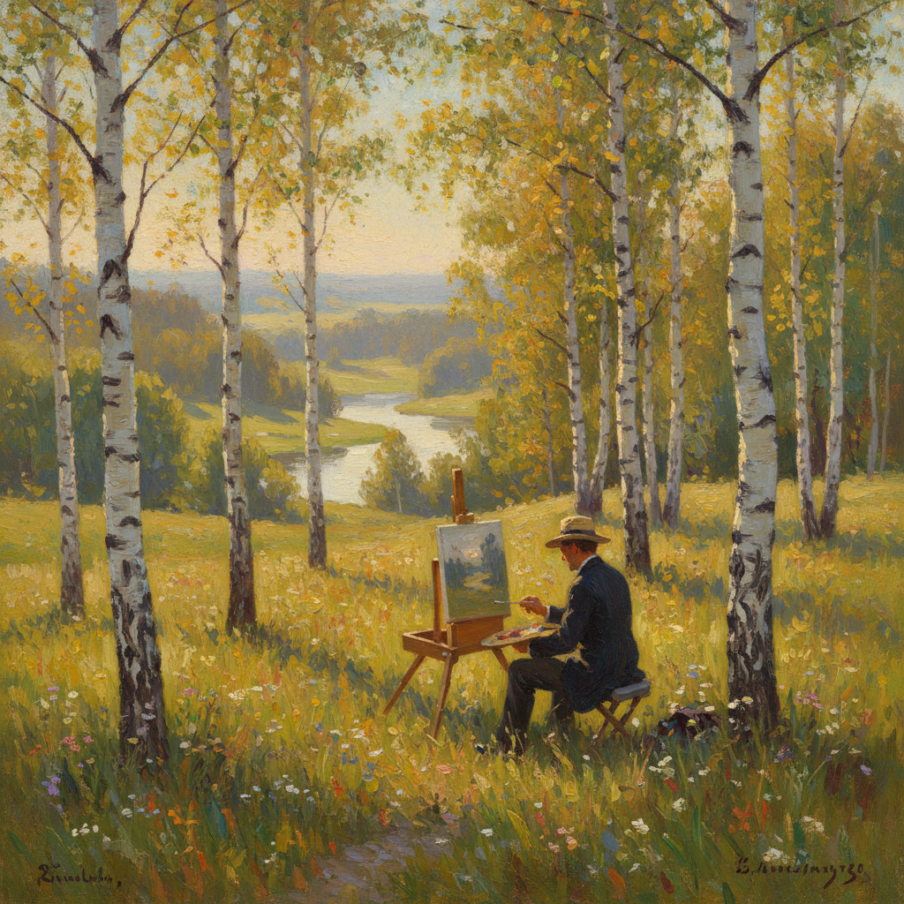

# 俄罗斯外光派绘画 · Russian Plein Air Art

> "走出画室，走进自然——只有在阳光下，色彩才是真实的。" —— 瓦西里·波列诺夫

## 概述

俄罗斯外光派绘画（Russian Plein Air Art）是19世纪下半叶至20世纪初俄罗斯画家在户外直接面对自然写生的绘画实践与美学追求。受法国巴比松画派和印象派影响，俄罗斯画家将外光写生从辅助手段提升为独立的艺术表达方式。波列诺夫、列维坦、科罗温等人在莫斯科郊外和伏尔加河畔的外光实践，创造了一种兼具法国光色敏感性和俄罗斯抒情气质的独特风景画传统。

## 核心特征

| 特征 | 描述 |
|------|------|
| 时期 | 1870s–1910s |
| 地域 | 莫斯科郊外、伏尔加河流域、克里米亚 |
| 媒介 | 油画（小幅画板写生与大幅创作） |
| 核心理念 | 在自然光线下直接捕捉瞬间的色彩与氛围 |
| 色彩 | 明亮、清新，注重冷暖对比和光影变化 |

## 视觉特征

- **即时性笔触**：快速、松动的笔法捕捉光线变化
- **色彩真实性**：摒弃画室中的棕色调，追求户外真实色彩
- **大气透视**：通过色彩冷暖变化表现空间深度
- **时间感**：同一场景在不同时刻的光色变化
- **小幅习作**：便携画板上的快速写生成为独立作品

## 代表作品

| 作品 | 作者 | 年代 | 特点 |
|------|------|------|------|
| 《莫斯科庭院》 | 波列诺夫 | 1878 | 阳光下的城市风景 |
| 《金秋》 | 列维坦 | 1895 | 秋日外光色彩 |
| 《三月》 | 列维坦 | 1895 | 早春光线研究 |
| 《巴黎咖啡馆》 | 科罗温 | 1890s | 印象派式外光 |
| 《基督显圣》习作 | 伊万诺夫 | 1840s | 早期外光探索 |

## 发展时间线

| 时期 | 事件 |
|------|------|
| 1840s | 亚历山大·伊万诺夫在意大利进行早期外光实验 |
| 1870s | 波列诺夫从巴黎带回外光写生方法 |
| 1880s | 莫斯科绘画学校形成外光写生传统 |
| 1890s | 列维坦将外光写生提升为抒情风景画巅峰 |
| 1900s | 科罗温将外光色彩推向印象主义方向 |
| 1910s | 外光传统融入俄罗斯印象主义和现代主义 |

## 中国语境

俄罗斯外光派对中国油画影响深远。1950年代苏联专家马克西莫夫在中央美术学院开设油画训练班，系统传授了俄罗斯外光写生方法。中国几代风景画家——从吴作人、董希文到朱乃正、全山石——都继承了这一传统。至今中国美术院校的外光写生课程仍以俄罗斯方法为基础，"到自然中去"的理念深植于中国油画教育体系。

## AI 概念图

*AI 生成概念图：俄罗斯外光派绘画风格*

## 关联词条

- [[shishkin-art]] - 希施金艺术
- [[levitan-art]] - 列维坦艺术
- [[polenov-art]] - 波列诺夫艺术
- [[russian-landscape-art]] - 俄罗斯风景画
- [[russian-impressionism-art]] - 俄罗斯印象主义

---

*浮光艺志 · Chronicle of Artistry*
