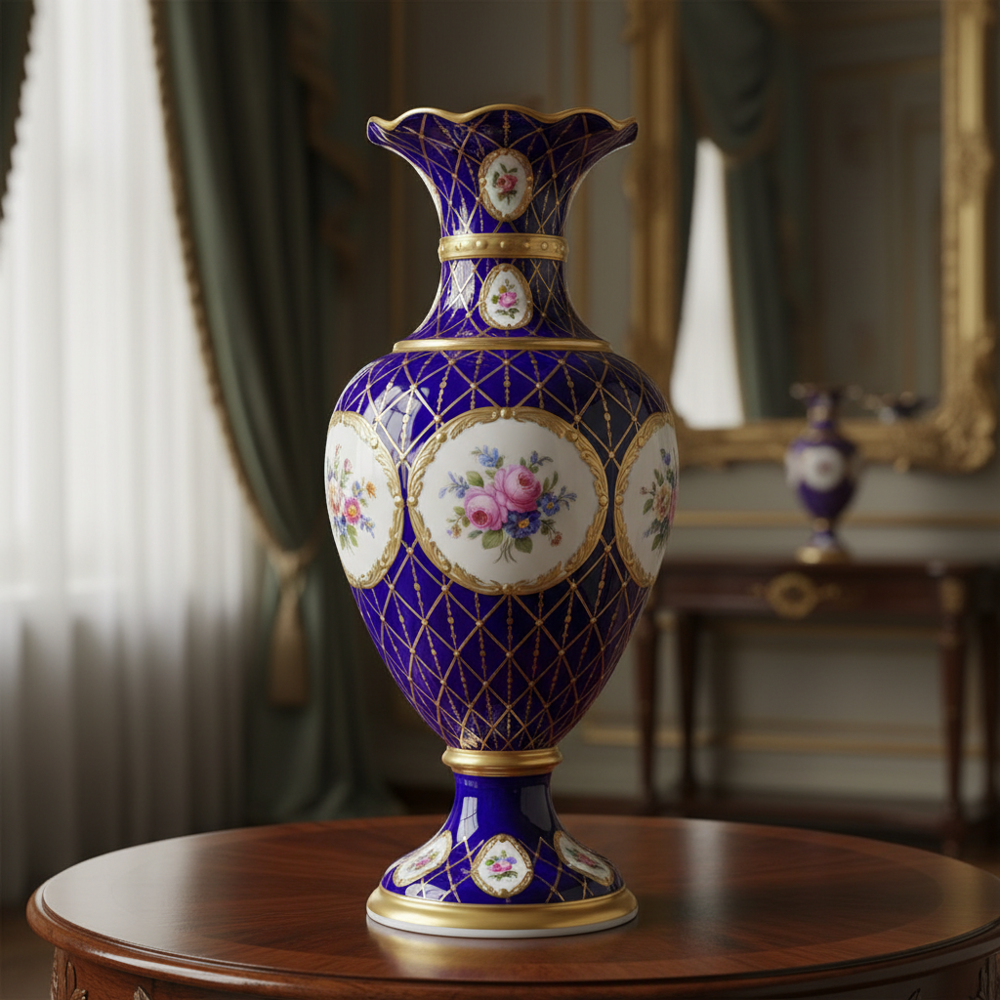

# Russian Porcelain Art 俄罗斯瓷器艺术

> "Russian porcelain united the secrets of Meissen with the grandeur of the Tsars." — Imperial porcelain tradition

## 概述

俄罗斯瓷器艺术（Russian Porcelain Art）是18世纪以来俄罗斯发展的瓷器制造和装饰艺术传统。俄罗斯瓷器以帝国瓷器厂（Imperial Porcelain Factory，1744年建立）为核心——这是欧洲第三家成功生产硬质瓷器的工厂（仅次于迈森和维也纳），其产品以精湛的工艺、华丽的装饰和独特的俄罗斯风格闻名于世。

俄罗斯瓷器的历史始于1744年——伊丽莎白女皇下令在圣彼得堡建立瓷器工厂，化学家德米特里·维诺格拉多夫（Vinogradov）独立研发出了硬质瓷器的配方。叶卡捷琳娜大帝时期（1762-1796年），帝国瓷器厂达到了第一个高峰——生产了大量精美的宫廷用瓷。19世纪的亚历山大时期和尼古拉时期，俄罗斯瓷器发展出了独特的帝国风格——融合了新古典主义、帝国风格和俄罗斯民族元素。

俄罗斯瓷器艺术的核心要素包括：1）帝国传统——沙皇宫廷的瓷器传统；2）独立研发——独立掌握硬质瓷器技术；3）华丽装饰——金彩和精细绘画的华丽装饰；4）民族风格——融入俄罗斯民族元素；5）苏联时期——革命后的宣传瓷器；6）格热利传统——民间蓝白陶瓷传统；7）当代延续——帝国瓷器厂至今运营。

## 核心特征

| 特征 | 描述 |
|------|------|
| 帝国传统 | 沙皇宫廷瓷器传统 |
| 独立研发 | 独立掌握硬质瓷器技术 |
| 华丽装饰 | 金彩精细绘画华丽装饰 |
| 民族风格 | 融入俄罗斯民族元素 |
| 苏联宣传瓷 | 革命后宣传瓷器 |
| 当代延续 | 帝国瓷器厂至今运营 |

## 视觉特征

- **金彩装饰**：大量使用金彩
- **帝国纹章**：双头鹰等帝国符号
- **精细绘画**：微型绘画般的精细装饰
- **钴蓝网格**：经典的钴蓝网格图案
- **革命题材**：苏联时期的宣传图案
- **民族纹样**：俄罗斯民间纹样

## 代表作品

| 作品 | 年代 | 意义 |
|------|------|------|
| *叶卡捷琳娜宫廷瓷器* | 18世纪 | 帝国风格 |
| *钴蓝网格茶具* | 1944年设计 | 经典图案 |
| *苏联宣传瓷盘* | 1920年代 | 革命艺术 |
| *帝国瓷器厂花瓶* | 19世纪 | 装饰巅峰 |
| *格热利蓝白陶瓷* | 各时期 | 民间传统 |
| *当代俄罗斯瓷器* | 21世纪 | 传统延续 |

## 历史时间线

| 时期 | 事件 |
|------|------|
| 1744年 | 帝国瓷器厂建立 |
| 1750年代 | 维诺格拉多夫研发成功 |
| 1762-96年 | 叶卡捷琳娜时期繁荣 |
| 19世纪 | 帝国风格发展 |
| 1917年后 | 革命宣传瓷器 |
| 1944年 | 钴蓝网格图案设计 |
| 当代 | 洛蒙诺索夫瓷器厂延续 |

## 中国语境

俄罗斯瓷器与中国瓷器有着直接的历史联系。俄罗斯对瓷器的追求本身就是受到中国瓷器的启发——18世纪欧洲各国竞相研发瓷器技术，都是为了摆脱对中国瓷器进口的依赖。俄罗斯通过陆路丝绸之路（茶叶之路）大量进口中国瓷器——中国瓷器对俄罗斯宫廷审美产生了深远影响。帝国瓷器厂早期的产品中可以看到明显的中国风格影响。苏联时期的"宣传瓷器"是一个独特的现象——将政治宣传与精美瓷器相结合，这与中国文革时期的政治瓷器有着有趣的平行关系。格热利的蓝白陶瓷传统与中国青花瓷在视觉上极为相似——虽然两者独立发展，但都选择了钴蓝作为主要装饰色彩。

## 概念图

## 与其他风格的关系

- **Gzhel** → 格热利（民间陶瓷）
- **Meissen** → 迈森瓷器（技术来源）
- **Chinese Porcelain** → 中国瓷器（灵感来源）
- **Imperial Style** → 帝国风格
- **Soviet Art** → 苏联艺术（宣传瓷）
- **Copenhagen Porcelain** → 哥本哈根瓷器

---

*浮光艺志 | Chronicle of Artistry*
