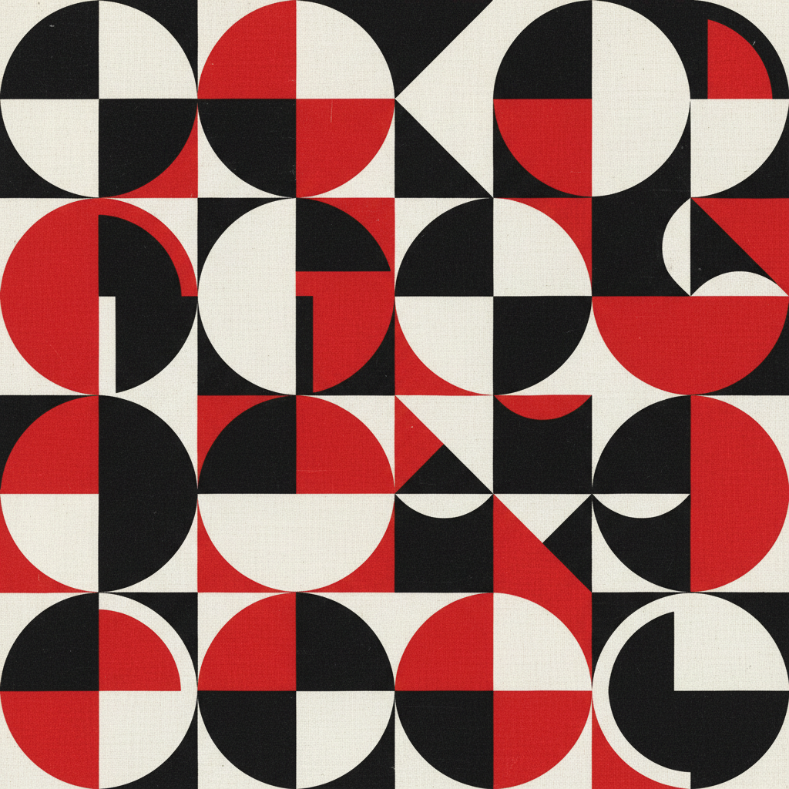

# 俄罗斯生产主义 · Russian Productivism Art

> "艺术家必须走进工厂，艺术必须服务于生活。" —— 亚历山大·罗钦科

## 概述

生产主义（Productivism / Производственное искусство）是1920年代初苏联构成主义运动中分化出的激进派别，主张彻底废除"架上艺术"（easel painting），将艺术家转变为工业设计师和生产者。以罗钦科、斯捷潘诺娃、波波娃、塔特林为代表，生产主义者投身纺织设计、海报、书籍排版、家具、工人服装和工业产品设计，试图通过"生产艺术"直接改造苏联人民的日常生活。

## 核心特征

| 特征 | 描述 |
|------|------|
| 时期 | 1921年–1930年代 |
| 地域 | 莫斯科、VKhUTEMAS（高等艺术技术工作室） |
| 媒介 | 纺织、海报、书籍设计、家具、服装、摄影 |
| 核心理念 | 艺术即生产——为无产阶级日常生活服务 |
| 色彩 | 红、黑、白为主，工业化的简洁配色 |

## 视觉特征

- **功能至上**：一切装饰服从功能需求
- **几何化图案**：纺织品和海报中的抽象几何重复图案
- **摄影蒙太奇**：罗钦科发展的摄影拼贴技法
- **大胆排版**：不对称版式、斜线文字、红黑对比
- **标准化设计**：追求可批量生产的工业美学

## 代表作品

| 作品 | 艺术家 | 年代 | 类型 |
|------|--------|------|------|
| 纺织品图案设计 | 柳博芙·波波娃 | 1923-1924 | 纺织设计 |
| 运动服设计 | 瓦尔瓦拉·斯捷潘诺娃 | 1923 | 服装设计 |
| 《列夫》杂志版式 | 罗钦科 | 1923-1925 | 书籍/排版 |
| 工人俱乐部设计 | 罗钦科 | 1925 | 室内/家具 |
| 《书籍给各领域》海报 | 罗钦科 | 1924 | 摄影蒙太奇海报 |

## 发展时间线

| 时期 | 事件 |
|------|------|
| 1921 | INKhUK（艺术文化研究所）内部辩论，生产主义立场确立 |
| 1921 | "5×5=25"展览，罗钦科宣布绘画终结 |
| 1922 | 《列夫》杂志创刊，生产主义理论阵地 |
| 1923 | 波波娃、斯捷潘诺娃进入纺织工厂 |
| 1925 | 巴黎国际装饰艺术博览会，苏联生产主义设计获奖 |
| 1920s末 | 斯大林时期生产主义被边缘化 |
| 1930s | 社会主义现实主义成为唯一官方路线 |

## 中国语境

生产主义对中国的影响主要通过两条路径：一是1950年代苏联工业设计教育模式的引入，中央工艺美术学院（今清华美院）的建立即受此影响；二是文革时期"艺术为工农兵服务"的理念与生产主义"艺术即生产"的口号有结构性相似。当代中国设计教育中"设计为人民服务"的理念，可追溯到生产主义的精神源头。

## AI 概念图

*AI 生成概念图：俄罗斯生产主义风格*

## 关联词条

- [[russian-constructivism-art]] - 俄罗斯构成主义
- [[russian-avant-garde-art]] - 俄罗斯先锋派
- [[russian-suprematism-art]] - 俄罗斯至上主义
- [[russian-agitprop-art]] - 俄罗斯宣传鼓动艺术

---

*浮光艺志 · Chronicle of Artistry*
