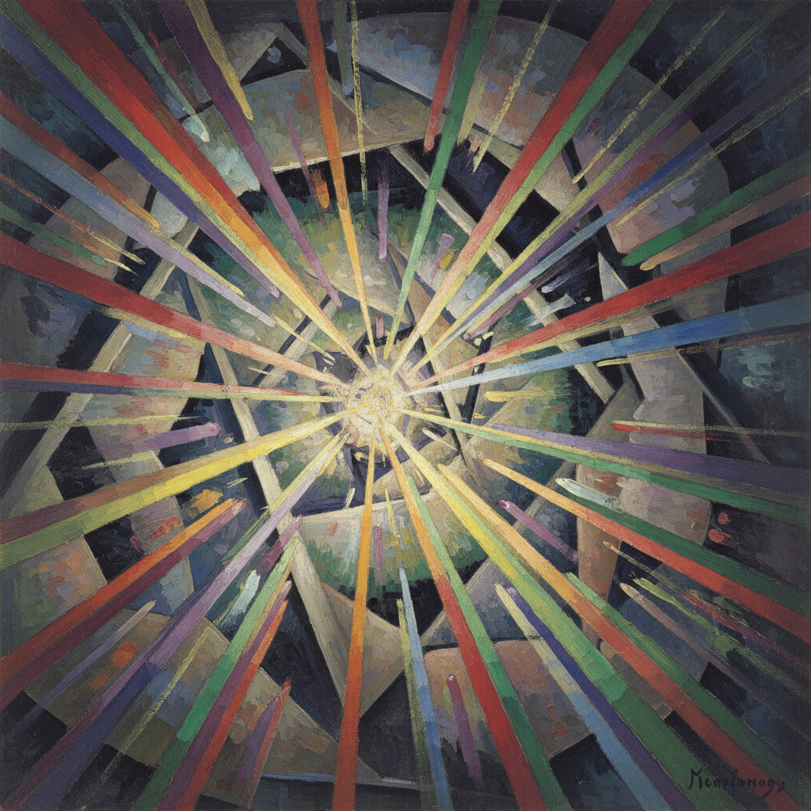

# 俄罗斯辐射主义 · Russian Rayonism Art

> "我们宣告辐射主义的天才——它是绘画中空间形式的真正解放。" —— 米哈伊尔·拉里奥诺夫

## 概述

辐射主义（Rayonism / Лучизм）是1911年由米哈伊尔·拉里奥诺夫和娜塔莉亚·冈察洛娃在俄罗斯创立的抽象艺术运动，是俄罗斯先锋派中最早的纯抽象实验之一。辐射主义理论认为，人眼感知的不是物体本身，而是物体反射的光线（射线）在空间中的交叉与干涉。画家应描绘这些射线的动态交织，而非物体的外形。这一理论预示了至上主义和构成主义的到来。

## 核心特征

| 特征 | 描述 |
|------|------|
| 时期 | 1911年–1914年 |
| 地域 | 莫斯科 |
| 媒介 | 油画、水彩、版画 |
| 核心理念 | 描绘光线（射线）的交叉而非物体本身 |
| 色彩 | 棱镜色谱——彩虹般的光谱分解色彩 |

## 视觉特征

- **斜线交织**：大量平行或交叉的斜线构成画面主体
- **光谱色彩**：如棱镜分光般的彩虹色带
- **动态能量**：画面充满运动感和辐射感
- **半抽象过渡**：从可辨识的物象逐渐走向纯抽象
- **笔触即射线**：每一笔都代表一条光线的轨迹

## 代表作品

| 作品 | 艺术家 | 年代 | 类型 |
|------|--------|------|------|
| 《辐射主义的红与蓝》 | 拉里奥诺夫 | 1911 | 油画 |
| 《玻璃》 | 拉里奥诺夫 | 1912 | 油画 |
| 《猫（辐射主义感知）》 | 冈察洛娃 | 1913 | 油画 |
| 《辐射主义风景》 | 拉里奥诺夫 | 1912 | 油画 |
| 《辐射主义香肠与鲭鱼》 | 拉里奥诺夫 | 1912 | 油画 |

## 发展时间线

| 时期 | 事件 |
|------|------|
| 1911 | 拉里奥诺夫开始辐射主义实验 |
| 1912 | "驴尾巴"展览，辐射主义作品首次公开 |
| 1913 | 拉里奥诺夫发表《辐射主义宣言》 |
| 1913 | "靶子"展览，辐射主义专题展示 |
| 1914 | 拉里奥诺夫和冈察洛娃移居巴黎 |
| 1914后 | 辐射主义作为独立运动结束，影响融入其他先锋流派 |

## 中国语境

辐射主义在中国的直接影响有限，但其"描绘光线而非物体"的理念与中国传统绘画中"气韵生动"的追求有精神上的呼应。当代中国抽象画家如朱德群、赵无极在巴黎时期的创作，与辐射主义共享对光与能量的抽象表达兴趣。辐射主义作为俄罗斯先锋派的重要环节，在中国美术史教学中被纳入20世纪现代艺术运动的谱系。

## AI 概念图

*AI 生成概念图：俄罗斯辐射主义风格*

## 关联词条

- [[russian-avant-garde-art]] - 俄罗斯先锋派
- [[russian-futurism-art]] - 俄罗斯未来主义
- [[russian-suprematism-art]] - 俄罗斯至上主义
- [[russian-neo-primitivism-art]] - 俄罗斯新原始主义

---

*浮光艺志 · Chronicle of Artistry*
