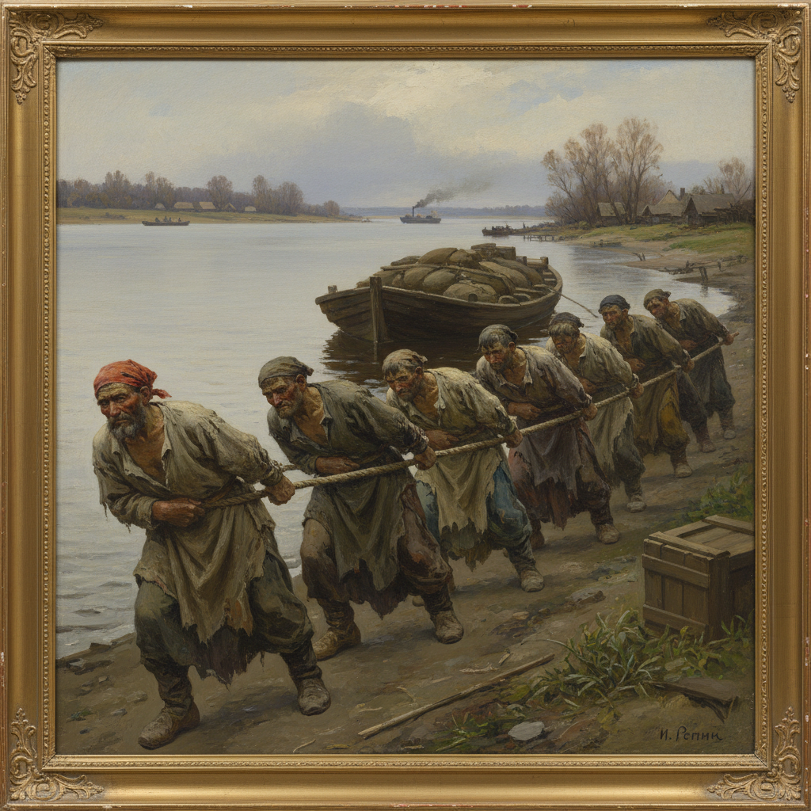

# Russian Realism Art 俄罗斯现实主义艺术

> "The artist is not a decorator of life, but its witness and judge." — Ilya Repin

## 概述

俄罗斯现实主义艺术（Russian Realism Art）是19世纪下半叶俄罗斯发展的以忠实反映社会现实为核心的艺术传统。俄罗斯现实主义是世界现实主义艺术中最深刻、最具社会批判力的流派之一——它不仅追求视觉上的真实，更追求对社会本质的揭示和对人民命运的关注。

俄罗斯现实主义的兴起有着深刻的社会背景——19世纪中叶的俄罗斯正经历着从农奴制向资本主义的痛苦转型，社会矛盾尖锐，知识分子普遍关注"人民的命运"这一核心问题。在文学领域，托尔斯泰、陀思妥耶夫斯基、契诃夫等作家创造了伟大的现实主义文学；在绘画领域，列宾、苏里科夫、克拉姆斯柯依等画家则以画笔记录和批判社会现实。俄罗斯现实主义绘画的核心人物是伊利亚·列宾——他的《伏尔加河上的纤夫》《意外归来》《查波罗什人写信给土耳其苏丹》等作品是世界现实主义绘画的巅峰之作。

俄罗斯现实主义艺术的核心要素包括：1）社会批判——揭示社会不公和人民苦难；2）人物刻画——深刻的人物心理描写；3）历史题材——俄罗斯历史的戏剧性表现；4）民族意识——强烈的民族自觉和文化认同；5）叙事性——绘画的文学性和叙事性；6）技术精湛——高超的写实绘画技巧；7）人道主义——对人的尊严和命运的关注。

## 核心特征

| 特征 | 描述 |
|------|------|
| 社会批判 | 揭示社会不公人民苦难 |
| 人物刻画 | 深刻人物心理描写 |
| 历史题材 | 俄罗斯历史戏剧性表现 |
| 民族意识 | 强烈民族自觉文化认同 |
| 叙事性 | 绘画文学性叙事性 |
| 人道主义 | 对人尊严命运的关注 |

## 视觉特征

- **人物群像**：多人物的复杂构图
- **表情刻画**：深刻的面部表情
- **戏剧性光线**：强调情感的光线处理
- **历史场景**：宏大的历史场景
- **日常生活**：普通人的日常生活
- **心理深度**：人物内心世界的揭示

## 代表作品

| 作品 | 画家 | 意义 |
|------|------|------|
| *伏尔加河上的纤夫* | 列宾 | 社会批判巅峰 |
| *意外归来* | 列宾 | 心理描写 |
| *女贵族莫洛佐娃* | 苏里科夫 | 历史画巨制 |
| *无名女郎* | 克拉姆斯柯依 | 肖像经典 |
| *战争的残酷* | 韦列夏金 | 反战主题 |
| *三勇士* | 瓦斯涅佐夫 | 民族史诗 |

## 历史时间线

| 时期 | 事件 |
|------|------|
| 1860年代 | 现实主义思潮兴起 |
| 1863年 | "十四人事件" |
| 1870年代 | 巡回派成立，现实主义确立 |
| 1880年代 | 黄金时代 |
| 1890年代 | 新一代现实主义画家 |
| 20世纪初 | 现代主义挑战 |
| 1930年代 | 演变为社会主义现实主义 |

## 中国语境

俄罗斯现实主义对中国美术的影响是全方位的、深层次的。20世纪50年代，中国全面引入苏联美术教育体系——俄罗斯现实主义的创作方法、教学体系和艺术观念成为中国美术的主导范式。"艺术为人民服务""反映社会现实""深入生活"等理念直接来源于俄罗斯现实主义传统。中国的"伤痕美术""乡土写实""新写实主义"等艺术潮流都可以追溯到俄罗斯现实主义的影响。列宾的人物画技法、苏里科夫的历史画构图、克拉姆斯柯依的肖像画心理刻画——这些俄罗斯现实主义大师的技术和理念至今仍是中国美术教育的重要组成部分。当代中国写实绘画虽然已经融入了更多元的影响，但俄罗斯现实主义的基因仍然清晰可辨。

## 概念图

## 与其他风格的关系

- **Peredvizhniki** → 巡回展览画派（组织形式）
- **Repin** → 列宾（核心人物）
- **French Realism** → 法国现实主义（库尔贝）
- **Socialist Realism** → 社会主义现实主义（后续）
- **Critical Realism** → 批判现实主义（文学平行）
- **Chinese Realism** → 中国写实主义（受其影响）

---

*浮光艺志 | Chronicle of Artistry*
