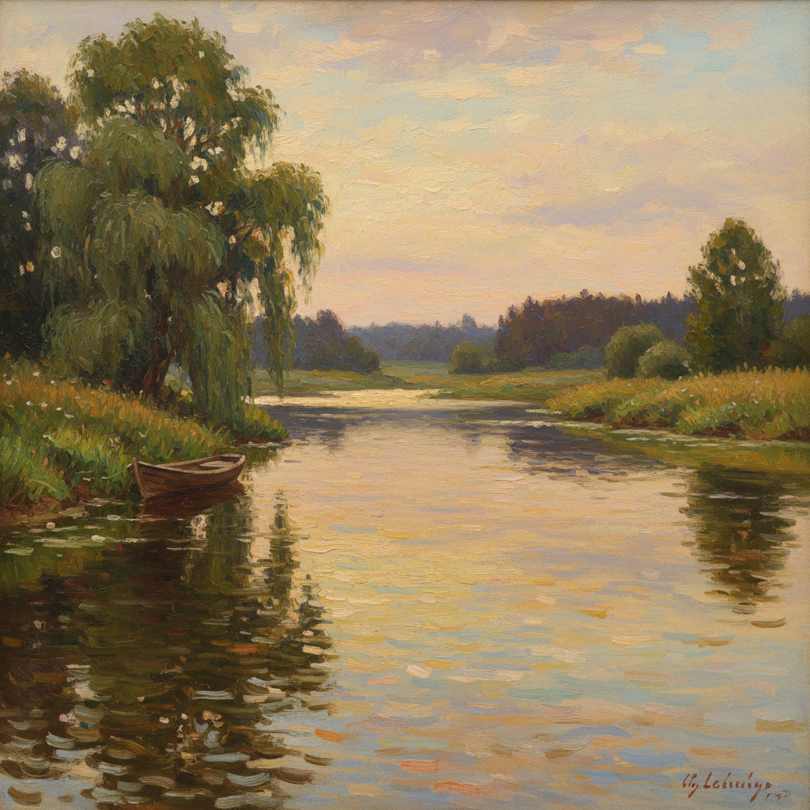

# 俄罗斯河流绘画 · Russian River Painting Art

> "伏尔加河不仅是一条河流，它是俄罗斯的命运之河。" —— 伊利亚·列宾

## 概述

俄罗斯河流绘画（Russian River Painting Art）是俄罗斯风景画中以河流为核心主题的绘画传统。俄罗斯的河流——伏尔加河、第聂伯河、奥卡河、莫斯科河——不仅是地理景观，更是民族历史和精神生活的载体。从列维坦在伏尔加河畔创作的一系列抒情杰作，到库因芝对第聂伯河月光的戏剧性表现，再到波列诺夫沿奥卡河的温暖写生，河流主题承载了俄罗斯画家对时间流逝、生命无常和自然永恒的深层思考。

## 核心特征

| 特征 | 描述 |
|------|------|
| 时期 | 1870s–1910s |
| 地域 | 伏尔加河、第聂伯河、奥卡河、涅瓦河流域 |
| 媒介 | 油画 |
| 核心理念 | 以河流为镜映照天空、时间与民族命运 |
| 色彩 | 银灰（水面）、深蓝（倒影）、金色（日落反光）、翠绿（河岸） |

## 视觉特征

- **水面反射**：河面如镜，映照天空和岸边景物
- **水平构图**：河流的水平线条营造宁静与开阔
- **晨昏时刻**：日出日落时河面的色彩变化最为丰富
- **蜿蜒曲线**：河流的弯曲引导视线深入画面
- **雾气效果**：河面蒸腾的薄雾增添神秘感
- **岸边生活**：渡船、码头、钓鱼人作为人文点缀

## 代表作品

| 作品 | 作者 | 年代 | 特点 |
|------|------|------|------|
| 《第聂伯河上的月夜》 | 库因芝 | 1880 | 月光河面的戏剧性 |
| 《伏尔加河上》 | 列维坦 | 1889 | 暮色中的伏尔加 |
| 《永恒的宁静》 | 列维坦 | 1894 | 河畔的哲学沉思 |
| 《奥卡河畔》 | 波列诺夫 | 1890s | 温暖的河岸风光 |
| 《伏尔加河上的纤夫》 | 列宾 | 1873 | 河流与人的命运 |

## 发展时间线

| 时期 | 事件 |
|------|------|
| 1870s | 巡回展览画派画家开始沿伏尔加河写生旅行 |
| 1873 | 列宾《伏尔加河上的纤夫》将河流与社会批判结合 |
| 1880 | 库因芝《第聂伯河上的月夜》以光影实验轰动画坛 |
| 1880s | 波列诺夫定居奥卡河畔，系统描绘河流四季 |
| 1888-1890 | 列维坦在伏尔加河畔普廖斯创作系列杰作 |
| 1890s | 河流主题在列维坦手中达到哲学化深度 |
| 1900s | 河流风景融入俄罗斯印象主义和象征主义 |

## 中国语境

俄罗斯河流绘画与中国山水画中的"水"主题有深层共鸣。中国画家描绘长江、黄河时，在精神层面与俄罗斯画家描绘伏尔加河有相似的民族情感投射。1950年代以来，中国油画家借鉴俄罗斯河流画的构图和光色处理方法，创作了大量以中国河流为主题的风景画。颜文樑的苏州河系列、吴冠中的江南水乡，都在不同程度上受到俄罗斯河流绘画传统的影响。

## AI 概念图

*AI 生成概念图：俄罗斯河流绘画风格*

## 关联词条

- [[levitan-art]] - 列维坦艺术
- [[kuindzhi-art]] - 库因芝艺术
- [[polenov-art]] - 波列诺夫艺术
- [[russian-landscape-art]] - 俄罗斯风景画
- [[russian-pastoral-art]] - 俄罗斯田园风景画

---

*浮光艺志 · Chronicle of Artistry*
