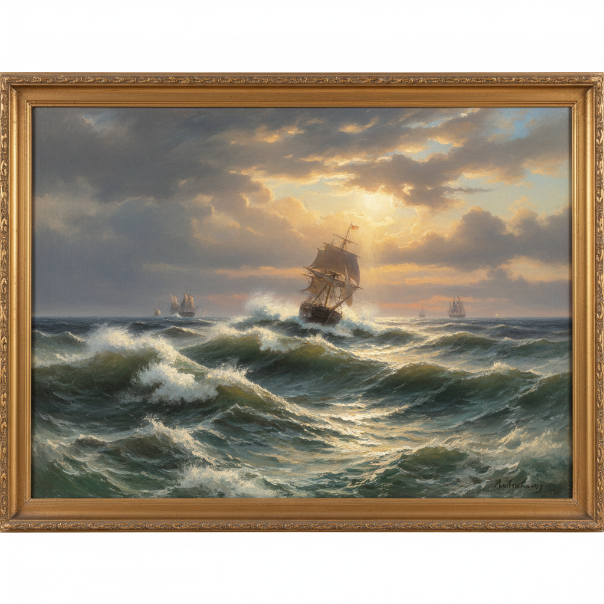

# Russian Romanticism Art 俄罗斯浪漫主义艺术

> "The artist's soul is a mirror of the infinite — in nature, in history, in the depths of human passion." — Russian Romantic tradition

## 概述

俄罗斯浪漫主义艺术（Russian Romanticism Art）是19世纪上半叶俄罗斯发展的一种强调个人情感、自然崇高和民族精神的艺术运动。俄罗斯浪漫主义是欧洲浪漫主义运动的重要组成部分——它将西欧浪漫主义的理念与俄罗斯独特的文化传统和自然环境相结合，创造了具有鲜明俄罗斯特色的浪漫主义艺术。

俄罗斯浪漫主义的兴起与1812年卫国战争密切相关——拿破仑入侵后俄罗斯民族意识的觉醒为浪漫主义提供了精神土壤。在绘画领域，浪漫主义的代表包括奥列斯特·基普连斯基（Kiprensky）的肖像画、西尔维斯特·谢德林（Shchedrin）的意大利风景、伊万·艾瓦佐夫斯基（Aivazovsky）的海景画等。艾瓦佐夫斯基是俄罗斯浪漫主义最著名的代表——他的海景画以其对光线、波浪和风暴的戏剧性表现闻名于世。

俄罗斯浪漫主义艺术的核心要素包括：1）自然崇高——对自然力量的崇拜和敬畏；2）个人情感——强调个人的内心世界；3）民族觉醒——1812年后的民族意识；4）异国情调——对高加索、克里米亚等地的浪漫化；5）英雄主义——对英雄人物的崇拜；6）文学联系——与普希金、莱蒙托夫的紧密联系；7）光影戏剧——戏剧性的光影效果。

## 核心特征

| 特征 | 描述 |
|------|------|
| 自然崇高 | 对自然力量崇拜敬畏 |
| 个人情感 | 强调个人内心世界 |
| 民族觉醒 | 1812年后民族意识 |
| 异国情调 | 高加索克里米亚浪漫化 |
| 英雄主义 | 对英雄人物崇拜 |
| 光影戏剧 | 戏剧性光影效果 |

## 视觉特征

- **戏剧光线**：强烈的明暗对比和光影效果
- **壮阔自然**：暴风雨、大海、山脉的壮阔
- **情感肖像**：充满内心世界的肖像画
- **异国风景**：高加索、意大利的异国风景
- **动态构图**：充满运动和张力的构图
- **温暖色调**：金色和暖色调的运用

## 代表作品

| 作品 | 画家 | 意义 |
|------|------|------|
| *第九浪* | 艾瓦佐夫斯基 | 海景画巅峰 |
| *普希金肖像* | 基普连斯基 | 浪漫肖像 |
| *意大利风景* | 谢德林 | 风景浪漫 |
| *庞贝城的末日* | 布留洛夫 | 历史浪漫 |
| *高加索风景* | 莱蒙托夫 | 文人画 |
| *暴风雨中的船* | 艾瓦佐夫斯基 | 自然崇高 |

## 历史时间线

| 时期 | 事件 |
|------|------|
| 1812年 | 卫国战争，民族意识觉醒 |
| 1820年代 | 浪漫主义在俄罗斯兴起 |
| 1830年代 | 布留洛夫、基普连斯基活跃 |
| 1840年代 | 艾瓦佐夫斯基海景画 |
| 1850年代 | 浪漫主义向现实主义过渡 |
| 1860年代 | 现实主义取代浪漫主义 |

## 中国语境

俄罗斯浪漫主义对中国美术的直接影响相对有限——中国在20世纪50年代主要学习的是俄罗斯现实主义而非浪漫主义。但艾瓦佐夫斯基的海景画在中国有着广泛的知名度和影响力——他对光线和水的表现技巧被许多中国画家所学习。俄罗斯浪漫主义的"民族觉醒"主题与中国近现代美术中的民族主义情感有着深层的共鸣——两国都经历了从模仿西方到寻找民族特色的艺术发展过程。中国"革命浪漫主义"的概念——虽然与欧洲浪漫主义有本质区别——在某种程度上也继承了浪漫主义对英雄主义和崇高感的追求。

## 概念图

## 与其他风格的关系

- **Aivazovsky** → 艾瓦佐夫斯基（海景大师）
- **European Romanticism** → 欧洲浪漫主义（母运动）
- **Russian Academic** → 俄罗斯学院派（体制背景）
- **Peredvizhniki** → 巡回展览画派（后续发展）
- **Pushkin** → 普希金（文学联系）
- **Turner** → 透纳（英国平行）

---

*浮光艺志 | Chronicle of Artistry*
