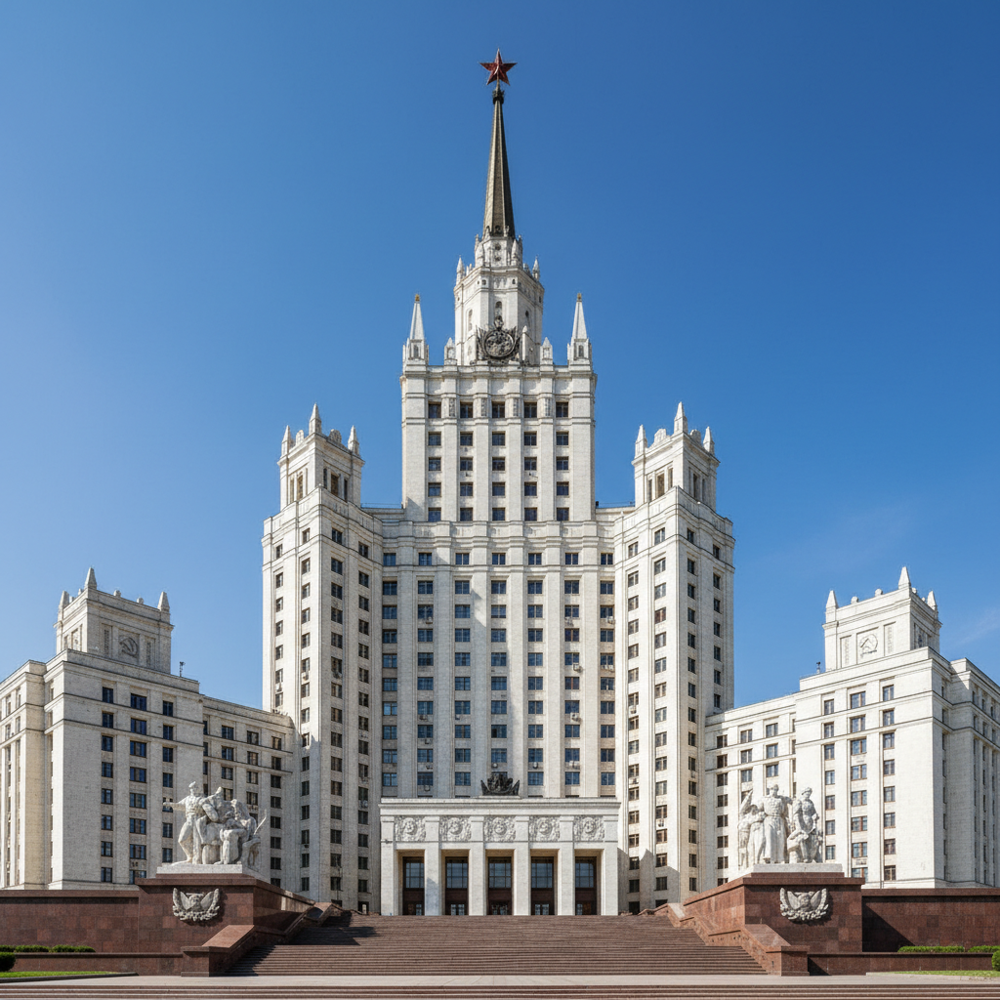

# 俄罗斯社会主义古典主义 · Russian Socialist Classicism Art

> "我们建造的不是房屋，而是新世界的纪念碑。" —— 鲍里斯·约凡

## 概述

俄罗斯社会主义古典主义（Socialist Classicism / Сталинский ампир），又称"斯大林帝国风格"，是1930年代至1950年代苏联官方建筑与视觉艺术的主导风格。它将古典主义的对称、柱式、纪念碑性与社会主义意识形态的宏大叙事相结合，以莫斯科"七姐妹"高层建筑、全苏农业展览馆和莫斯科地铁为代表，创造了一种帝国式的社会主义美学——既要超越资本主义的摩天大楼，又要继承人类古典文明的遗产。

## 核心特征

| 特征 | 描述 |
|------|------|
| 时期 | 1932年–1955年 |
| 地域 | 莫斯科、列宁格勒、各加盟共和国首都 |
| 媒介 | 建筑、雕塑、壁画、室内装饰 |
| 核心理念 | 以古典形式表达社会主义的永恒性与优越性 |
| 色彩 | 白色大理石、金色装饰、深红花岗岩 |

## 视觉特征

- **巨型柱式**：科林斯柱、爱奥尼柱的超大尺度应用
- **塔楼尖顶**：哥特式垂直感与古典水平感的融合
- **浮雕叙事**：建筑外墙大量社会主义主题浮雕
- **对称轴线**：严格的中轴对称和仪式性空间序列
- **材料奢华**：大理石、花岗岩、青铜、马赛克的大量使用

## 代表作品

| 作品 | 建筑师 | 年代 | 类型 |
|------|--------|------|------|
| 莫斯科大学主楼 | 鲁德涅夫 | 1949-1953 | 高层建筑 |
| 苏维埃宫设计（未建成） | 约凡 | 1933 | 建筑方案 |
| 全苏农业展览馆 | 多位建筑师 | 1939/1954 | 展览建筑群 |
| 莫斯科地铁环线站 | 多位建筑师 | 1950-1954 | 地下建筑 |
| 华沙文化科学宫 | 鲁德涅夫 | 1952-1955 | 高层建筑 |

## 发展时间线

| 时期 | 事件 |
|------|------|
| 1931 | 苏维埃宫国际竞赛，古典方案获胜 |
| 1932 | 苏联建筑师联盟成立，构成主义被否定 |
| 1934 | 社会主义现实主义确立为文艺总方针 |
| 1935 | 莫斯科总体规划，大规模古典主义改造 |
| 1947-1957 | "七姐妹"高层建筑群建成 |
| 1954 | 全苏农业展览馆重建完成 |
| 1955 | 赫鲁晓夫发布"消除建筑中的浪费"法令 |
| 1955后 | 社会主义古典主义被现代主义取代 |

## 中国语境

社会主义古典主义对中国建筑影响极为直接。1950年代"一五计划"期间，苏联专家直接参与了北京、上海等城市的重要建筑设计。北京展览馆（1954）、上海中苏友好大厦（1955）是典型的斯大林帝国风格建筑。"十大建筑"（1959）虽已开始探索民族形式，但在体量感、对称性和纪念碑性上仍深受社会主义古典主义影响。哈尔滨、长春、大连等城市保留了大量这一时期的苏式建筑。

## AI 概念图

*AI 生成概念图：俄罗斯社会主义古典主义风格*

## 关联词条

- [[russian-art-deco]] - 俄罗斯装饰艺术
- [[russian-neoclassicism-art]] - 俄罗斯新古典主义
- [[russian-baroque-art]] - 俄罗斯巴洛克艺术
- [[severe-style-art]] - 严厉风格

---

*浮光艺志 · Chronicle of Artistry*
