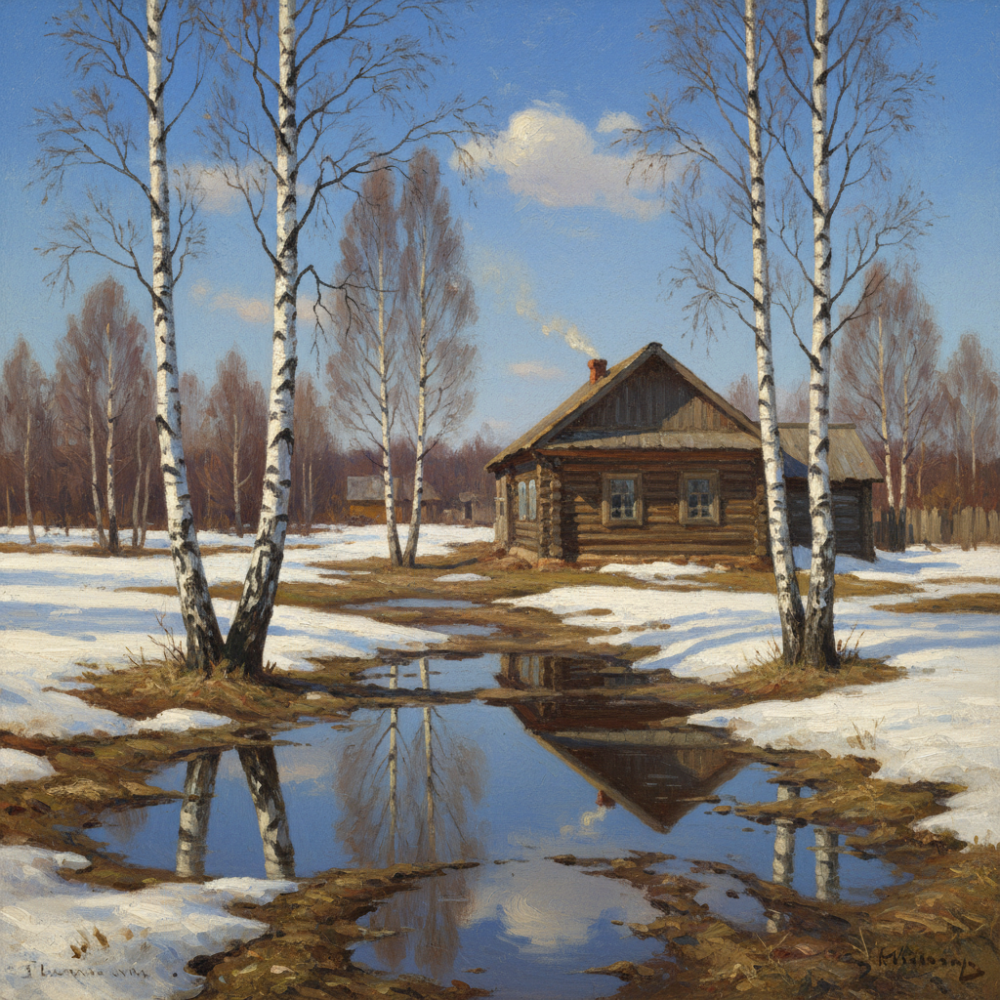

# 俄罗斯春景绘画 · Russian Spring Art

> "春天来了——白嘴鸦飞来了，冰雪在融化，大地在苏醒。" —— 阿列克谢·萨夫拉索夫

## 概述

俄罗斯春景绘画（Russian Spring Art）是俄罗斯风景画中以早春融雪、万物复苏为主题的绘画传统。在漫长严冬之后，俄罗斯的春天具有特殊的情感力量——冰雪消融、溪流奔涌、白嘴鸦归来、第一抹新绿，这些微妙的变化被俄罗斯画家赋予了深刻的象征意义。萨夫拉索夫的《白嘴鸦飞来了》（1871）是俄罗斯春景画的奠基之作，列维坦的《三月》和《春·大水》则将春天的光色表现推向了巅峰。

## 核心特征

| 特征 | 描述 |
|------|------|
| 时期 | 1870s–1910s |
| 地域 | 俄罗斯中部、莫斯科郊外 |
| 媒介 | 油画 |
| 核心理念 | 以春天的苏醒表达希望、新生与生命力 |
| 色彩 | 淡蓝（天空）、银白（残雪）、嫩绿（新芽）、褐色（湿土） |

## 视觉特征

- **融雪质感**：半融化的雪呈现灰白色，露出褐色泥土
- **春水泛滥**：河流涨水淹没低洼地带的独特景观
- **明亮天空**：春日天空的清澈蓝色与冬日灰色形成对比
- **裸露树枝**：尚未发芽的树枝在蓝天下的精致剪影
- **温暖阳光**：春日阳光在雪面和墙壁上的暖色反射
- **生命迹象**：归来的候鸟、冒出的嫩芽、流动的溪水

## 代表作品

| 作品 | 作者 | 年代 | 特点 |
|------|------|------|------|
| 《白嘴鸦飞来了》 | 萨夫拉索夫 | 1871 | 俄罗斯春景画的奠基作 |
| 《三月》 | 列维坦 | 1895 | 早春阳光的温暖 |
| 《春·大水》 | 列维坦 | 1897 | 春水泛滥的诗意 |
| 《早春》 | 萨夫拉索夫 | 1880s | 融雪中的乡村 |
| 《春天的最后一场雪》 | 库因芝 | 1890s | 春雪的光色实验 |

## 发展时间线

| 时期 | 事件 |
|------|------|
| 1871 | 萨夫拉索夫《白嘴鸦飞来了》开创俄罗斯抒情春景画 |
| 1880s | 萨夫拉索夫在莫斯科绘画学校培养学生关注季节变化 |
| 1890s | 列维坦继承师传，将春景推向更高的艺术境界 |
| 1895 | 列维坦《三月》以外光写生捕捉早春光色 |
| 1897 | 《春·大水》成为俄罗斯春景画的巅峰之作 |
| 1900s | 春景主题融入俄罗斯印象主义 |

## 中国语境

春天在中国文化中是最重要的季节意象——"春风又绿江南岸""忽如一夜春风来"。俄罗斯春景画对中国油画家描绘北方早春有直接影响。萨夫拉索夫式的融雪乡村、列维坦式的春水泛滥，在中国东北和华北的早春风景画中都能找到回响。中国美术院校的春季外光写生课程，在方法论上仍以俄罗斯传统为基础——关注融雪的色彩变化、春日光线的温暖质感。

## AI 概念图

*AI 生成概念图：俄罗斯春景绘画风格*

## 关联词条

- [[savrasov-art]] - 萨夫拉索夫艺术
- [[levitan-art]] - 列维坦艺术
- [[russian-landscape-art]] - 俄罗斯风景画
- [[russian-plein-air-art]] - 俄罗斯外光派
- [[russian-winter-landscape-art]] - 俄罗斯冬景绘画

---

*浮光艺志 · Chronicle of Artistry*
