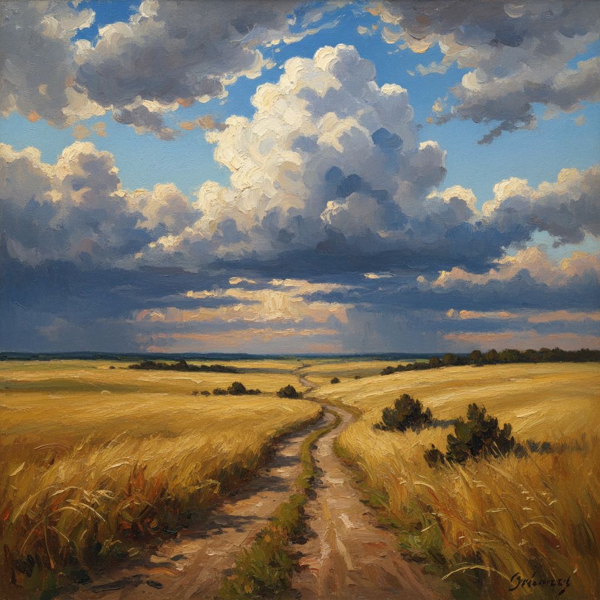

# 俄罗斯草原绘画 · Russian Steppe Art

> "草原是俄罗斯的呼吸——无边无际，自由而忧郁。" —— 安东·契诃夫

## 概述

俄罗斯草原绘画（Russian Steppe Art）是俄罗斯风景画中以南俄草原、乌克兰平原和中亚旷野为主题的绘画传统。草原（Steppe）是俄罗斯文化中自由、孤独和无限的象征——从库因芝笔下乌克兰草原上戏剧性的月光，到列维坦伏尔加河畔的苍茫旷野，再到阿尔希普·库因芝学生们对南方阳光的追寻，草原题材承载了俄罗斯人对广袤空间的独特情感体验。

## 核心特征

| 特征 | 描述 |
|------|------|
| 时期 | 1870s–1910s |
| 地域 | 南俄、乌克兰、顿河流域、中亚 |
| 媒介 | 油画 |
| 核心理念 | 以无垠平原表达自由、孤独与崇高 |
| 色彩 | 金黄（干草）、翠绿（春草）、深蓝（天穹）、赭红（泥土） |

## 视觉特征

- **极低地平线**：地平线压至画面下三分之一，天空占据主导
- **无限延伸感**：没有遮挡物的视线一直延伸到天际
- **戏剧性天空**：巨大的云团、雷暴、日落成为主角
- **孤独元素**：单独的旅人、马车、坟冢（库尔干）点缀旷野
- **色彩对比**：大面积单色草地与天空的强烈色调对比
- **风的痕迹**：弯曲的草浪暗示看不见的风

## 代表作品

| 作品 | 作者 | 年代 | 特点 |
|------|------|------|------|
| 《乌克兰之夜》 | 库因芝 | 1876 | 月光下的草原村庄 |
| 《第聂伯河上的月夜》 | 库因芝 | 1880 | 草原河流的月光 |
| 《弗拉基米尔大道》 | 列维坦 | 1892 | 荒凉草原上的流放之路 |
| 《黑麦田》 | 希施金 | 1878 | 金色麦浪的壮阔 |
| 《草原上的雷雨》 | 瓦西里耶夫 | 1870 | 暴风雨前的紧张 |

## 发展时间线

| 时期 | 事件 |
|------|------|
| 1870s | 库因芝开始描绘乌克兰草原的戏剧性光影 |
| 1878 | 希施金《黑麦田》将草原提升为民族象征 |
| 1880 | 库因芝《第聂伯河上的月夜》轰动彼得堡 |
| 1890s | 列维坦赋予草原以哲学性的孤独感 |
| 1900s | 库因芝学生群体继续南方草原光色探索 |
| 苏联时期 | 草原开垦题材成为社会主义现实主义主题 |

## 中国语境

俄罗斯草原画与中国西北、内蒙古的草原风景画有天然的共鸣。中国画家描绘呼伦贝尔、新疆草原时，常借鉴俄罗斯草原画的构图方式——低地平线、大面积天空、孤独的点景元素。妥木斯等蒙古族画家的草原油画，在精神气质上与库因芝的乌克兰草原有深层的相通。当代中国草原题材绘画在保持民族特色的同时，仍以俄罗斯传统为重要的技法参照。

## AI 概念图

*AI 生成概念图：俄罗斯草原绘画风格*

## 关联词条

- [[kuindzhi-art]] - 库因芝艺术
- [[levitan-art]] - 列维坦艺术
- [[shishkin-art]] - 希施金艺术
- [[russian-landscape-art]] - 俄罗斯风景画
- [[russian-pastoral-art]] - 俄罗斯田园风景画

---

*浮光艺志 · Chronicle of Artistry*
