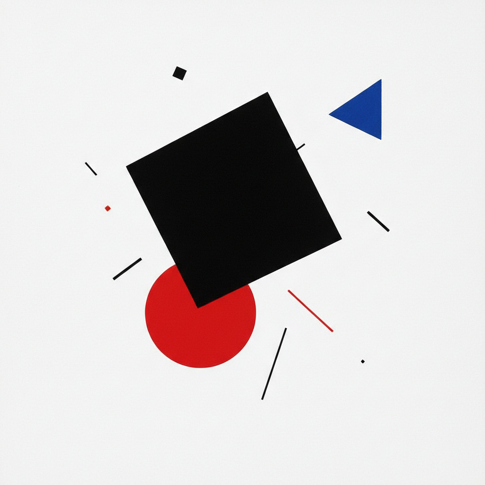

# 俄罗斯至上主义 · Russian Suprematism Art

> "在至上主义的无限白色中，我看见了世界的自由。" —— 卡西米尔·马列维奇

## 概述

至上主义（Suprematism / Супрематизм）是1915年由卡西米尔·马列维奇在俄罗斯创立的抽象艺术运动，是20世纪最激进的视觉革命之一。马列维奇宣称"纯粹的感觉"高于一切物质再现，以最基本的几何形——方形、圆形、十字形——和有限的色彩（黑、白、红、蓝、黄）构建一个超越物质世界的精神宇宙。至上主义深刻影响了包豪斯、荷兰风格派和整个现代设计体系。

## 核心特征

| 特征 | 描述 |
|------|------|
| 时期 | 1915年–1930年代 |
| 地域 | 彼得格勒（圣彼得堡）、莫斯科、维捷布斯克 |
| 媒介 | 油画、版画、建筑模型、陶瓷、纺织 |
| 核心理念 | 纯粹感觉的至上性，超越物质再现 |
| 色彩 | 黑、白、红为核心，辅以蓝、黄、绿 |

## 视觉特征

- **基本几何形**：方形、圆形、三角形、十字形作为唯一元素
- **白色空间**：白色背景代表无限的宇宙空间
- **动态平衡**：几何形在画面中呈现漂浮、旋转的动势
- **极简色彩**：严格限制色彩数量，追求纯粹的视觉冲击
- **无重力感**：摆脱地平线和透视法，创造失重的精神空间

## 代表作品

| 作品 | 艺术家 | 年代 | 类型 |
|------|--------|------|------|
| 《黑色方块》 | 马列维奇 | 1915 | 油画 |
| 《白上白》 | 马列维奇 | 1918 | 油画 |
| 《至上主义构图》 | 马列维奇 | 1916 | 油画 |
| 《红色方块》 | 马列维奇 | 1915 | 油画 |
| 至上主义茶壶设计 | 苏耶金 | 1923 | 陶瓷 |

## 发展时间线

| 时期 | 事件 |
|------|------|
| 1913 | 马列维奇为歌剧《战胜太阳》设计布景，萌芽期 |
| 1915 | "0.10最后的未来主义展览"，《黑色方块》首次展出 |
| 1916 | 马列维奇发表至上主义宣言 |
| 1919 | 马列维奇在维捷布斯克建立UNOVIS团体 |
| 1920s | 至上主义向建筑和设计领域扩展 |
| 1927 | 马列维奇访问包豪斯，影响西方现代设计 |
| 1930s | 斯大林时期至上主义被压制，马列维奇被迫回归具象 |
| 1935 | 马列维奇去世 |

## 中国语境

至上主义对中国当代艺术和设计的影响主要通过包豪斯和现代主义设计教育间接传入。1980年代中国美术学院引入现代设计教育后，马列维奇的几何抽象成为基础设计课程的重要参考。丁乙的"十示"系列（1988-至今）在方法论上与至上主义的几何纯粹性有对话关系。中国当代建筑中的极简主义倾向也可追溯到至上主义的精神源头。

## AI 概念图

*AI 生成概念图：俄罗斯至上主义风格*

## 关联词条

- [[russian-avant-garde-art]] - 俄罗斯先锋派
- [[russian-constructivism-art]] - 俄罗斯构成主义
- [[russian-futurism-art]] - 俄罗斯未来主义
- [[moscow-conceptualism-art]] - 莫斯科概念主义

---

*浮光艺志 · Chronicle of Artistry*
