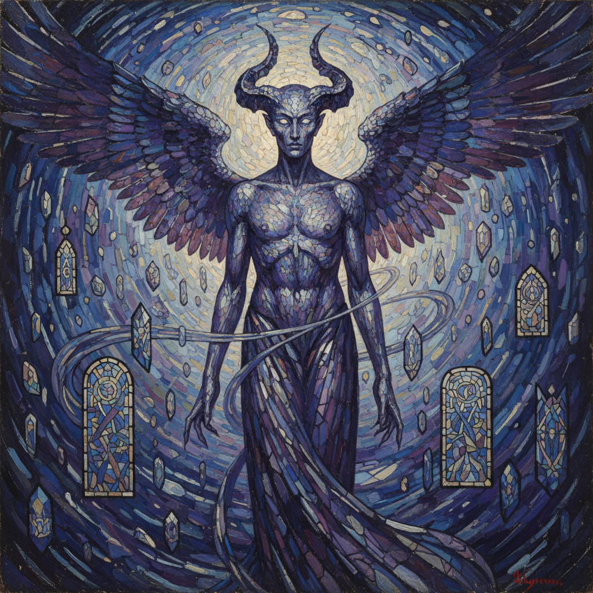

# Russian Symbolism Art 俄罗斯象征主义艺术

> "Art is not a mirror held up to reality, but a hammer with which to shape it — through dream, myth, and mystery." — Russian Symbolist tradition

## 概述

俄罗斯象征主义艺术（Russian Symbolism Art）是19世纪末至20世纪初俄罗斯发展的一种追求精神超越和神秘体验的艺术运动。俄罗斯象征主义是欧洲象征主义运动中最具精神深度和哲学野心的分支——它不仅追求美学上的创新，更试图通过艺术达到一种宗教般的精神启示。

俄罗斯象征主义的核心人物是米哈伊尔·弗鲁贝尔（Mikhail Vrubel, 1856-1910）——他的作品融合了拜占庭镶嵌画的装饰性、新艺术运动的流动线条和深邃的精神象征，创造了一种独特的视觉语言。弗鲁贝尔的《恶魔》系列是俄罗斯象征主义的巅峰之作——将莱蒙托夫的文学形象转化为令人震撼的视觉体验。其他重要的象征主义画家包括维克托·鲍里索夫-穆萨托夫（Borisov-Musatov）、库兹马·彼得罗夫-沃德金（Petrov-Vodkin）等。

俄罗斯象征主义艺术的核心要素包括：1）精神超越——追求超越物质世界的精神体验；2）神话与梦——以神话、梦境和幻想为题材；3）装饰性——强烈的装饰性和平面化倾向；4）色彩象征——色彩的象征性和情感性使用；5）文学联系——与象征主义文学的紧密联系；6）宗教哲学——与俄罗斯宗教哲学的深层联系；7）过渡性——从现实主义到先锋派的过渡。

## 核心特征

| 特征 | 描述 |
|------|------|
| 精神超越 | 追求超越物质世界精神体验 |
| 神话与梦 | 神话梦境幻想为题材 |
| 装饰性 | 强烈装饰性平面化倾向 |
| 色彩象征 | 色彩象征性情感性使用 |
| 文学联系 | 与象征主义文学紧密联系 |
| 宗教哲学 | 与俄罗斯宗教哲学深层联系 |

## 视觉特征

- **碎片化笔触**：如镶嵌画般的碎片化笔触
- **紫蓝色调**：神秘的紫色和蓝色主调
- **装饰线条**：新艺术运动风格的流动线条
- **梦幻氛围**：朦胧、梦幻的画面氛围
- **神话形象**：恶魔、天使、精灵等形象
- **平面化空间**：压缩的、装饰性的空间

## 代表作品

| 作品 | 画家 | 意义 |
|------|------|------|
| *坐着的恶魔* | 弗鲁贝尔 | 象征主义巅峰 |
| *天鹅公主* | 弗鲁贝尔 | 神话题材 |
| *水池* | 鲍里索夫-穆萨托夫 | 怀旧象征 |
| *沐浴红马* | 彼得罗夫-沃德金 | 色彩象征 |
| *六翼天使* | 弗鲁贝尔 | 宗教象征 |
| *丁香花* | 弗鲁贝尔 | 自然象征 |

## 历史时间线

| 时期 | 事件 |
|------|------|
| 1880年代 | 弗鲁贝尔开始创作 |
| 1890年代 | 象征主义文学运动兴起 |
| 1890-1900年代 | 弗鲁贝尔恶魔系列 |
| 1898年 | "艺术世界"杂志创刊 |
| 1900年代 | 蓝玫瑰画派 |
| 1910年代 | 向先锋派过渡 |

## 中国语境

俄罗斯象征主义对中国美术的直接影响相对有限——因为中国在20世纪50年代主要学习的是俄罗斯现实主义传统。但弗鲁贝尔的作品在中国美术界有着重要的学术影响——他的装饰性绘画语言和精神深度被许多中国画家所欣赏。俄罗斯象征主义追求的"精神超越"与中国传统绘画中的"意境"概念有着深层的共鸣——两者都不满足于对物质世界的客观再现，而是追求通过艺术达到精神的升华。弗鲁贝尔的碎片化笔触与中国画中的"皴法"在视觉效果上有某种相似性——都通过碎片化的笔触构建整体的视觉效果。当代中国艺术中的"新象征主义"倾向也可以在俄罗斯象征主义中找到某种精神上的先驱。

## 概念图

## 与其他风格的关系

- **Vrubel** → 弗鲁贝尔（核心人物）
- **French Symbolism** → 法国象征主义（平行运动）
- **Art Nouveau** → 新艺术运动（装饰性）
- **Russian Icon** → 俄罗斯圣像画（精神传统）
- **World of Art** → 艺术世界（相关运动）
- **Russian Avant-Garde** → 俄罗斯先锋派（后续发展）

---

*浮光艺志 | Chronicle of Artistry*
