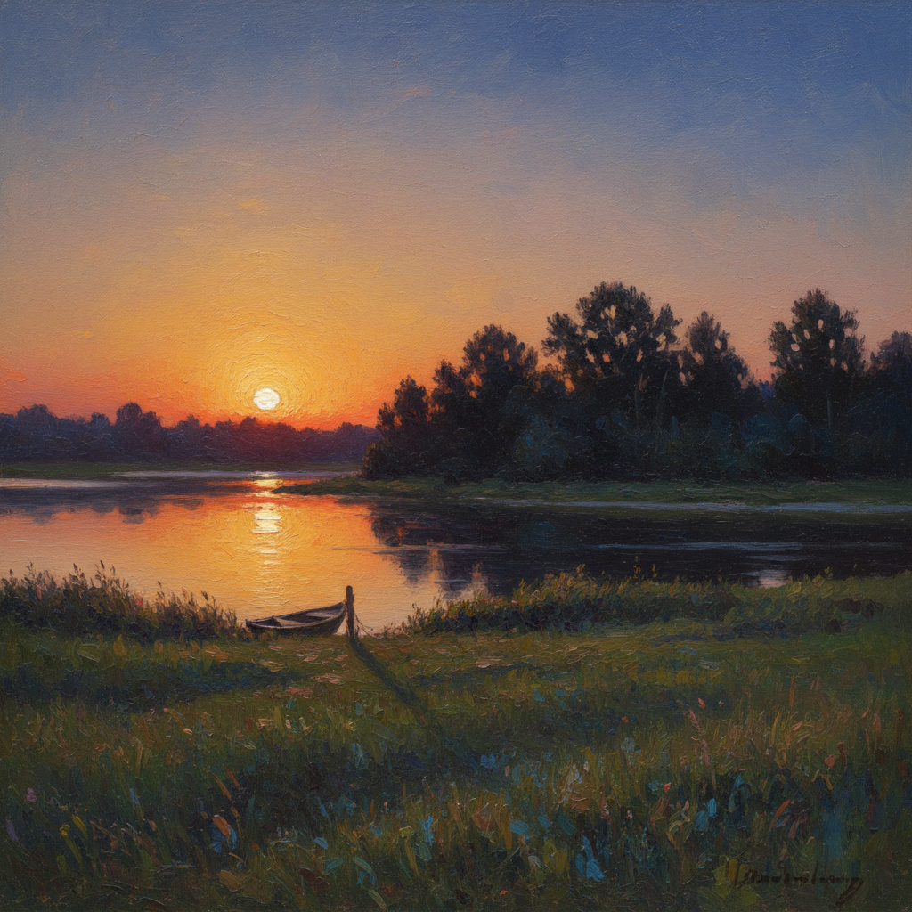

# 俄罗斯黄昏绘画 · Russian Twilight Art

> "黄昏是大自然最深沉的告白——在光与暗之间，一切都变得柔软而忧伤。" —— 伊萨克·列维坦

## 概述

俄罗斯黄昏绘画（Russian Twilight Art）是俄罗斯风景画中以日落、暮色和黄昏时分为核心表现对象的绘画传统。黄昏在俄罗斯文化中具有特殊的情感重量——漫长的北方黄昏、伏尔加河上的落日、秋天傍晚的忧郁，都是俄罗斯画家反复描绘的主题。列维坦是黄昏绘画的最高代表，他笔下的暮色不仅是光线现象，更是对生命短暂和永恒宁静的哲学沉思。库因芝则以其标志性的戏剧性日落和月升时刻，将黄昏推向崇高美学的极致。

## 核心特征

| 特征 | 描述 |
|------|------|
| 时期 | 1870s–1910s |
| 地域 | 俄罗斯全境（尤以伏尔加河畔和南方为多） |
| 媒介 | 油画 |
| 核心理念 | 以黄昏时刻表达时间流逝、生命无常与永恒宁静 |
| 色彩 | 金橙、玫瑰紫、深蓝、暗绿、银灰 |

## 视觉特征

- **色彩渐变**：从暖色地平线到冷色天顶的微妙过渡
- **剪影效果**：树木、建筑在暮色中化为深色剪影
- **水面映照**：河面或湖面反射天空的暖色
- **长影投射**：低角度阳光投射的长长暗影
- **大气层次**：黄昏时空气中的微粒使远景变得朦胧
- **情绪渲染**：黄昏的忧郁感与俄罗斯文学中的"тоска"（忧愁）相呼应

## 代表作品

| 作品 | 作者 | 年代 | 特点 |
|------|------|------|------|
| 《暮色·干草垛》 | 列维坦 | 1899 | 暮色中的宁静田野 |
| 《傍晚的钟声》 | 列维坦 | 1892 | 黄昏中的修道院 |
| 《红色日落》 | 库因芝 | 1905-08 | 戏剧性的日落色彩 |
| 《黄昏》 | 萨夫拉索夫 | 1870s | 乡村暮色的抒情 |
| 《伏尔加河上的黄昏》 | 列维坦 | 1888 | 河面的落日余晖 |

## 发展时间线

| 时期 | 事件 |
|------|------|
| 1870s | 萨夫拉索夫开始关注黄昏时刻的情感表达 |
| 1876 | 库因芝《乌克兰之夜》探索暮色与月光的交界 |
| 1880s | 列维坦在伏尔加河畔系统研究黄昏光色 |
| 1890s | 列维坦将黄昏主题推向哲学化深度 |
| 1900s | 库因芝晚期作品中日落色彩更加大胆 |
| 1910s | 黄昏主题融入俄罗斯象征主义绘画 |

## 中国语境

黄昏意象在中国文化中同样具有深厚的诗意传统——"夕阳无限好，只是近黄昏"。俄罗斯黄昏画的情感表达方式与中国山水画中的"暮归"主题有精神上的共鸣。中国油画家在描绘黄昏场景时，常借鉴列维坦式的色彩渐变和情绪营造方法。何多苓、艾轩等中国当代写实画家的暮色作品中，可以清晰地看到俄罗斯黄昏绘画传统的影响。

## AI 概念图

*AI 生成概念图：俄罗斯黄昏绘画风格*

## 关联词条

- [[levitan-art]] - 列维坦艺术
- [[kuindzhi-art]] - 库因芝艺术
- [[savrasov-art]] - 萨夫拉索夫艺术
- [[russian-landscape-art]] - 俄罗斯风景画
- [[russian-river-painting-art]] - 俄罗斯河流绘画

---

*浮光艺志 · Chronicle of Artistry*
