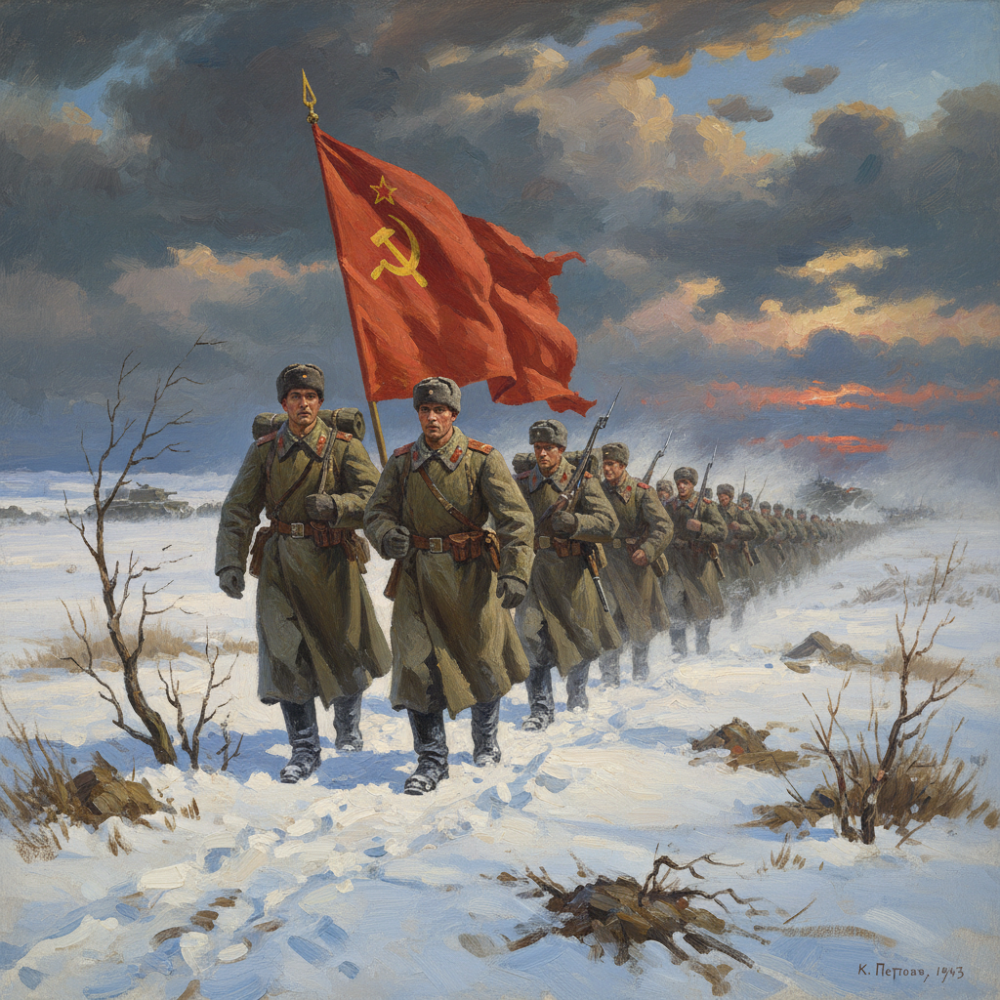

# 俄罗斯战争艺术 · Russian War Art

> "我们用画笔记录战争的真相，让后人永远不要忘记。" —— 亚历山大·杰伊涅卡

## 概述

俄罗斯战争艺术（Russian War Art）是从拿破仑战争到两次世界大战期间俄罗斯艺术家以战争为主题创作的绘画、雕塑和版画传统。这一传统在卫国战争（1941-1945）期间达到巅峰，艺术家们以亲历者的身份记录战场、后方和胜利，创造了大量具有强烈情感冲击力的作品。从韦列夏金19世纪的反战写实到杰伊涅卡的英雄主义现代风格，俄罗斯战争艺术构成了世界军事艺术中最丰富的传统之一。

## 核心特征

| 特征 | 描述 |
|------|------|
| 时期 | 19世纪–1945年及之后 |
| 地域 | 全俄罗斯/苏联 |
| 媒介 | 油画、版画、海报、雕塑、素描 |
| 核心理念 | 以艺术见证战争的残酷与人民的英勇 |
| 色彩 | 从灰暗压抑到英雄主义的红金色调 |

## 视觉特征

- **纪实性**：前线速写和战地素描的即时记录
- **纪念碑性**：大尺幅历史画的庄严叙事
- **情感强度**：悲壮、愤怒、坚韧等极端情感的表达
- **动态场面**：战斗、冲锋、爆炸等激烈动态的捕捉
- **象征手法**：将个体命运升华为民族精神的象征

## 代表作品

| 作品 | 艺术家 | 年代 | 类型 |
|------|--------|------|------|
| 《战争的神化》 | 韦列夏金 | 1871 | 油画 |
| 《塞瓦斯托波尔保卫战》 | 杰伊涅卡 | 1942 | 油画 |
| 《母亲》 | 彼得罗夫-沃德金 | 1920 | 油画 |
| 《法西斯飞过》 | 普拉斯托夫 | 1942 | 油画 |
| 《胜利》 | 克里沃诺戈夫 | 1948 | 油画 |

## 发展时间线

| 时期 | 事件 |
|------|------|
| 1812 | 拿破仑入侵，俄罗斯战争绘画传统开始 |
| 1870s | 韦列夏金以反战立场创作战争系列 |
| 1914-1918 | 一战时期俄罗斯战争艺术 |
| 1918-1922 | 内战时期宣传艺术 |
| 1941-1945 | 卫国战争，战争艺术达到巅峰 |
| 1941 | "塔斯之窗"战时海报运动 |
| 1945后 | 战争纪念绘画和雕塑持续创作 |

## 中国语境

俄罗斯/苏联战争艺术对中国革命美术影响极为直接。抗日战争和解放战争时期的中国木刻运动受苏联战时版画启发。新中国成立后，大量军事题材油画（如董希文《开国大典》、詹建俊《狼牙山五壮士》）在构图和表现手法上借鉴了苏联卫国战争绘画传统。中国军事博物馆的历史画创作体系直接继承了苏联战争艺术的方法论。

## AI 概念图

*AI 生成概念图：俄罗斯战争艺术风格*

## 关联词条

- [[russian-realism-art]] - 俄罗斯现实主义
- [[peredvizhniki-art]] - 巡回展览画派
- [[russian-agitprop-art]] - 俄罗斯宣传鼓动艺术
- [[severe-style-art]] - 严厉风格

---

*浮光艺志 · Chronicle of Artistry*
