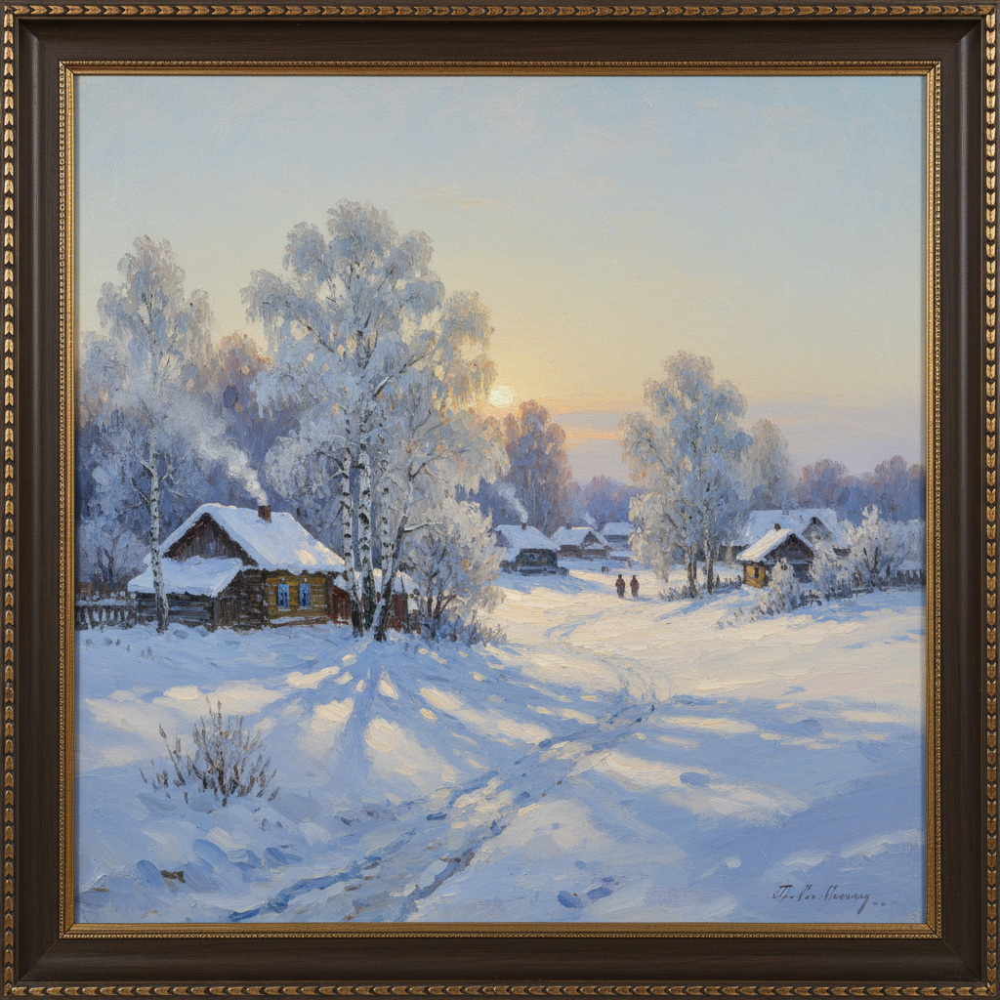

# 俄罗斯冬景绘画 · Russian Winter Landscape Art

> "冬天的俄罗斯是一首白色的诗——寂静、纯净、无边无际。" —— 伊萨克·列维坦

## 概述

俄罗斯冬景绘画（Russian Winter Landscape Art）是俄罗斯风景画中最具民族辨识度的子题材之一。漫长的冬季是俄罗斯自然的主旋律——白雪覆盖的森林、冰封的河流、雪橇上的旅人、暮色中的村庄，构成了俄罗斯人集体记忆中最深刻的风景意象。从萨夫拉索夫对早春融雪的敏感捕捉，到库斯托季耶夫对冬日集市的热烈描绘，再到格拉巴里对霜雪色彩的印象派式探索，俄罗斯画家将冬景发展为一个丰富而独特的视觉传统。

## 核心特征

| 特征 | 描述 |
|------|------|
| 时期 | 1860s–1920s（巅峰期） |
| 地域 | 俄罗斯全境 |
| 媒介 | 油画 |
| 核心理念 | 以冬景表达俄罗斯自然的崇高与民族性格的坚韧 |
| 色彩 | 银白、淡蓝、玫瑰紫（雪影）、金橙（冬日低阳） |

## 视觉特征

- **雪的色彩**：白雪并非纯白，而是蓝紫色阴影与暖色反光的交响
- **低角度阳光**：冬日太阳低悬，投射长长的蓝色影子
- **霜挂效果**：树枝上的冰霜在阳光下闪烁
- **对比法则**：白雪与深色树干、建筑的强烈明暗对比
- **寂静感**：大面积留白营造冬日的宁静与孤寂
- **烟与雾**：炊烟、呼出的白气、薄雾增添冬日氛围

## 代表作品

| 作品 | 作者 | 年代 | 特点 |
|------|------|------|------|
| 《二月的蓝天》 | 格拉巴里 | 1904 | 霜雪的印象派色彩 |
| 《俄罗斯冬天》 | 尼古拉·克雷莫夫 | 1919 | 暮色中的雪村 |
| 《谢肉节》 | 库斯托季耶夫 | 1916 | 冬日集市的热闹 |
| 《三月》 | 列维坦 | 1895 | 初春融雪的微妙 |
| 《冬天》 | 希施金 | 1890 | 雪中松林的静谧 |

## 发展时间线

| 时期 | 事件 |
|------|------|
| 1860s | 萨夫拉索夫开始关注冬春交替的微妙变化 |
| 1870s | 巡回展览画派将冬景纳入民族风景画体系 |
| 1890s | 希施金、列维坦创作经典冬景作品 |
| 1900s | 格拉巴里以印象派方法革新冬景色彩表现 |
| 1910s | 库斯托季耶夫将冬景与民俗生活结合 |
| 苏联时期 | 冬景画成为社会主义现实主义风景画的重要题材 |

## 中国语境

俄罗斯冬景画对中国东北和北方风景画影响显著。中国东北的冰雪景观与俄罗斯相似，哈尔滨、长春等地的画家群体深受俄罗斯冬景画传统影响。于志学创立的"冰雪山水画"虽以中国画媒介为主，但在对雪景光色的关注上与俄罗斯传统有共通之处。当代中国冰雪风景油画在技法和审美上仍以俄罗斯冬景画为重要参照。

## AI 概念图

*AI 生成概念图：俄罗斯冬景绘画风格*

## 关联词条

- [[shishkin-art]] - 希施金艺术
- [[levitan-art]] - 列维坦艺术
- [[savrasov-art]] - 萨夫拉索夫艺术
- [[russian-landscape-art]] - 俄罗斯风景画
- [[russian-plein-air-art]] - 俄罗斯外光派

---

*浮光艺志 · Chronicle of Artistry*
