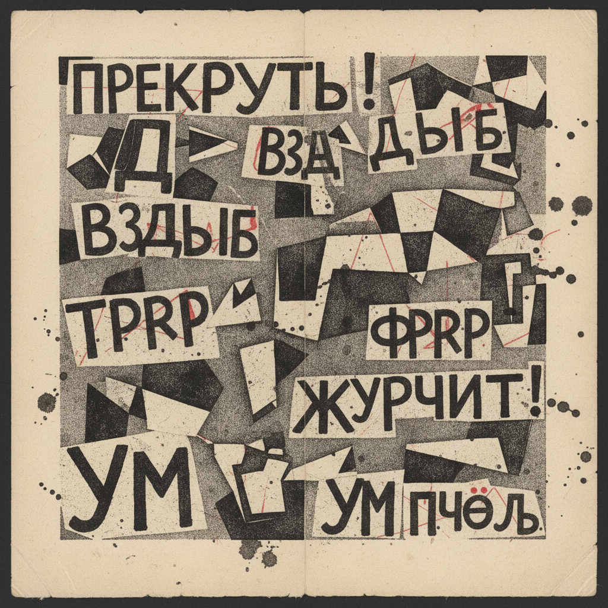

# 俄罗斯超理性艺术 · Russian Zaum Art

> "我们解放了词语，让它回归纯粹的声音与形状。" —— 阿列克谢·克鲁乔内赫

## 概述

超理性艺术（Zaum Art / Заумь）是1913年至1920年代俄罗斯未来主义运动中最激进的跨媒介实验，由诗人克鲁乔内赫和赫列布尼科夫创造的"超理性语言"（zaum）为核心，将语言从意义中解放出来，使其成为纯粹的声音、视觉和物质存在。Zaum不仅是文学运动，更深刻影响了视觉艺术——未来主义书籍（artist's book）将手写文字、版画、拼贴融为一体，创造了20世纪最早的跨媒介艺术实验。

## 核心特征

| 特征 | 描述 |
|------|------|
| 时期 | 1913年–1920年代 |
| 地域 | 莫斯科、圣彼得堡、梯弗利斯（第比利斯） |
| 媒介 | 艺术家书籍、版画、拼贴、表演、声音诗 |
| 核心理念 | 语言超越理性意义，回归纯粹的物质性与声音性 |
| 色彩 | 手工印刷的粗糙质感，墨黑与彩色拼贴 |

## 视觉特征

- **手工书籍**：石版印刷、手写文字、剪贴拼合的艺术家书籍
- **文字即图像**：字母脱离语义功能，成为纯视觉元素
- **粗糙美学**：故意的低技术、手工感，对抗工业印刷的精致
- **跨媒介融合**：诗歌、绘画、版画、表演在同一作品中交织
- **反逻辑构图**：打破阅读方向和页面秩序

## 代表作品

| 作品 | 创作者 | 年代 | 类型 |
|------|--------|------|------|
| 《世界之末》 | 克鲁乔内赫/冈察洛娃 | 1912 | 艺术家书籍 |
| 《让我们嘟囔》 | 克鲁乔内赫/马列维奇 | 1913 | 艺术家书籍 |
| 《战胜太阳》 | 克鲁乔内赫/马列维奇 | 1913 | 歌剧/表演 |
| 《Tango with Cows》 | 卡缅斯基 | 1914 | 视觉诗 |
| 41度小组出版物 | 梯弗利斯小组 | 1918-1920 | 艺术家书籍 |

## 发展时间线

| 时期 | 事件 |
|------|------|
| 1912 | 克鲁乔内赫和赫列布尼科夫提出zaum概念 |
| 1912-1913 | 第一批未来主义艺术家书籍出版 |
| 1913 | 《战胜太阳》首演，zaum歌剧 |
| 1913 | 克鲁乔内赫发表纯zaum诗《Dyr bul shchyl》 |
| 1914 | 一战爆发，未来主义书籍出版高峰 |
| 1917-1920 | 革命后zaum在梯弗利斯（41度小组）延续 |
| 1920s | zaum影响达达主义和国际声音诗运动 |

## 中国语境

Zaum艺术与中国的关联主要体现在当代实验诗歌和艺术家书籍领域。中国1980年代的"非非主义"诗歌运动在"语言自觉"层面与zaum有精神共鸣。徐冰《天书》（1987-1991）创造无人能读的伪汉字，与zaum创造无意义语言的策略异曲同工。当代中国艺术家书籍运动（如邱志杰、张浩等人的实践）也延续了zaum将文字视觉化、将书籍物质化的传统。

## AI 概念图

*AI 生成概念图：俄罗斯超理性艺术风格*

## 关联词条

- [[russian-futurism-art]] - 俄罗斯未来主义
- [[russian-cubo-futurism-art]] - 俄罗斯立体未来主义
- [[russian-avant-garde-art]] - 俄罗斯先锋派
- [[russian-suprematism-art]] - 俄罗斯至上主义

---

*浮光艺志 · Chronicle of Artistry*
