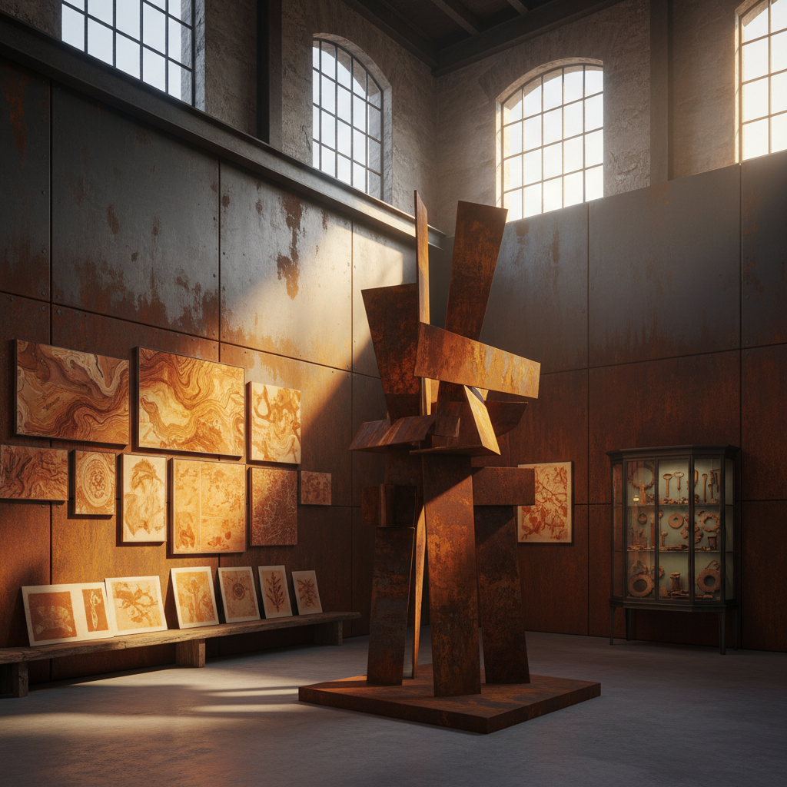

# Rust Art 锈蚀艺术

> "Rust art celebrates what most people consider decay — the slow transformation of iron into iron oxide, the patient work of oxygen and water on metal over months and years. Rust is not destruction; it is transformation, a new skin growing on old bones, a palette of oranges and browns and reds that no paint can match, a texture that no tool can replicate. The rust artist sees beauty where others see neglect, finds poetry in oxidation, and understands that time is the greatest colorist of all." — Unknown

## 概述

锈蚀艺术（Rust Art）是以金属氧化——特别是铁的锈蚀过程和锈蚀产物——为核心美学元素的艺术实践。锈（铁的氧化物）具有独特的视觉品质：温暖的橙红色调、丰富的纹理变化、不可预测的图案形成。

锈蚀艺术的实践包括：1）耐候钢雕塑——使用Corten钢（耐候钢）让其自然生锈形成保护层；2）锈蚀绘画——用铁粉和氧化剂在画布上创造锈蚀图案；3）锈蚀转印——将锈蚀纹理转印到纸张或织物上；4）受控锈蚀——通过控制湿度和化学物质引导锈蚀图案；5）锈蚀摄影——记录锈蚀的美学品质；6）工业遗产——将废弃工业设施的锈蚀作为美学对象。

## 核心特征

| 特征 | 描述 |
|------|------|
| 氧化 | 铁的氧化过程 |
| 时间 | 时间的可见化 |
| 色彩 | 温暖的橙红色 |
| 纹理 | 丰富的表面纹理 |
| 转化 | 材料的转化 |
| 工业 | 工业美学 |

## 视觉特征

- **橙红**：锈的温暖色调
- **纹理**：粗糙的锈蚀纹理
- **层次**：不同阶段的锈蚀层
- **图案**：自然形成的图案
- **对比**：锈与未锈的对比
- **厚重**：金属的厚重感

## 代表作品

| 作品 | 艺术家 | 年代 | 意义 |
|------|--------|------|------|
| *Corten steel sculptures* | Richard Serra | 1970年代至今 | 耐候钢雕塑 |
| *Rust paintings* | Various | 2000年代 | 锈蚀绘画 |
| *Angel of the North* | Antony Gormley | 1998 | 耐候钢公共雕塑 |
| *Industrial rust photography* | Various | 2000年代 | 工业锈蚀摄影 |
| *Rust transfer art* | Various | 2010年代 | 锈蚀转印艺术 |

## 历史时间线

| 时期 | 事件 |
|------|------|
| 1930年代 | 耐候钢的发明 |
| 1960年代 | 极简主义雕塑使用耐候钢 |
| 1970年代 | Serra的大型耐候钢作品 |
| 1998 | 北方天使（耐候钢） |
| 当代 | 锈蚀作为独立艺术媒介 |

## 中国语境

锈蚀艺术在中国有独特的工业和文化背景。中国经历了快速的工业化和去工业化过程——大量废弃的工厂、铁路、矿山留下了壮观的锈蚀景观。中国的"工业遗产"保护运动将这些锈蚀的工业设施视为文化遗产——如北京798艺术区（原电子工厂）、沈阳铁西区工业遗址等。中国传统文化中对"古铜色"的欣赏——青铜器的绿锈（铜绿）被视为岁月的印记和价值的象征。中国当代的一些艺术家在探索锈蚀艺术：在中国废弃工厂中创作锈蚀装置、用耐候钢创作呼应中国工业记忆的公共雕塑、以及将中国传统的"包浆"美学（物件经时间氧化形成的表面层）与当代锈蚀艺术结合。

## AI生成概念图

## 与其他风格的关系

- **Erosion Art** → 侵蚀艺术
- **Industrial Art** → 工业艺术
- **Process Art** → 过程艺术
- **Patina Art** → 铜绿艺术
- **Found Object Art** → 现成品艺术
- **Material Art** → 材料艺术

---

*浮光艺志 | Chronicle of Artistry*
