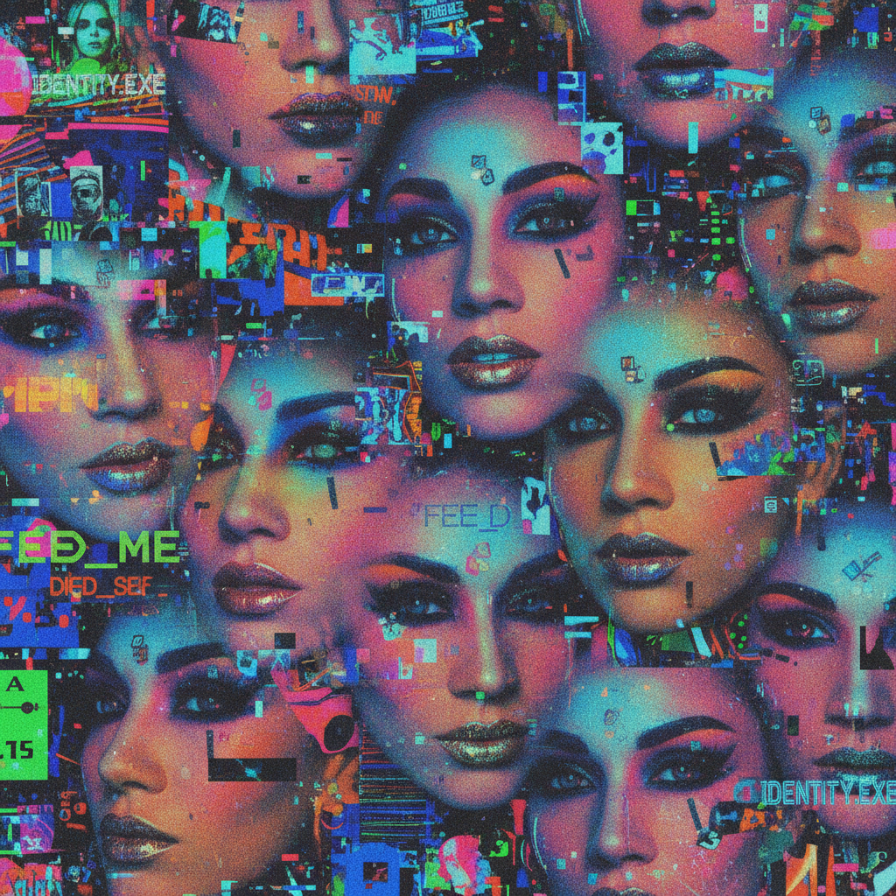

# Ryan Trecartin 瑞安·特雷卡廷

> **时期：** 1981–至今  
> **关键词：** 后互联网视频、身份表演、数字原住民、过度刺激

## 概述

Ryan Trecartin 是美国艺术家，以疯狂的、过度饱和的视频装置闻名。他的作品如同社交媒体时代的意识流——角色不断变换身份、语速极快、画面过度编辑、色彩爆炸——捕捉了数字原住民一代的注意力模式和身份流动性。

## 风格特征

- **过度编辑**：极快的剪辑、叠加、变速和特效
- **身份流动**：角色不断变换性别、种族和人格
- **社交媒体语言**：模仿网络直播、vlog和视频通话的语法
- **色彩过载**：荧光色、饱和度拉满的视觉轰炸
- **集体即兴**：朋友们在镜头前的半即兴表演

## 代表作品

- *I-Be Area*（2007）
- *CENTER JENNY*（2013）
- *Temple Time*（2016）
- *Whether Line*（2019）

## 概念图

