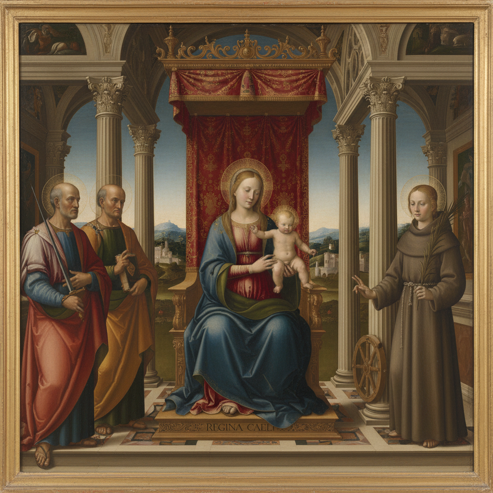

# Sacra Conversazione 神圣对话

> **时期：** 15世纪–17世纪  
> **关键词：** 圣母子与圣徒、统一空间、文艺复兴、祭坛画、宁静氛围

## 概述

Sacra Conversazione（神圣对话）是文艺复兴时期发展出的祭坛画构图类型——圣母子与多位圣徒共处于同一个统一的建筑或风景空间中，仿佛在进行一场安静的精神交流。它打破了中世纪多联画中人物各占一格的传统，创造了一种宁静、和谐、超越时间的神圣共在。

## 风格特征

- **统一空间**：所有人物共享同一场景
- **对称构图**：圣母居中，圣徒对称分列
- **建筑背景**：古典柱廊或壁龛
- **宁静氛围**：沉思冥想的安静气质
- **时间超越**：不同时代的圣徒同时出现

## 代表人物与作品

- 乔瓦尼·贝利尼《圣扎卡里亚祭坛画》
- 拉斐尔《西斯廷圣母》
- 安德烈亚·曼特尼亚《圣泽诺祭坛画》
- 弗拉·安杰利科 圣马可修道院壁画

## 概念图

