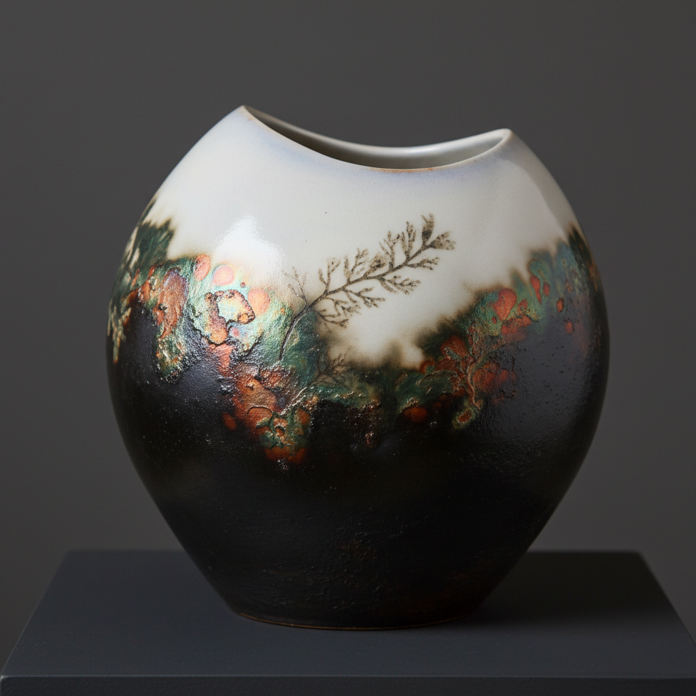

# Saggar-Fired Art 匣钵烧艺术

> "The saggar is a secret chamber where fire paints in whispers." — Contemporary ceramic firing tradition

## 概述

匣钵烧艺术（Saggar-Fired Art）是一种将陶器放入密封的耐火容器（匣钵/saggar）中，与各种可燃物和化学物质一起烧制的装饰技术。匣钵烧是坑烧的精致化版本——通过将陶器封闭在匣钵中，陶艺家可以更精确地控制烟熏和化学着色的效果，同时保护作品免受窑内直接火焰的冲击。

匣钵（saggar）一词源自英语"safeguard"的缩写——最初是工业陶瓷生产中用来保护精细瓷器免受窑内灰烬和火焰污染的容器。但当代陶艺家反其道而行之——他们利用匣钵创造一个封闭的微环境，在其中放入盐、铜线、海藻、香蕉皮、锯末、报纸等材料，这些材料在烧成过程中产生的烟雾和化学蒸气被封闭在匣钵内，与陶器表面发生反应，产生丰富的色彩和纹理效果。

匣钵烧艺术的核心要素包括：1）封闭环境——匣钵创造的密封微环境；2）化学着色——各种材料产生的色彩效果；3）可控随机——比坑烧更可控但仍保持随机性；4）表面效果——烟熏、闪光、渐变的丰富效果；5）材料实验——不断探索新的着色材料；6）当代美学——现代陶艺的重要表达方式；7）过程艺术——烧成过程本身即是创作。

## 核心特征

| 特征 | 描述 |
|------|------|
| 封闭环境 | 匣钵创造密封微环境 |
| 化学着色 | 各种材料产生色彩效果 |
| 可控随机 | 比坑烧更可控仍保持随机 |
| 表面效果 | 烟熏闪光渐变丰富效果 |
| 材料实验 | 不断探索新着色材料 |
| 过程艺术 | 烧成过程即是创作 |

## 视觉特征

- **烟熏渐变**：从深黑到浅灰的烟熏渐变
- **铜绿闪光**：铜线产生的绿色和蓝色闪光
- **盐晶纹理**：盐产生的橙色结晶纹理
- **有机印痕**：海藻、树叶的印痕
- **丝绸质感**：抛光后的丝绸般光滑表面
- **抽象画面**：如同抽象绘画的表面效果

## 代表作品

| 作品 | 年代 | 意义 |
|------|------|------|
| *工业匣钵* | 18-19世纪 | 保护性用途 |
| *当代匣钵烧花瓶* | 20世纪末 | 艺术转化 |
| *铜线匣钵烧* | 当代 | 金属着色 |
| *海藻匣钵烧* | 当代 | 有机材料 |
| *抛光匣钵烧* | 当代 | 精致表面 |
| *大型匣钵烧装置* | 21世纪 | 当代艺术 |

## 历史时间线

| 时期 | 事件 |
|------|------|
| 中世纪 | 匣钵用于保护精细陶瓷 |
| 18-19世纪 | 工业陶瓷大量使用匣钵 |
| 20世纪中期 | 电窑普及，工业匣钵衰落 |
| 1970年代 | 陶艺家开始探索匣钵烧艺术 |
| 1990年代 | 匣钵烧成为流行技法 |
| 当代 | 持续创新和实验 |

## 中国语境

匣钵在中国陶瓷史上有着极其重要的地位。中国是世界上最早使用匣钵的国家之一——早在唐代，景德镇等窑口就开始使用匣钵来保护瓷器在烧成过程中免受灰烬和火焰的污染，这是中国瓷器能够达到极高品质的关键技术之一。宋代龙泉窑的青瓷、景德镇的青白瓷都依赖匣钵来获得纯净的釉面效果。中国传统匣钵的功能是"保护"——隔绝灰烬和火焰；而当代西方匣钵烧的功能是"创造"——利用封闭环境产生装饰效果。这种功能的反转体现了陶瓷艺术从实用到表达的历史转变。

## 概念图

## 与其他风格的关系

- **Pit-Fired** → 坑烧（开放版本）
- **Raku** → 乐烧（低温烧成）
- **Wood-Fired** → 柴烧（自然灰釉）
- **Smoke-Fired** → 烟熏烧成
- **Obvara** → 奥布瓦拉（另一种表面技法）
- **Horsehair Raku** → 马毛乐烧

---

*浮光艺志 | Chronicle of Artistry*
