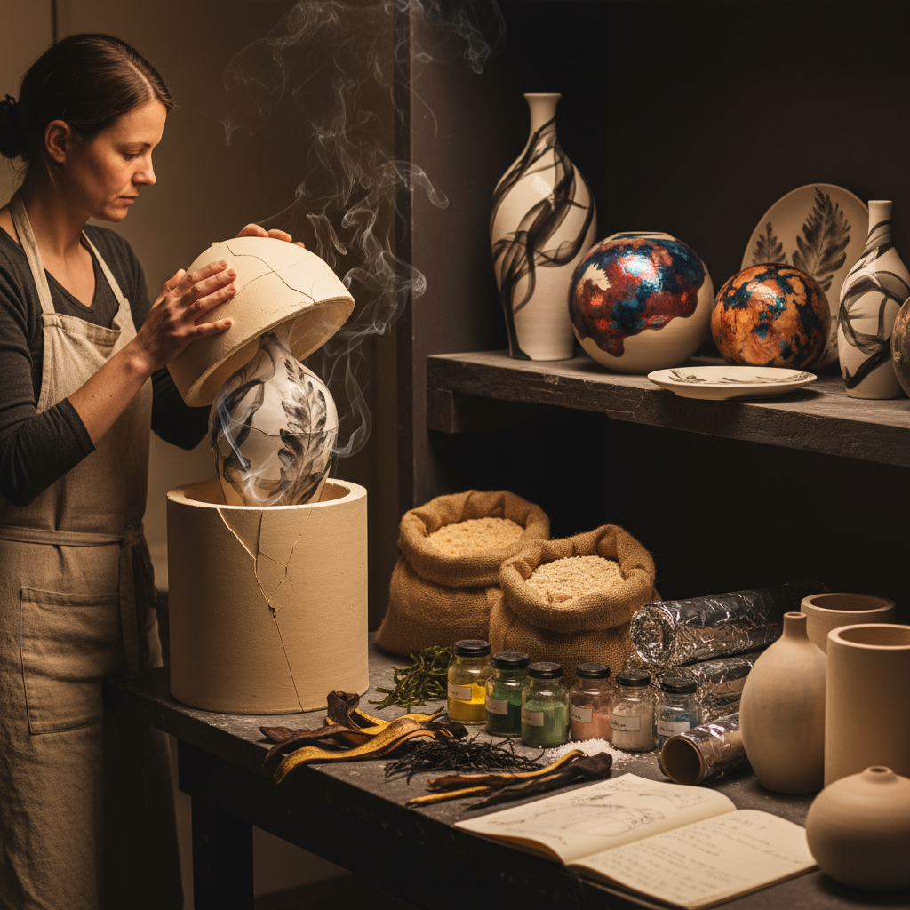

# Saggar Firing Art 匣钵烧艺术

> "Saggar firing is ceramics in a sealed chamber of secrets — each piece enclosed in its own clay container with combustible materials, metal salts, and organic matter that create a unique microenvironment during firing. When the saggar is broken open after cooling, the potter discovers what the fire has written: swirling smoke patterns, metallic flashes, and color blooms that could never be planned or repeated." — Unknown

## 概述

匣钵烧艺术（Saggar Firing Art）是将陶器放入密封的耐火容器（匣钵/saggar）中，与各种着色材料（金属盐、有机物、可燃材料）一起烧制的陶瓷技法——匣钵内形成独特的微环境，产生不可预测的烟熏图案、金属色彩和有机纹理。每件作品都是火焰与化学反应的独特记录。

匣钵烧艺术的实践包括：1）传统匣钵——保护瓷器免受窑灰的工业用途；2）艺术匣钵烧——利用匣钵创造装饰效果；3）铝箔匣钵——使用铝箔代替陶制匣钵；4）金属盐着色——使用铜、铁、钴等金属盐；5）有机物着色——使用海藻、香蕉皮等有机物；6）当代匣钵烧——将传统技法与现代艺术结合的创作。

## 核心特征

| 特征 | 描述 |
|------|------|
| 密封 | 密封环境中的烧制 |
| 偶然 | 高度偶然的效果 |
| 化学 | 金属盐的化学着色 |
| 烟熏 | 有机物的烟熏效果 |
| 独特 | 每件作品独一无二 |
| 发现 | 开匣钵时的惊喜 |

## 视觉特征

- **烟雾**：流动的烟熏图案
- **金属**：金属盐的闪光色彩
- **有机**：有机物留下的印记
- **渐变**：色彩的自然渐变
- **斑驳**：不规则的色彩分布
- **神秘**：神秘莫测的效果

## 代表作品

| 作品 | 艺术家/文化 | 年代 | 意义 |
|------|-------------|------|------|
| *Traditional saggars* | 工业陶瓷 | 中世纪至今 | 传统保护性匣钵 |
| *Sagger Maker's Bottom Knocker* | 英国 | 18-19世纪 | 工业匣钵制作 |
| *Contemporary saggar art* | 当代陶艺 | 1980s至今 | 艺术匣钵烧 |
| *Foil saggar works* | 当代 | 当代 | 铝箔匣钵烧 |
| *Mixed media saggar* | 当代 | 当代 | 混合材料匣钵 |

## 历史时间线

| 时期 | 事件 |
|------|------|
| 古代 | 匣钵作为保护容器的使用 |
| 中世纪 | 中国和欧洲的工业匣钵 |
| 18-19世纪 | 英国陶瓷工业的匣钵 |
| 1980年代 | 匣钵烧作为艺术手法的发展 |
| 当代 | 匣钵烧的当代艺术实践 |

## 中国语境

匣钵烧艺术在中国有深厚的工业传统——中国是最早使用匣钵的国家之一。中国古代的瓷器生产中，匣钵是保护瓷器免受窑灰和火焰直接接触的重要工具——景德镇的传统窑炉中使用大量匣钵。中国的龙泉青瓷烧制中，匣钵起到了关键的保护作用——确保青瓷在还原气氛中获得纯净的青色。中国考古发现的古代窑址中，匣钵碎片是最常见的遗物之一——反映了中国陶瓷工业的规模。中国当代的陶艺家开始探索匣钵烧的艺术可能性——将传统的工业工具转化为艺术创作手段。中国的一些陶艺工作室开设匣钵烧课程——让学生体验这种充满偶然性的烧制方式。中国的陶瓷研究者也在研究古代匣钵的材料和工艺——为理解中国陶瓷史提供技术证据。

## AI生成概念图

## 与其他风格的关系

- **Pit Firing** → 坑烧艺术
- **Raku** → 乐烧艺术
- **Smoke Firing** → 熏烧艺术
- **Ceramics** → 陶瓷艺术
- **Wood Firing** → 柴烧艺术
- **Alternative Firing** → 替代烧制

---

*浮光艺志 | Chronicle of Artistry*
