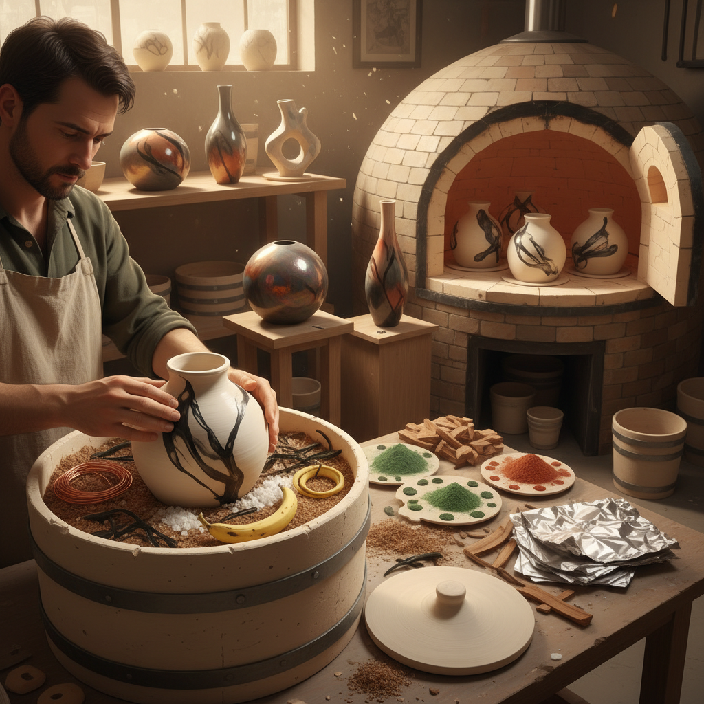

# Saggar Firing 匣钵烧

> "Saggar firing is controlled chaos — the potter seals clay and chemistry together in a vessel within a vessel, surrendering the final surface to the alchemy of heat, smoke, and mineral." — Unknown

## 概述

匣钵烧（Saggar Firing）是一种将陶器放入密封的容器（匣钵，saggar）中进行烧制的技法。匣钵是一个耐火的陶制容器，陶器被放入其中，周围填充各种可燃物和化学物质——锯末、海藻、铜线、铁丝、盐、硫酸铜、碳酸钡等。匣钵密封后放入窑中烧制，内部形成一个独立的微环境——烟气、矿物蒸气和化学反应在封闭空间中与陶器表面互动，留下独特的色彩和痕迹。

匣钵烧的魅力在于：可控的不可预测性——艺术家可以通过选择材料和放置方式来引导结果，但最终效果总有惊喜。匣钵烧结合了坑烧的自然美感和窑烧的温度控制。

## 核心特征

| 特征 | 描述 |
|------|------|
| 匣钵 | 密封容器中烧制 |
| 微环境 | 封闭的化学环境 |
| 化学 | 矿物和化学反应 |
| 烟熏 | 烟气的作用 |
| 可控 | 部分可控的结果 |
| 独特 | 每件作品独一无二 |

## 视觉特征

- **色彩**：丰富的自然色彩
- **烟熏**：烟熏的黑色痕迹
- **金属**：金属盐的闪光
- **渐变**：自然的色彩渐变
- **有机**：有机的图案
- **独特**：不可重复的表面

## 代表作品

| 作品 | 艺术家 | 年代 | 意义 |
|------|--------|------|------|
| *Historical saggar ware* | 匿名 | 18-19世纪 | 工业匣钵保护 |
| *Contemporary saggar firing* | Various | 当代 | 当代匣钵艺术 |
| *Saggar-fired vessels* | Judy Motzkin | 当代 | 匣钵烧器物 |
| *Alternative firing* | Various | 当代 | 替代烧制探索 |
| *Saggar sculptures* | Various | 当代 | 匣钵烧雕塑 |

## 历史时间线

| 时期 | 事件 |
|------|------|
| 古代 | 匣钵用于保护瓷器 |
| 宋代 | 中国匣钵技术的成熟 |
| 18-19世纪 | 欧洲工业匣钵的使用 |
| 20世纪后半 | 匣钵烧作为艺术技法 |
| 当代 | 当代匣钵烧的创新 |
| 当代 | 与其他烧制技法的融合 |

## 中国语境

匣钵在中国陶瓷史上有着极其重要的地位——中国是最早使用匣钵的国家之一。宋代的景德镇窑、龙泉窑等都大量使用匣钵来保护瓷器在烧制过程中不受窑灰和火焰的直接影响，确保釉面的纯净。中国传统的匣钵主要是保护性的（防止污染），而当代西方的Saggar Firing则是装饰性的（利用封闭环境创造效果）。当代中国的一些陶艺家也开始探索装饰性匣钵烧的可能性。

## AI生成概念图

## 与其他风格的关系

- **Pit Firing** → 坑烧
- **Raku** → 乐烧
- **Wood Firing** → 柴烧
- **Smoke Firing** → 熏烧
- **Ceramics** → 陶瓷
- **Alternative Firing** → 替代烧制

---

*浮光艺志 | Chronicle of Artistry*
