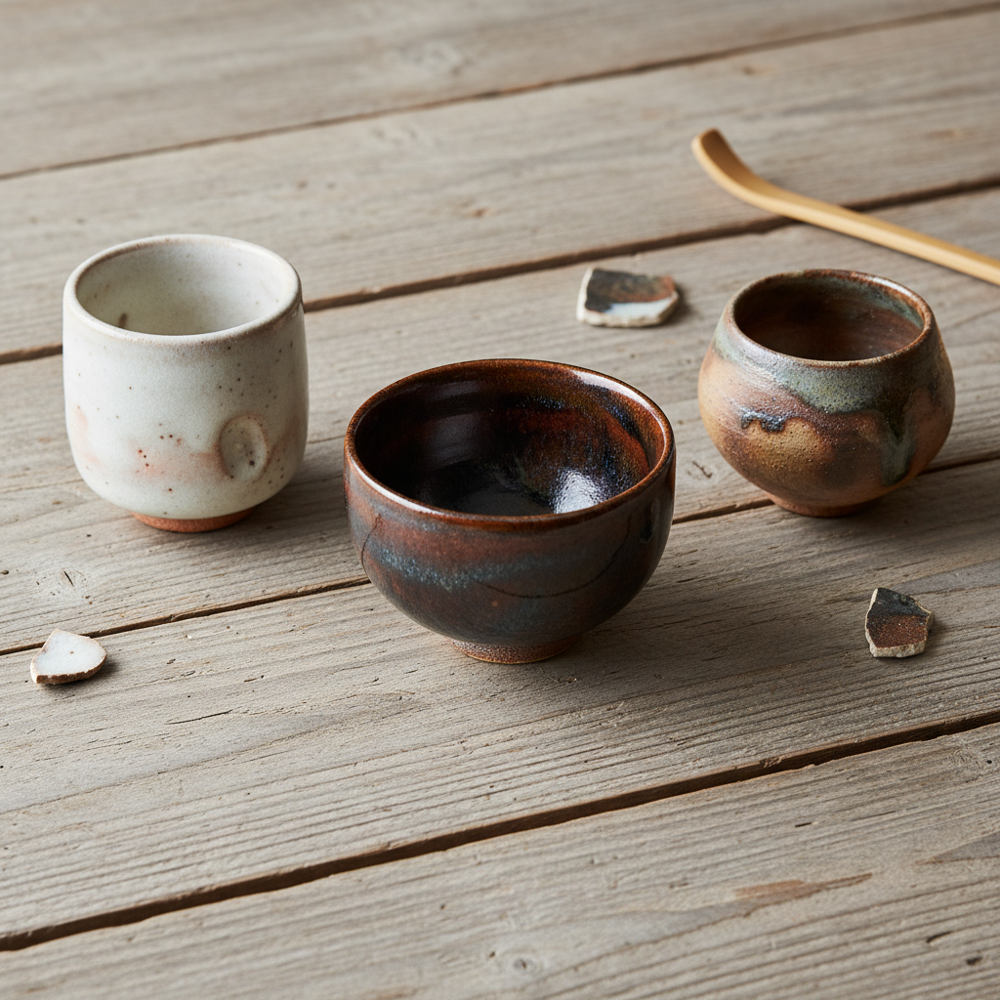

# Sake Cup Art 酒杯艺术

> "The sake cup is intimacy in ceramic form — a vessel so small it must be refilled constantly, each pouring an act of attention between host and guest, the cup's size enforcing conversation and connection, its rim shaped for the particular warmth of rice wine, its foot designed to rest unstably so it must be held or emptied, form following the social choreography of drinking together." — Unknown

## 概述

酒杯艺术（Sake Cup Art）是一种以日本清酒杯（猪口/ぐい呑み/お猪口）为核心的陶瓷艺术形式。清酒杯虽然体积小巧，却是日本陶瓷美学的精华浓缩——每一只酒杯都是陶艺家技艺和审美的微型展示。清酒杯的小巧尺寸使其成为陶艺家最自由的创作载体——可以大胆实验釉色、造型和装饰，而不必承担大型器物的风险。

酒杯艺术的核心要素包括：1）小巧尺寸——通常容量30-60ml；2）手感体验——握在手中的触觉享受；3）口缘设计——适合饮酒的唇感；4）釉色实验——小尺寸允许大胆的釉色尝试；5）社交功能——斟酒的社交仪式；6）收藏性——小巧易于收藏；7）多样性——从粗犷到精致的广泛风格。

## 核心特征

| 特征 | 描述 |
|------|------|
| 小巧精致 | 通常容量30-60ml |
| 手感至上 | 握持的触觉体验 |
| 釉色丰富 | 各种釉色的实验场 |
| 社交器具 | 斟酒仪式的核心 |
| 收藏价值 | 小巧易于收藏展示 |
| 风格多样 | 从朴素到华丽 |

## 视觉特征

- **小巧造型**：掌心大小的精致器形
- **釉色变化**：丰富多变的釉面效果
- **手工痕迹**：指纹和工具的痕迹
- **口缘变化**：各种口沿造型
- **高台设计**：精心设计的底足
- **质感对比**：釉面与裸露坯体的对比

## 代表作品

| 作品 | 艺术家/文化 | 年代 | 意义 |
|------|-------------|------|------|
| *备前烧酒杯* | 日本备前 | 各时期 | 质朴的酒杯美学 |
| *志野烧酒杯* | 日本美浓 | 16世纪起 | 志野酒杯传统 |
| *九谷烧酒杯* | 日本九谷 | 17世纪起 | 华丽的彩绘酒杯 |
| *萩烧酒杯* | 日本萩 | 16世纪起 | 萩烧的温润酒杯 |
| *当代酒杯* | 各地陶艺家 | 当代 | 酒杯的当代创作 |

## 历史时间线

| 时期 | 事件 |
|------|------|
| 古代 | 日本早期饮酒器的发展 |
| 16世纪 | 茶道影响下酒杯美学的确立 |
| 江户时代 | 各产地酒杯风格的形成 |
| 明治以后 | 酒杯作为独立艺术品类 |
| 当代 | 酒杯收藏文化的繁荣 |

## 中国语境

中国的饮酒器传统同样悠久而丰富——从商代的青铜爵到宋代的瓷盏，从明代的青花杯到清代的粉彩杯。中国的酒杯（酒盅）虽然在当代不如日本清酒杯那样形成独立的艺术收藏门类，但中国传统酒器的美学价值同样深厚。中国当代陶艺家开始关注小型饮器的创作——将中国传统酒器的造型与当代审美结合。中国的白酒文化和茶文化都催生了精致的小型饮器——从景德镇的薄胎酒杯到宜兴的紫砂品茗杯，中国在小型饮器方面有丰富的传统资源。

## AI生成概念图

## 与其他风格的关系

- **Tea Bowl** → 茶碗
- **Bizen Ware** → 备前烧
- **Shino** → 志野烧
- **Kutani** → 九谷烧
- **Wabi-Sabi** → 侘寂美学
- **Drinking Vessel** → 饮器

---

*浮光艺志 | Chronicle of Artistry*
