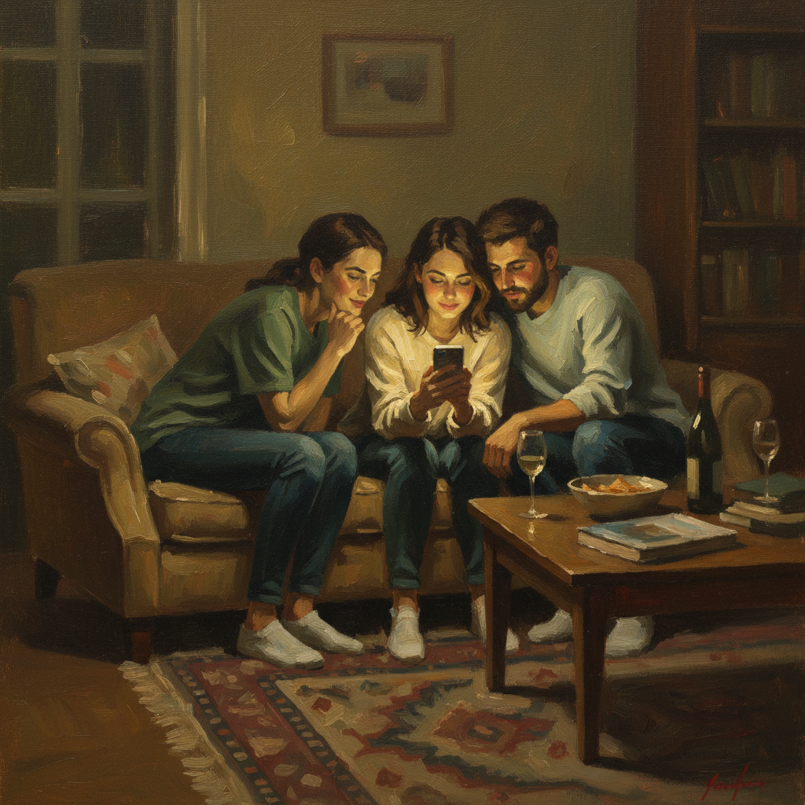

# Salman Toor 萨尔曼·图尔

> **时期：** 1983–至今  
> **关键词：** 酷儿亲密、小幅叙事、棕色调、南亚散居经验

## 概述

Salman Toor 是巴基斯坦裔美国画家，以描绘南亚酷儿男性的私密日常场景闻名。他的小幅油画捕捉了手机时代的社交生活——聚会、约会软件、深夜对话——用古典大师的技法讲述当代移民和性少数群体的故事。

## 风格特征

- **小尺幅亲密**：多数作品不超过60厘米，营造窥视般的私密感
- **棕绿色调**：以深棕、橄榄绿和暖黄为主，如同老大师画作被手机屏幕照亮
- **当代叙事**：人物使用手机、笔记本电脑，处于公寓、酒吧等当代空间
- **松弛笔触**：快速而精准的笔触，人物面部常以几笔概括
- **群像构图**：多人场景中的身体语言传达复杂的情感关系

## 代表作品

- *Bar Boy*（2019）
- *Rooftop Party with Ghosts*（2015）
- *Four Friends*（2019）
- *Bedroom Boy*（2019）

## 历史意义

Toor 将酷儿南亚男性的日常生活带入西方美术馆的视野，他的作品证明了传统油画技法可以服务于最当代的身份政治议题，同时保持诗意和温柔。

## 概念图

