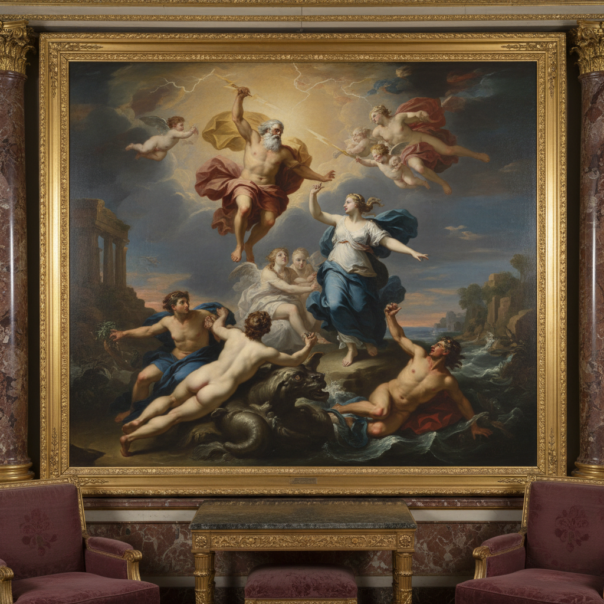

# Salon Painting 沙龙绘画

> **时期：** 17世纪–19世纪  
> **关键词：** 官方展览、学院标准、大尺幅、精细完成、公众审美

## 概述

Salon Painting（沙龙绘画）指为巴黎沙龙等官方展览创作的绘画——遵循学院标准、追求精细完成度、以大尺幅历史画和裸体画为最高等级。沙龙是艺术家获得声誉和委托的唯一途径，也是公众接触当代艺术的主要渠道。印象派的反叛正是针对沙龙体系的僵化和保守。

## 风格特征

- **精细完成**：看不见笔触的光滑表面
- **大尺幅**：适合沙龙展厅的巨型画布
- **学院标准**：遵循透视、解剖、构图规则
- **叙事清晰**：观众能立即理解的故事
- **技术炫示**：展示学院训练的全部技巧

## 代表人物与作品

- 威廉·阿道夫·布格罗 学院派裸体
- 亚历山大·卡巴内尔《维纳斯的诞生》
- 让-莱昂·热罗姆 东方主义场景
- 保罗·德拉罗什 历史画

## 概念图

