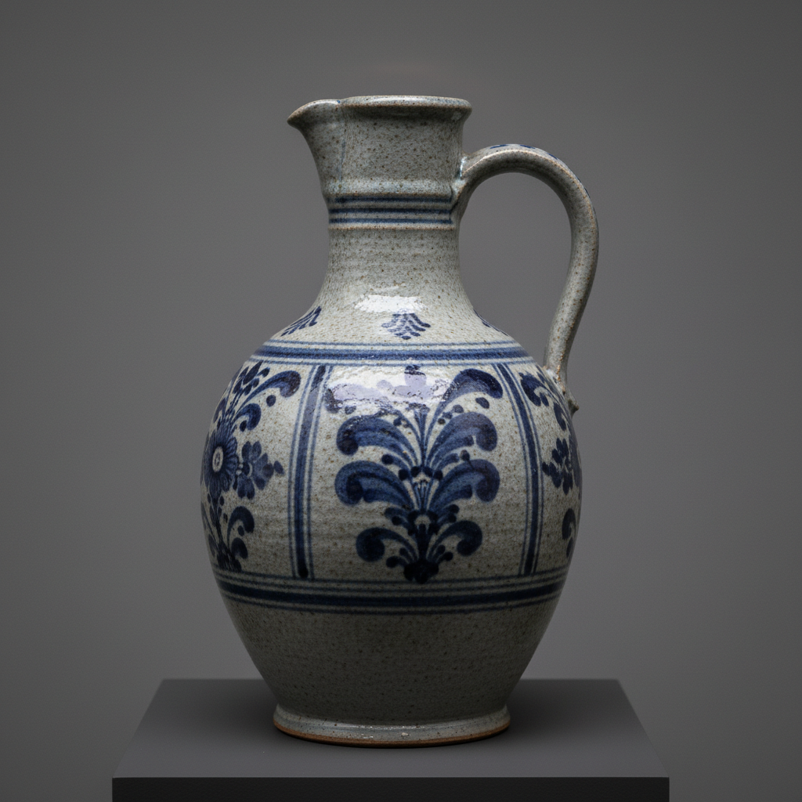

# Salt Glaze Art 盐釉陶艺术

> "Salt glazing is alchemy in the kiln — at the peak of firing, common salt is thrown into the white-hot chamber where it vaporizes instantly, the sodium combining with the silica in the clay body to form a thin, tight glaze with a distinctive orange-peel texture that coats every surface the vapor touches, creating stoneware of extraordinary durability with a surface as tough as glass and as textured as skin." — Unknown

## 概述

盐釉陶艺术（Salt Glaze Art）是一种在窑烧最高温度时向窑内投入食盐（氯化钠），盐在高温下气化，钠与陶坯表面的硅反应形成一层薄而坚硬的玻璃质釉面的独特技法——盐釉以其特征性的"橘皮"质感、极高的耐久性和独特的审美效果著称，是欧洲传统炻器最重要的施釉方式之一。

盐釉陶艺术的实践包括：1）制坯——制作炻器坯体；2）高温烧制——将窑温升至1200°C以上；3）投盐——在最高温度时向窑内投入食盐；4）气化——盐在高温下气化；5）反应——钠与坯体表面硅反应形成釉；6）橘皮质感——形成特征性的橘皮质感；7）当代盐釉——将传统技法与现代创作结合。

## 核心特征

| 特征 | 描述 |
|------|------|
| 投盐 | 向窑内投入食盐 |
| 气化 | 盐在高温下气化 |
| 反应 | 化学反应形成釉 |
| 橘皮 | 特征性的橘皮质感 |
| 耐久 | 极其耐久的釉面 |
| 炻器 | 主要用于炻器 |

## 视觉特征

- **橘皮**：特征性的橘皮质感
- **薄釉**：薄而紧密的釉层
- **光泽**：微妙的光泽
- **质朴**：质朴自然的表面
- **变化**：窑内位置造成的变化
- **坚硬**：坚硬如玻璃的表面

## 代表作品

| 作品 | 艺术家/文化 | 年代 | 意义 |
|------|-------------|------|------|
| *Rhineland salt-glazed stoneware* | 德国 | 15世纪起 | 莱茵兰盐釉炻器 |
| *Westerwald stoneware* | 德国 | 17世纪 | 韦斯特瓦尔德炻器 |
| *English salt glaze* | 英国 | 18世纪 | 英国盐釉陶 |
| *Don Reitz salt glaze* | 美国 | 20世纪 | 唐·赖茨盐釉陶 |
| *Contemporary salt glaze* | 国际 | 当代 | 当代盐釉陶 |

## 历史时间线

| 时期 | 事件 |
|------|------|
| 15世纪 | 德国莱茵兰盐釉的发展 |
| 16-17世纪 | 盐釉炻器的黄金时代 |
| 18世纪 | 英国盐釉陶的发展 |
| 20世纪 | 工作室陶艺中的盐釉复兴 |
| 当代 | 盐釉的持续实践 |

## 中国语境

盐釉与中国的传统陶瓷有一定的关联。中国的传统柴烧——虽然不使用盐，但窑内气氛对釉面的影响有相似的原理。中国当代的陶艺家——有一些学习和实践盐釉技法。中国的陶瓷教育中，盐釉作为重要的施釉技法——在相关课程中介绍。中国的工作室陶艺中，盐釉窑——在一些陶艺工作室中建造和使用。中国的陶瓷研究中，盐釉的化学原理——是重要的研究课题。

## AI生成概念图

## 与其他风格的关系

- **Stoneware** → 炻器
- **Wood Firing** → 柴烧
- **Anagama** → 穴窑
- **German Pottery** → 德国陶器
- **Studio Pottery** → 工作室陶艺
- **Atmospheric Firing** → 气氛烧制

---

*浮光艺志 | Chronicle of Artistry*
