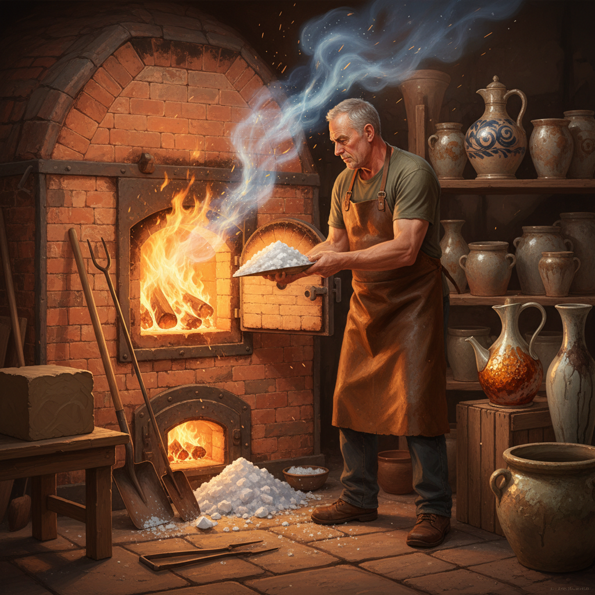

# Salt Glazing 盐釉

> "Salt glazing is alchemy in the kiln — common salt thrown into the inferno vaporizes and bonds with the clay body itself, creating a glaze that is not applied but born from the marriage of sodium and silica at white heat." — Unknown

## 概述

盐釉（Salt Glazing）是一种独特的陶瓷施釉技法——在窑烧的最高温度阶段（约1200-1300°C），将食盐（氯化钠NaCl）投入窑中。食盐在高温下分解为钠和氯——钠蒸气与陶器表面的二氧化硅（silica）反应，在陶器表面形成一层薄而均匀的玻璃质釉面（硅酸钠）。氯气则从烟囱排出。

盐釉的独特之处在于：釉不是事先涂在陶器上的，而是在烧制过程中通过化学反应"生长"在陶器表面的。盐釉的典型外观是"橘皮纹"（orange peel texture）——表面有细微的凹凸质感，类似橘子皮。盐釉陶器通常呈现灰色、棕色或米色，表面有独特的光泽。盐釉在德国（如韦斯特瓦尔德Westerwald陶器）和英国有着悠久的传统。

## 核心特征

| 特征 | 描述 |
|------|------|
| 投盐 | 高温时投入食盐 |
| 化学 | 化学反应生成釉 |
| 橘皮 | 橘皮纹质感 |
| 高温 | 需要高温烧制 |
| 整窑 | 整个窑内都被釉覆盖 |
| 传统 | 欧洲传统技法 |

## 视觉特征

- **橘皮**：橘皮般的质感
- **光泽**：柔和的光泽
- **灰棕**：灰色到棕色的色调
- **质朴**：质朴的美感
- **均匀**：相对均匀的釉面
- **自然**：自然的色彩变化

## 代表作品

| 作品 | 艺术家 | 年代 | 意义 |
|------|--------|------|------|
| *Westerwald stoneware* | 德国工匠 | 16世纪起 | 韦斯特瓦尔德盐釉陶 |
| *Bellarmine jugs* | 匿名 | 16-17世纪 | 贝拉明壶 |
| *English salt-glazed stoneware* | 匿名 | 18世纪 | 英国盐釉炻器 |
| *Don Reitz salt-glazed works* | Don Reitz | 20世纪 | 当代盐釉大师 |
| *Contemporary salt-glazed pottery* | Various | 当代 | 当代盐釉陶器 |

## 历史时间线

| 时期 | 事件 |
|------|------|
| 15世纪 | 德国莱茵河地区盐釉的发明 |
| 16-17世纪 | 德国盐釉陶器的繁荣 |
| 17世纪 | 盐釉技术传入英国 |
| 18世纪 | 英国盐釉炻器的发展 |
| 19世纪 | 工业化和环保问题 |
| 当代 | 盐釉作为工作室陶艺技法 |

## 中国语境

盐釉在中国的陶瓷传统中并不常见——中国传统陶瓷主要使用灰釉、石灰釉和各种配方釉。但中国的一些当代陶艺家开始尝试盐釉技法——特别是在工作室陶艺（studio pottery）的语境下。中国的一些陶艺学校和工作坊建有盐釉窑。盐釉的环保问题（氯气排放）在中国也受到关注——一些陶艺家转向使用碳酸钠（soda firing）作为替代。中国的陶艺社区中有关于盐釉的讨论和实践。

## AI生成概念图

## 与其他风格的关系

- **Wood Firing** → 柴烧
- **Soda Firing** → 苏打烧
- **Stoneware** → 炻器
- **Ash Glazing** → 灰釉
- **Ceramics** → 陶瓷
- **German Pottery** → 德国陶器

---

*浮光艺志 | Chronicle of Artistry*
