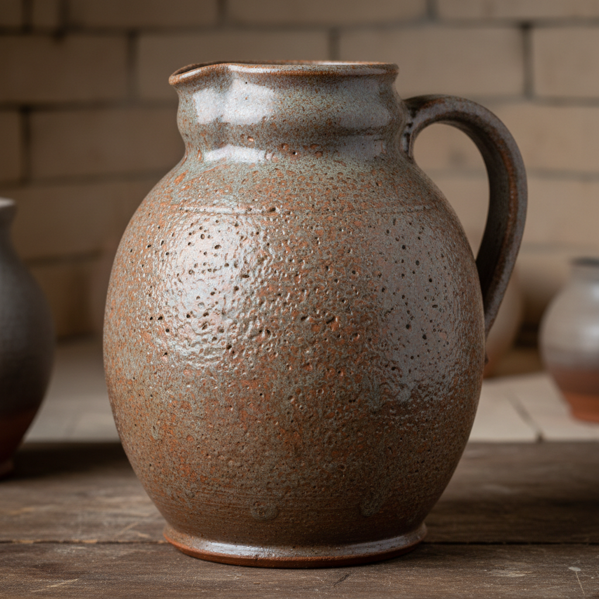

# Salt Kiln Art 盐窑艺术

> "Salt kiln firing is glazing by atmosphere — common rock salt hurled into the kiln at peak temperature, vaporizing instantly into sodium and chlorine that swirl through the chamber, the sodium bonding with silica in the clay surface to form a thin, tight glaze with the texture of orange peel, each pot glazed differently depending on its position in the kiln's turbulent salt cloud, decoration by chemistry and chance in equal measure." — Unknown

## 概述

盐窑艺术（Salt Kiln Art）是一种通过在高温烧制过程中向窑内投入食盐（氯化钠），使钠蒸气与陶瓷坯体表面的二氧化硅反应形成天然釉面的烧制技法。盐釉的特征是独特的"橘皮"质感——一层薄而紧密的釉面覆盖在坯体表面，既保护了器物又保留了坯体的质感。盐窑烧制产生的效果因器物在窑内的位置不同而各异，每件作品都是独一无二的。

盐窑艺术的核心要素包括：1）投盐烧制——在高温时向窑内投入食盐；2）蒸气釉化——钠蒸气与坯体硅反应成釉；3）橘皮质感——独特的橘皮般表面纹理；4）位置差异——窑内不同位置效果不同；5）不可预测——每次烧制结果独特；6）环境问题——氯气排放的环境考量；7）历史传统——欧洲数百年的盐釉传统。

## 核心特征

| 特征 | 描述 |
|------|------|
| 投盐釉化 | 食盐蒸气形成天然釉 |
| 橘皮质感 | 独特的表面纹理 |
| 位置差异 | 窑内位置决定效果 |
| 薄釉紧密 | 薄而紧密的釉层 |
| 不可预测 | 每件作品独一无二 |
| 历史悠久 | 数百年的欧洲传统 |

## 视觉特征

- **橘皮纹理**：如橘子皮般的表面质感
- **薄釉透体**：薄釉下可见坯体色泽
- **盐斑效果**：盐蒸气浓度不均的斑驳
- **色彩变化**：从灰到棕到橙的色彩
- **光泽适中**：介于哑光和高光之间
- **坯体质感**：保留坯体原有的质感

## 代表作品

| 作品 | 艺术家/文化 | 年代 | 意义 |
|------|-------------|------|------|
| *莱茵盐釉炻器* | 德国莱茵 | 15世纪起 | 盐釉的经典传统 |
| *英国盐釉陶* | 英国 | 17-18世纪 | 英国盐釉传统 |
| *Don Reitz作品* | Don Reitz | 20世纪 | 美国盐釉大师 |
| *当代盐窑作品* | 各地陶艺家 | 当代 | 盐窑的当代实践 |
| *苏打烧* | 各地陶艺家 | 当代 | 盐烧的环保替代 |

## 历史时间线

| 时期 | 事件 |
|------|------|
| 15世纪 | 德国莱茵地区发明盐釉技术 |
| 17世纪 | 盐釉技术传入英国 |
| 18世纪 | 盐釉在欧美的广泛应用 |
| 20世纪 | 盐窑在工作室陶艺中的复兴 |
| 当代 | 苏打烧作为环保替代的发展 |

## 中国语境

盐窑烧制在中国传统陶瓷中没有直接对应——中国的釉料传统主要依赖施釉而非气相釉化。但中国当代陶艺家开始引入盐窑和苏打窑技术，将其与中国的陶瓷材料和审美结合。盐釉的"天然"和"不可控"特性与中国传统美学中的"天工"理念有相通之处——最好的效果来自人与窑火的合作而非完全控制。中国一些陶艺工作室已经建造了盐窑和苏打窑，探索这种西方技术在中国语境中的可能性。

## AI生成概念图

## 与其他风格的关系

- **Salt Glaze** → 盐釉
- **Wood Kiln** → 柴窑
- **Stoneware** → 炻器
- **Soda Firing** → 苏打烧
- **Atmospheric Firing** → 气氛烧制
- **German Ceramics** → 德国陶瓷

---

*浮光艺志 | Chronicle of Artistry*
