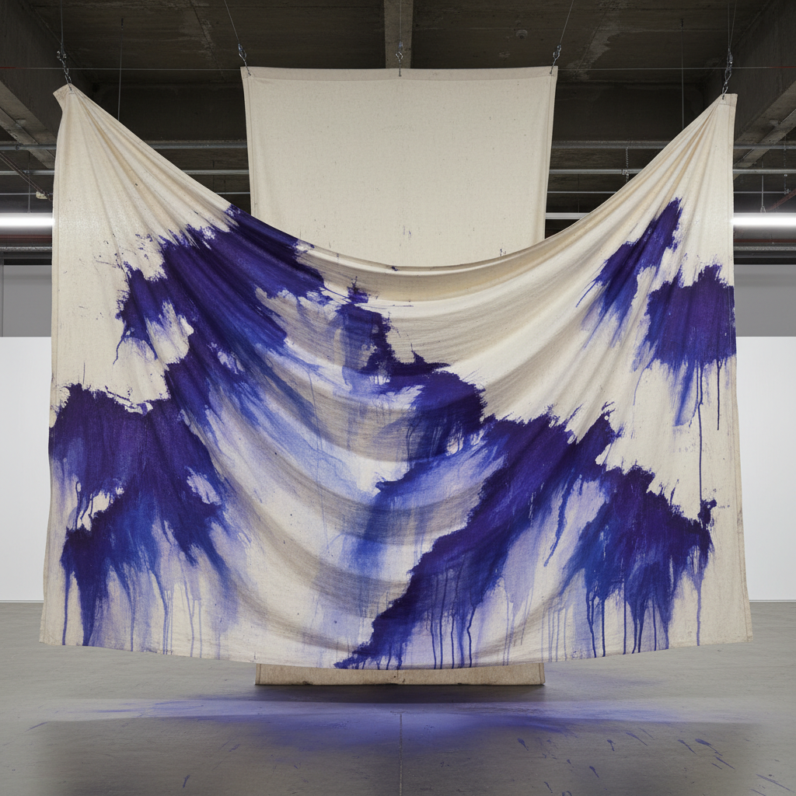

# Sam Gilliam 萨姆·吉利亚姆

> **时期：** 1933–2022  
> **关键词：** 悬挂画布、色彩浸染、雕塑性绘画、华盛顿色彩画派

## 概述

Sam Gilliam 是美国画家和雕塑家，以将画布从墙面解放出来的革命性实践闻名。他将未绷框的画布浸染、折叠、悬挂和堆叠，使绘画获得了雕塑的三维性。他是华盛顿色彩画派的核心成员，也是第一位代表美国参加威尼斯双年展的非裔美国艺术家。

## 风格特征

- **悬挂画布**：未绷框的画布从天花板悬垂，形成自然的褶皱和波浪
- **色彩浸染**：将稀释的丙烯颜料倒在未处理的画布上，让色彩自然渗透扩散
- **三维绘画**：画布被折叠、堆叠或悬挂，模糊了绘画与雕塑的界限
- **偶然性**：颜料的流动和画布的垂坠引入了不可控的偶然因素
- **色彩层次**：多次浸染创造出深邃的色彩层次，如同地质沉积

## 代表作品

- *Carousel*（1969）
- *Light Depth*（1969）
- *Drape*（1969）
- *Yves Klein Blue*（2017）

## 历史意义

Gilliam 打破了绘画必须是平面矩形的基本假设，他的悬挂画布预言了装置艺术的兴起。他证明了色域绘画可以超越画框的限制，进入真实的物理空间。

## 概念图

