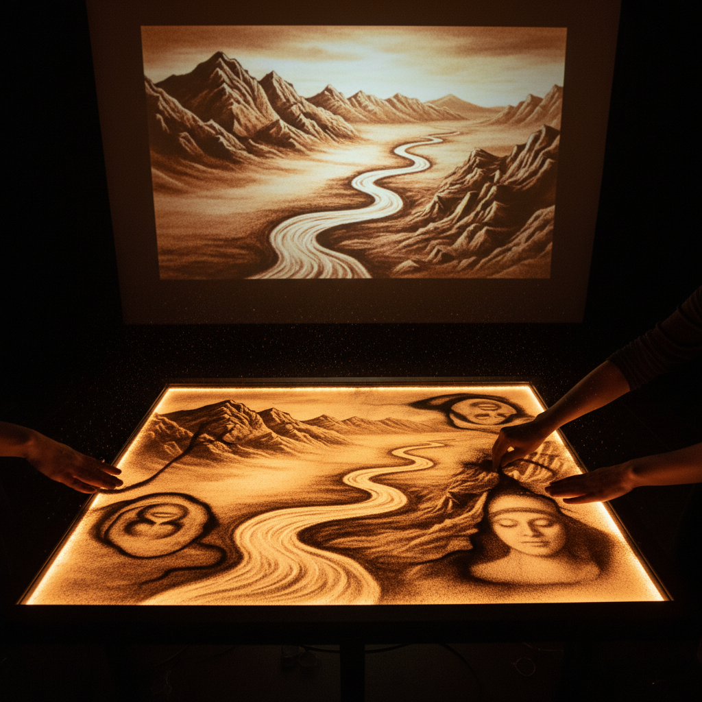

# Sand Animation Art 沙画动画艺术

> "Sand animation is drawing with time — each image exists only long enough to become the next. The artist's fingers sweep across the illuminated glass, and mountains become rivers, faces become flowers, stories unfold in a continuous metamorphosis where nothing is permanent and everything is connected. It is painting that breathes." — Unknown

## 概述

沙画动画艺术（Sand Animation Art）是在背光玻璃台上用细沙创作动态图像的表演艺术——艺术家用手指、手掌和简单工具在发光的玻璃面板上撒沙、推沙、抹沙，创造出不断变化的图像序列，通过摄像机实时投影给观众。沙画动画是绘画、动画和表演的独特结合。

沙画动画的实践包括：1）现场沙画表演——在舞台上实时创作沙画故事；2）沙画动画短片——录制并剪辑的沙画动画作品；3）沙画音乐视频——配合音乐的沙画表演；4）沙画纪录——用沙画讲述历史或纪实故事；5）互动沙画——观众参与的沙画体验；6）沙画教学——沙画技法的教育传播；7）数字沙画——用数字技术模拟沙画效果。

## 核心特征

| 特征 | 描述 |
|------|------|
| 变形 | 图像不断变形 |
| 实时 | 实时创作表演 |
| 叙事 | 讲述连续故事 |
| 光影 | 背光的光影效果 |
| 短暂 | 每幅画转瞬即逝 |
| 触感 | 手指直接触碰 |

## 视觉特征

- **金色**：背光透过沙的金色调
- **剪影**：沙的暗色剪影效果
- **渐变**：沙的厚薄产生的渐变
- **流动**：图像之间的流动转换
- **纹理**：沙粒的自然纹理
- **光晕**：背光的柔和光晕

## 代表作品

| 作品 | 艺术家 | 年代 | 意义 |
|------|--------|------|------|
| *Sand Fantasy* | Ferenc Cakó | 2005 | 经典沙画动画 |
| *Ukraine's Got Talent* | Kseniya Simonova | 2009 | 沙画表演走红全球 |
| *沙画中国* | 高赞民等 | 2010年代 | 中国沙画发展 |
| *Sand stories* | Various | 当代 | 叙事沙画 |
| *Sand music videos* | Various | 当代 | 音乐沙画 |

## 历史时间线

| 时期 | 事件 |
|------|------|
| 1968 | Caroline Leaf创作早期沙画动画 |
| 1990年代 | Ferenc Cakó发展沙画表演 |
| 2009 | Kseniya Simonova让沙画走红全球 |
| 2010年代 | 中国沙画艺术蓬勃发展 |
| 当代 | 沙画与数字技术结合 |

## 中国语境

沙画动画艺术在中国近十年来发展迅速。中国的沙画艺术家群体不断壮大——从高赞民、苏大宝等先驱到大量新生代沙画师。中国的沙画表演广泛应用于企业活动、婚礼、电视节目和公益宣传。中国的沙画艺术家将中国传统文化元素融入沙画——用沙画讲述中国历史故事、表现中国山水意境、描绘中国传统节日。中国的一些电视节目（如《出彩中国人》）让沙画表演获得了广泛的公众关注。中国的沙画培训和教育也在快速发展——许多城市都有沙画培训机构。中国沙画艺术家在国际比赛中也取得了优异成绩。

## AI生成概念图

## 与其他风格的关系

- **Animation Art** → 动画艺术
- **Performance Art** → 表演艺术
- **Ephemeral Art** → 短暂艺术
- **Light Art** → 光艺术
- **Storytelling Art** → 叙事艺术
- **Sand Art** → 沙艺术

---

*浮光艺志 | Chronicle of Artistry*
