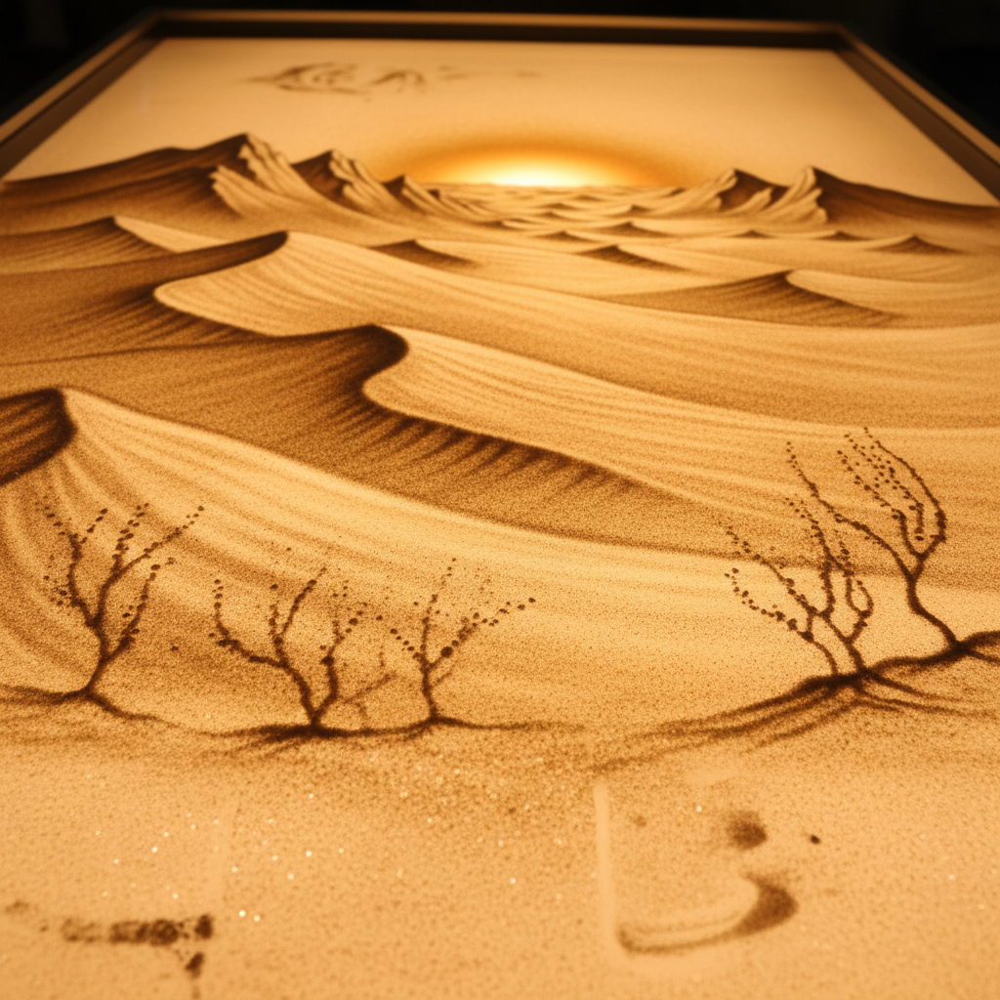

# Sand Animation 沙画动画

> **时期：** 1960年代–至今  
> **关键词：** 流沙绘画、光台表演、即兴创作、转瞬即逝、诗意叙事

## 概述

Sand Animation（沙画动画）是在背光玻璃台上用细沙创作的动画艺术形式。艺术家通过撒沙、拨沙、擦沙等手法在光台上绘制图像，每一帧都是对前一帧的改造——旧画面被抹去，新画面从中诞生。这种"创造即毁灭"的特性赋予沙画动画一种独特的诗意和哲学深度。

## 风格特征

- **光影对比**：背光透射创造的明暗效果
- **流动变化**：画面之间的有机过渡
- **即兴性**：创作过程本身即是表演
- **转瞬即逝**：每一帧都不可重复
- **颗粒质感**：沙粒创造的独特纹理

## 代表人物与作品

- 卡罗琳·丽芙《猫头鹰的婚礼》
- 费伦茨·卡科《沙画大师》
- 克塞尼娅·西蒙诺娃（现场沙画表演）
- 高赞民（中国沙画动画）

## 概念图

