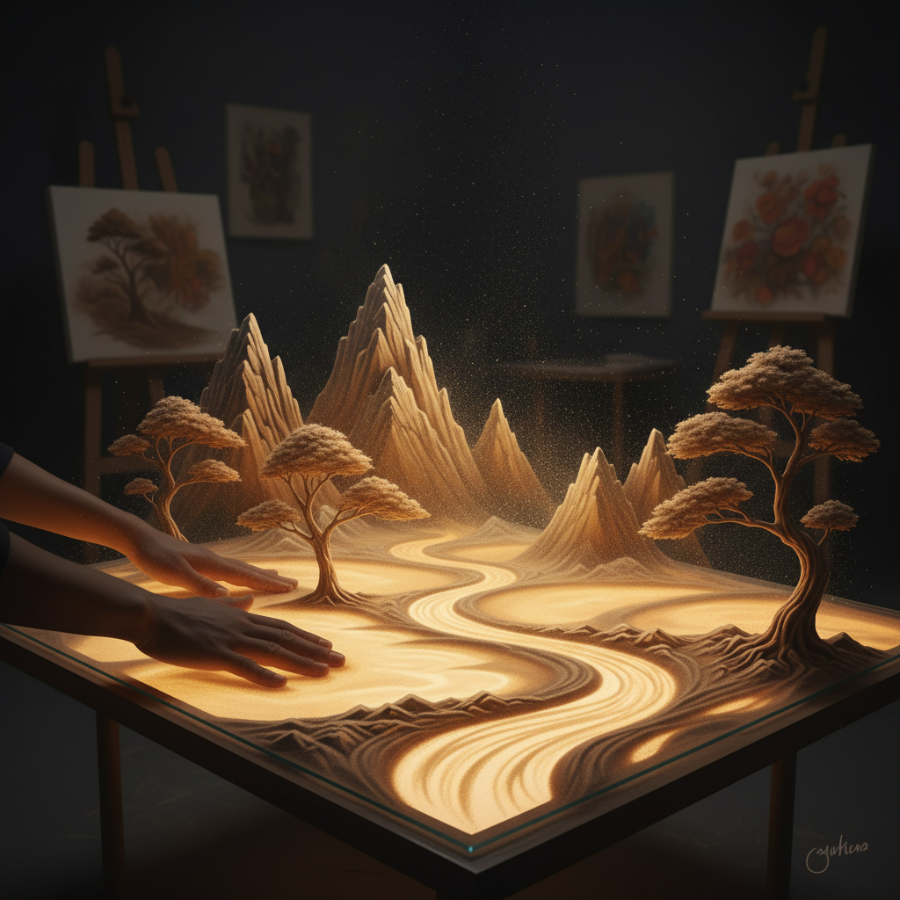

# Sand Art 沙画艺术

> "Sand art teaches us that beauty is temporary — and that is what makes it precious." — Kseniya Simonova

## 概述

沙画艺术（Sand Art）是以沙子为主要媒介的艺术形式，包括沙画表演（在灯箱上用手指绘制沙画）、沙雕（在海滩上雕刻大型沙塑）、沙瓶画（在瓶中用彩色沙子创作图案）和藏传佛教的坛城沙画等多种形式。

沙画最深刻的哲学意义来自藏传佛教的坛城——僧侣花费数周精心创作的沙画在完成后立即被扫除，象征着万物的无常。

## 核心特征

| 特征 | 描述 |
|------|------|
| 沙媒介 | 以沙子为主要创作材料 |
| 临时性 | 大多数沙画作品是临时的 |
| 表演性 | 沙画表演是时间艺术 |
| 触觉性 | 手指直接接触沙子 |
| 流动性 | 沙子的流动和堆积 |
| 哲学性 | 无常和当下的哲学 |

## 视觉特征

- **光影**：灯箱沙画的透光效果
- **流动**：沙子的流动轨迹
- **质感**：沙粒的颗粒质感
- **色彩**：天然沙色或彩色沙
- **变化**：从一个画面流动到另一个
- **尺度**：从灯箱到海滩的不同尺度

## 代表作品

| 作品/艺术家 | 形式 | 特征 |
|-------------|------|------|
| Kseniya Simonova | 沙画表演 | 乌克兰达人秀——战争记忆 |
| 藏传坛城沙画 | 仪式沙画 | 数周创作后立即销毁 |
| Sudarsan Pattnaik | 沙雕 | 印度沙雕大师 |
| Andrew Clemens | 沙瓶画 | 19世纪美国沙瓶艺术 |
| Jim Denevan | 海滩沙画 | 巨型海滩几何图案 |
| Joe Mangrum | 街头沙画 | 纽约街头的彩色沙画 |

## 历史时间线

| 时期 | 事件 |
|------|------|
| 远古 | 原住民的沙画仪式 |
| 8世纪+ | 藏传佛教坛城沙画传统 |
| 19世纪 | Andrew Clemens的沙瓶画 |
| 1970s | 现代沙雕比赛开始 |
| 2000s | 灯箱沙画表演的兴起 |
| 2009 | Kseniya Simonova——沙画表演走红全球 |
| 2010s-至今 | 沙画作为表演艺术和视频内容 |

## 中国语境

沙画在中国近年来非常流行——从电视节目中的沙画表演到婚礼和商业活动中的沙画秀。中国的沙画表演艺术家如高赞民等在国内外获得认可。藏传佛教的坛城沙画在中国西藏和藏区寺院中仍然是活的传统。中国的海滩沙雕节（如舟山沙雕节）也是沙画艺术的重要展示平台。

## AI生成概念图

## 与其他风格的关系

- **Performance Art** → 沙画表演是时间性的表演艺术
- **Ephemeral Art** → 沙画的临时性是其核心特征
- **Land Art** → 海滩沙画是大地艺术的形式
- **Religious Art** → 坛城沙画是宗教艺术
- **Animation Art** → 沙画表演的连续变化类似动画
- **Meditation Art** → 沙画创作的冥想品质

---

*浮光艺志 | Chronicle of Artistry*
