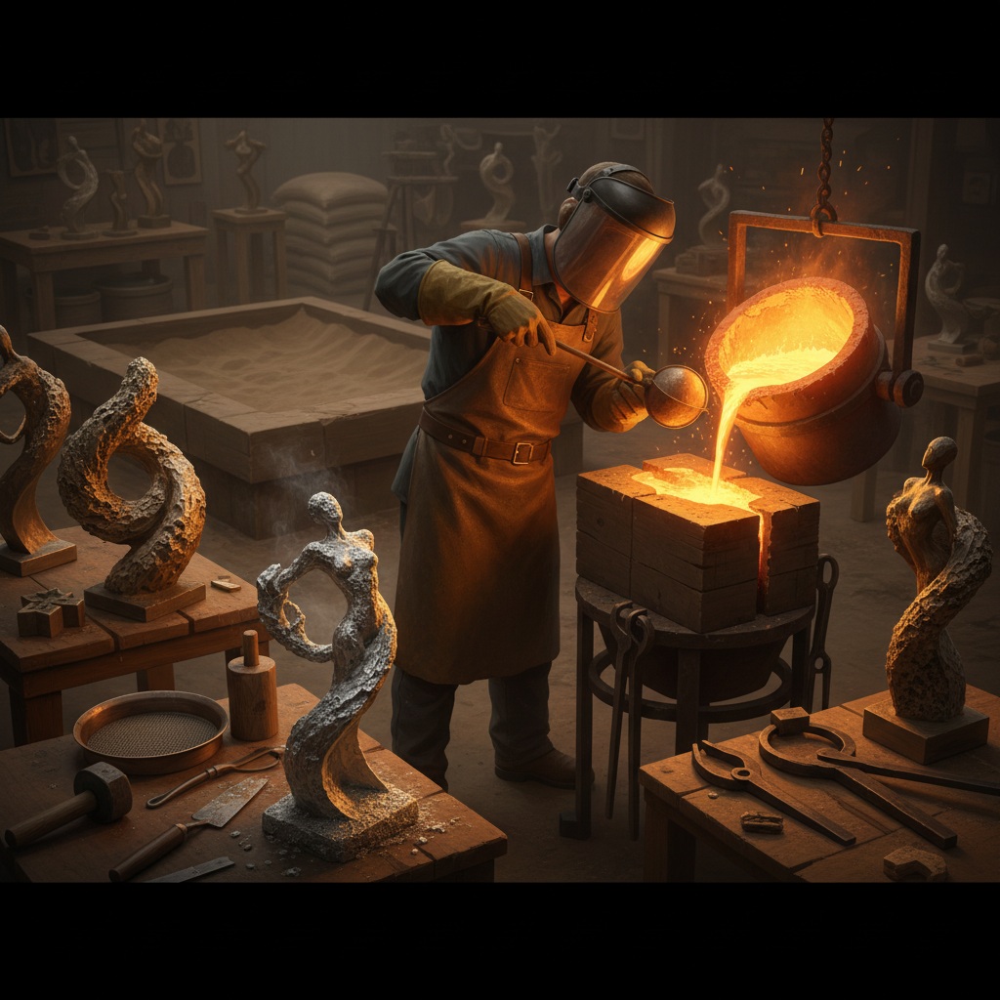

# Sand Casting Art 砂型铸造艺术

> "Sand casting art uses the oldest metal-forming technique known to humanity — pressing a pattern into sand, removing it to leave a void, and filling that void with molten metal. The sand remembers the shape of what was pressed into it, holds that memory through the violence of liquid metal pouring in, and then releases the solidified form — a metal ghost of the original pattern, born from fire and earth." — Unknown

## 概述

砂型铸造艺术（Sand Casting Art）是利用砂型铸造技术——将模型压入砂子形成模腔，然后浇入熔融金属——进行艺术创作的实践。砂型铸造是人类最古老的金属成形技术之一，有超过五千年的历史，至今仍是铸造雕塑和艺术品的重要方法。

砂型铸造艺术的实践包括：1）传统铸造雕塑——用砂型铸造制作青铜、铝、铁等金属雕塑；2）直接砂铸——直接在砂子中雕刻模腔（无需预制模型）；3）砂铸首饰——用砂型铸造制作金属首饰；4）砂铸纹理——利用砂子的天然纹理作为铸件表面效果；5）实验性砂铸——探索砂型铸造的意外效果和"缺陷美学"；6）砂铸建筑构件——用砂型铸造制作建筑装饰元素。

## 核心特征

| 特征 | 描述 |
|------|------|
| 古老 | 最古老的铸造技术 |
| 火 | 熔融金属 |
| 砂 | 砂子作为模具 |
| 负形 | 负空间成形 |
| 纹理 | 砂子的纹理 |
| 一次性 | 模具一次性使用 |

## 视觉特征

- **粗糙**：砂铸表面的粗糙质感
- **金属**：金属的光泽和重量
- **纹理**：砂粒留下的纹理
- **有机**：有机的形态
- **厚重**：金属的厚重感
- **痕迹**：铸造过程的痕迹

## 代表作品

| 作品 | 艺术家 | 年代 | 意义 |
|------|--------|------|------|
| *Bronze sculptures* | Various | 古代至今 | 青铜铸造雕塑 |
| *Direct sand casting* | Various | 当代 | 直接砂铸艺术 |
| *Cast iron art* | Various | 工业时代至今 | 铸铁艺术 |
| *Experimental casting* | Various | 2000年代 | 实验性铸造 |
| *Sand cast jewelry* | Various | 当代 | 砂铸首饰 |

## 历史时间线

| 时期 | 事件 |
|------|------|
| 公元前3000年 | 最早的砂型铸造 |
| 商周 | 中国青铜器铸造高峰 |
| 中世纪 | 欧洲钟铸造 |
| 工业革命 | 大规模铸铁生产 |
| 当代 | 砂铸作为艺术媒介 |

## 中国语境

砂型铸造艺术在中国有极其辉煌的历史。中国商周时期的青铜器铸造代表了古代世界最高的铸造技术水平——司母戊鼎重达832公斤，是世界上最大的古代青铜器。中国古代的"范铸法"（使用陶范而非砂型）是一种独特的铸造传统。中国传统的铸铁技术也极为发达——宋代的铁塔、明代的铁狮子等都是铸造艺术的杰作。中国当代的一些艺术家在探索砂型铸造艺术：将中国传统青铜器的美学与当代铸造结合、用砂铸技术创作呼应中国工业记忆的雕塑、以及将中国传统的"范铸"工艺知识与当代实验性铸造对话。

## AI生成概念图

## 与其他风格的关系

- **Bronze Sculpture** → 青铜雕塑
- **Metal Art** → 金属艺术
- **Lost Wax Casting** → 失蜡铸造
- **Foundry Art** → 铸造艺术
- **Industrial Art** → 工业艺术
- **Material Art** → 材料艺术

---

*浮光艺志 | Chronicle of Artistry*
