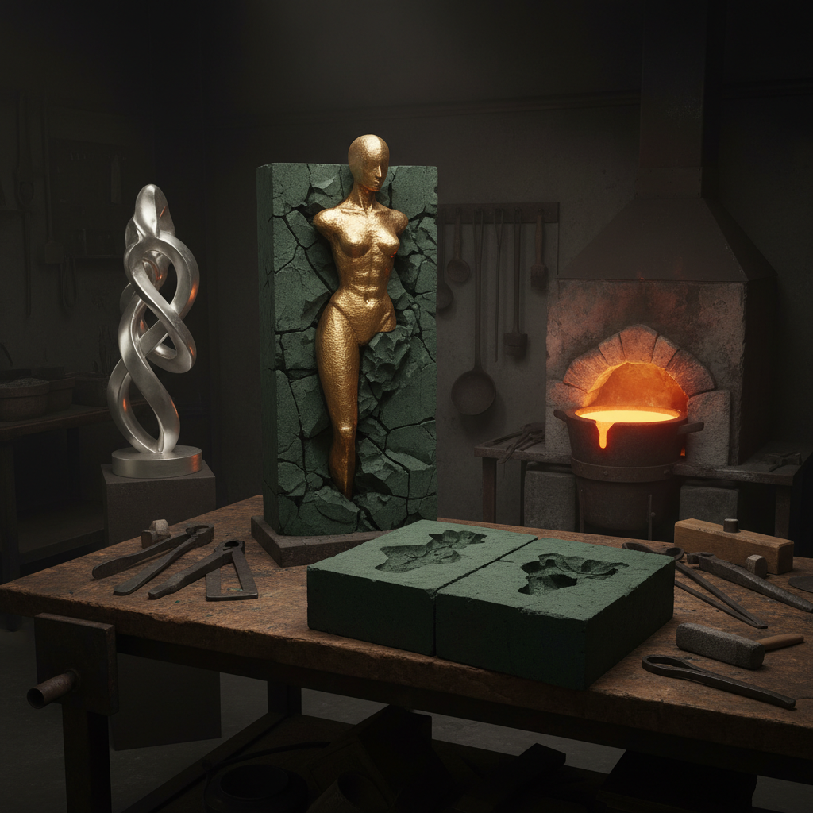

# Sand Casting Sculpture Art 砂型铸造雕塑艺术

> "Sand casting is the oldest conversation between earth and fire — a sculptor shapes a form, presses it into sand to leave its negative ghost, then pours molten metal into that void. When the sand falls away, the metal remembers the shape perfectly, but adds its own voice: the grain of the sand, the flow marks of liquid bronze, the slight imperfections that prove this object was born from heat and gravity rather than machined into existence." — Unknown

## 概述

砂型铸造雕塑艺术（Sand Casting Sculpture Art）是利用砂型铸造技术创造金属雕塑的艺术形式——通过在特制的铸造砂中压制模具，然后将熔融金属浇注入砂型中，冷却后取出金属铸件，再进行打磨和表面处理。砂型铸造是最古老也最广泛使用的金属铸造方法。

砂型铸造雕塑的实践包括：1）青铜铸造雕塑——用砂型铸造青铜雕塑；2）铝铸造雕塑——用砂型铸造铝雕塑；3）铁铸造雕塑——用砂型铸造铁雕塑；4）砂纹肌理——利用砂型特有的表面纹理作为艺术效果；5）开放式砂铸——在开放砂面上直接浇注的实验性技法；6）组合铸造——将多个砂铸部件组合成大型雕塑；7）当代砂铸艺术——将砂铸作为当代艺术表达的媒介。

## 核心特征

| 特征 | 描述 |
|------|------|
| 金属 | 金属材质的永久性 |
| 砂纹 | 砂型留下的独特纹理 |
| 重力 | 利用重力浇注 |
| 古老 | 数千年的技术传统 |
| 规模 | 可铸造大型作品 |
| 复制 | 可从同一模具复制 |

## 视觉特征

- **金属光泽**：青铜、铝或铁的光泽
- **砂纹**：砂型留下的细微纹理
- **流痕**：金属流动的痕迹
- **氧化**：金属氧化的色彩变化
- **重量感**：金属的重量和质感
- **粗犷**：相对粗犷的表面

## 代表作品

| 作品 | 艺术家 | 年代 | 意义 |
|------|--------|------|------|
| *Bronze Age sculptures* | 古代 | 公元前3000年 | 最早的砂铸雕塑 |
| *Sand cast aluminum works* | Various | 当代 | 铝砂铸雕塑 |
| *Open sand casting art* | Various | 当代 | 开放式砂铸艺术 |
| *Industrial sand castings* | Various | 19世纪至今 | 工业砂铸件 |
| *Contemporary sand cast sculpture* | Various | 当代 | 当代砂铸雕塑 |

## 历史时间线

| 时期 | 事件 |
|------|------|
| 公元前3000年 | 最早的砂型铸造 |
| 古代 | 中国商周青铜器铸造 |
| 中世纪 | 欧洲钟铸造和炮铸造 |
| 工业革命 | 砂铸的工业化 |
| 当代 | 砂铸作为艺术媒介的复兴 |

## 中国语境

砂型铸造在中国有极其悠久的历史——中国的商周青铜器是世界上最伟大的铸造艺术成就之一。虽然商周青铜器主要使用陶范铸造（而非严格意义上的砂型铸造），但中国后来也发展出了砂型铸造技术。中国的铸铁技术在世界上领先了数百年——砂型铸铁在中国的农业和建筑中广泛应用。中国当代的一些雕塑家使用砂型铸造技术创作——利用砂型特有的纹理和金属的质感表达艺术理念。中国的传统铸造工艺（如佛像铸造、钟铸造）至今仍在使用——一些寺庙和文化项目仍然采用传统砂铸方法。中国的工业铸造产业规模巨大——但艺术铸造作为独立的创作领域正在发展中。

## AI生成概念图

## 与其他风格的关系

- **Bronze Sculpture** → 青铜雕塑
- **Metal Art** → 金属艺术
- **Lost Wax Casting** → 失蜡铸造
- **Foundry Art** → 铸造艺术
- **Industrial Art** → 工业艺术
- **Sculpture** → 雕塑

---

*浮光艺志 | Chronicle of Artistry*
