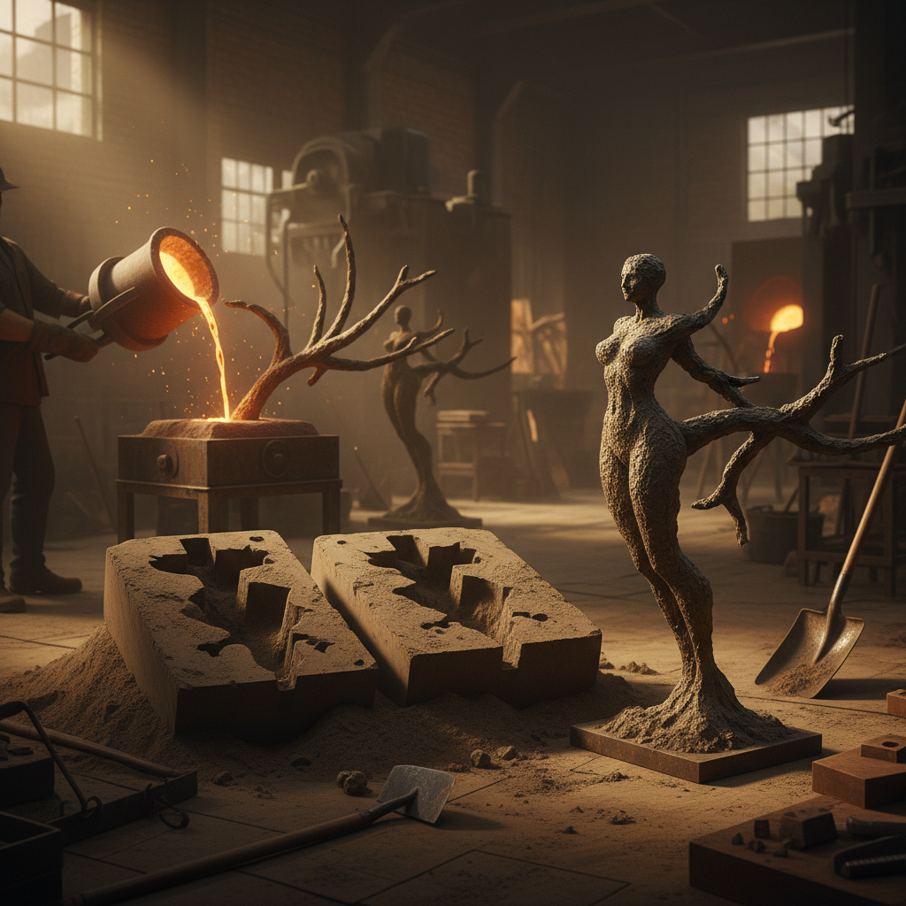

# Sand Casting 砂型铸造

> "Sand casting is the democracy of metalwork — any shape imagined can be born in sand and metal." — Unknown

## 概述

砂型铸造（Sand Casting）是将熔融金属浇入砂型模具中成形的铸造工艺——是人类最古老、最通用的金属成形方法之一。工匠将模型压入湿砂中形成型腔，取出模型后浇入熔融金属，冷却后打碎砂型取出铸件。这种方法几乎可以铸造任何尺寸和形状的金属制品——从几克的珠宝到几吨的雕塑，从精密的机械零件到粗犷的艺术铸件。砂型铸造的独特质感——略带粗糙的表面和砂粒的印记——本身就是一种美学。

砂型铸造的魅力在于：沙与火的对话——最柔软的沙子塑造最坚硬的金属，最短暂的浇注创造最持久的形态。

## 核心特征

| 特征 | 描述 |
|------|------|
| 砂型 | 用砂子制作模具 |
| 浇注 | 熔融金属浇入型腔 |
| 通用 | 几乎可铸任何形状 |
| 一次性 | 砂型只能用一次 |
| 质感 | 独特的砂铸质感 |
| 古老 | 数千年的历史 |

## 视觉特征

- **质感**：砂粒留下的表面质感
- **粗犷**：相对粗犷的表面
- **有机**：有机的自由形态
- **金属**：各种金属的色泽
- **重量**：实心铸件的重量感
- **原始**：原始的铸造美感

## 代表作品

| 作品 | 艺术家 | 年代 | 意义 |
|------|--------|------|------|
| *Chinese bronze bells* | 匿名 | 商周 | 中国青铜编钟 |
| *Church bells* | 匿名 | 中世纪 | 欧洲教堂大钟 |
| *Cast iron art* | Various | 19世纪 | 铸铁艺术品 |
| *Sand cast jewelry* | Various | 当代 | 砂铸珠宝 |
| *Art foundry sculptures* | Various | 当代 | 艺术铸造雕塑 |

## 历史时间线

| 时期 | 事件 |
|------|------|
| 公元前3000年 | 最早的砂型铸造 |
| 商周 | 中国的范铸法（陶范） |
| 中世纪 | 欧洲的钟和炮铸造 |
| 工业革命 | 砂型铸造的工业化 |
| 20世纪 | 艺术铸造的发展 |
| 当代 | 砂铸在艺术和工业中 |

## 中国语境

中国是砂型铸造（范铸法）的重要发源地——商周青铜器主要使用陶范铸造，这是砂型铸造的早期形式。中国古代的铸造技术在世界上长期领先，从青铜器到铁器，从编钟到佛像，铸造贯穿了中国金属工艺的全部历史。当代中国仍是全球最大的铸造生产国，传统的砂型铸造在艺术铸造和小批量生产中仍有广泛应用。

## AI生成概念图

## 与其他风格的关系

- **Lost-Wax Casting** → 失蜡铸造是另一种铸造法
- **Bronze Sculpture** → 青铜雕塑的铸造
- **Metalwork** → 金属成形工艺
- **Blacksmithing** → 锻造是铸造的对应
- **Industrial Design** → 工业铸造
- **Jewelry** → 砂铸珠宝

---

*浮光艺志 | Chronicle of Artistry*
