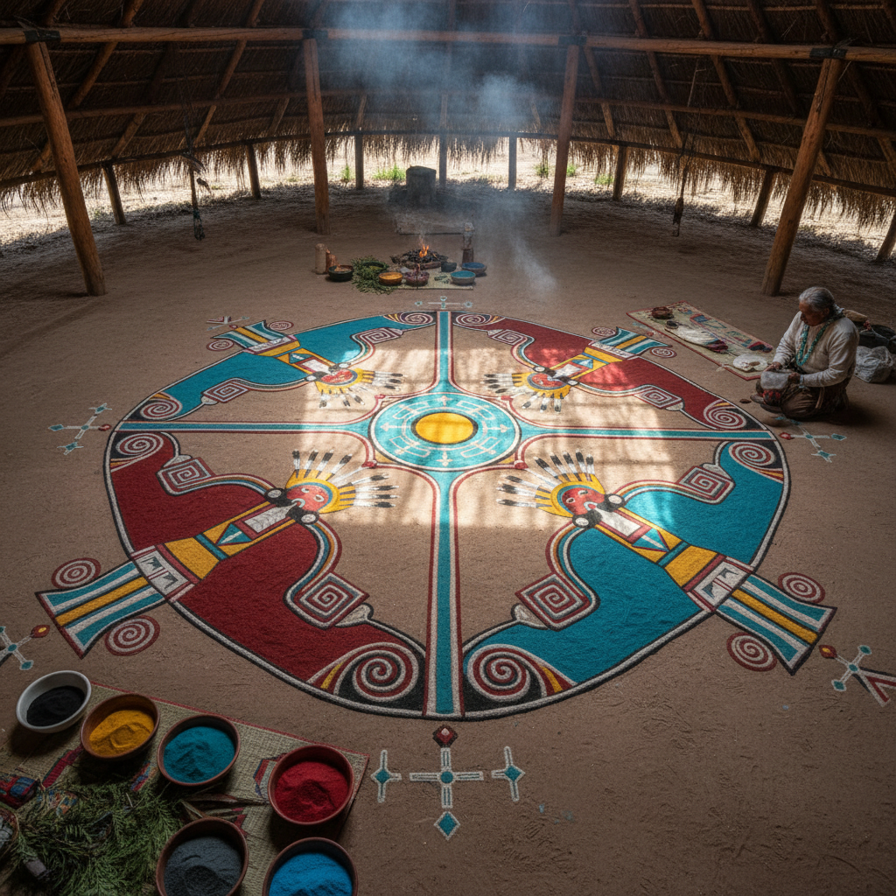

# Sand Painting 沙画 | Navajo iikaah / Tibetan དུལ་ཚོན

> **"风一吹就消失的艺术——纳瓦霍人和藏族僧侣用彩砂创造注定毁灭的神圣图像。"**

## 概述

沙画（Sand Painting）是多个文化中独立发展的仪式性地面艺术，用彩色砂粒在地面上精心撒制图案。最著名的两大传统是：1）纳瓦霍族（Navajo / Diné）的治愈仪式沙画（iikaah），用于治病和恢复和谐；2）藏传佛教的坛城沙画（དུལ་ཚོན་ mandala），用于冥想和教学。两种传统都强调沙画的临时性——仪式结束后必须销毁，象征万物无常。澳大利亚原住民也有类似的地面沙画传统。

## 主要传统

| 传统 | 特征 |
|------|------|
| 纳瓦霍 iikaah | 治愈仪式，神灵图像 |
| 藏传佛教 དུལ་ཚོན | 坛城曼陀罗，冥想 |
| 澳大利亚原住民 | 地面故事画 |
| 日本枯山水 | 白砂耙纹，禅意 |

## 核心特征

- **临时性**：仪式后必须销毁
- **彩色砂粒**：矿物或植物染色的砂
- **地面创作**：在平坦地面上撒制
- **仪式功能**：治愈、冥想、教学
- **精确图案**：严格的传统图案
- **集体创作**：多人协作完成

## 纳瓦霍沙画特征

| 特征 | 说明 |
|------|------|
| 四方位 | 东南西北的宇宙观 |
| 神灵形象 | Yei（神灵）的程式化形象 |
| 治愈功能 | 病人坐在沙画上接受治愈 |
| 当日销毁 | 日落前必须销毁 |
| 禁止复制 | 神圣图案不可随意复制 |

## 视觉特征

- 彩色砂粒的细腻质感
- 精确的几何对称
- 鲜艳的矿物色彩
- 大面积的地面构图
- 神圣的象征图案
- 临时性的脆弱之美

## 与其他风格的关系

| 风格 | 关系 |
|------|------|
| Rangoli地画 | 共享地面装饰传统 |
| Thangka唐卡 | 共享藏传佛教艺术 |
| Aboriginal Art | 共享地面故事画 |
| 曼陀罗 Mandala | 沙画的核心题材 |
| 当代装置艺术 | 沙画的临时性美学 |

## 概念图

---

*浮光艺志 | Chronicle of Artistry*
