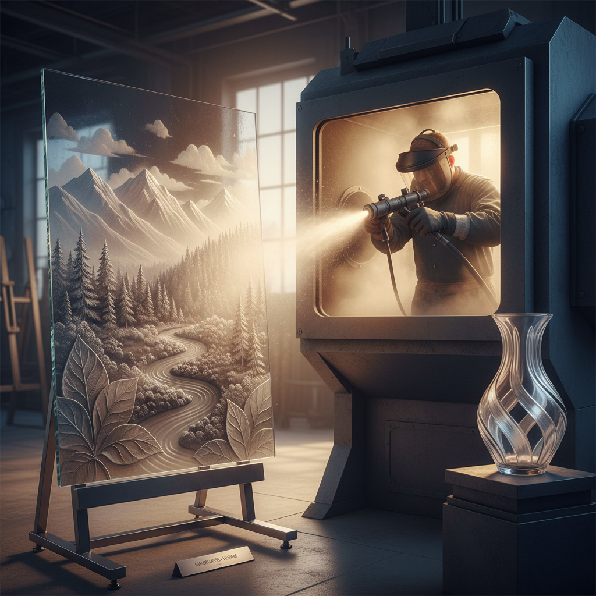

# Sandblasting 喷砂玻璃

> "Sandblasting writes with erosion — each grain of sand carves light into glass, turning transparency into poetry." — Unknown

## 概述

喷砂玻璃（Sandblasting）是使用高压气流将磨料（砂粒、氧化铝等）喷射到玻璃表面，通过物理侵蚀创造磨砂效果和浮雕图案的冷加工技法。通过遮蔽膜（resist）保护不需要喷砂的区域，艺术家可以创造精确的图案——从简单的磨砂文字到复杂的多层浮雕。喷砂的深度可以精确控制，不同深度产生不同的透明度和质感，创造出丰富的视觉层次。

喷砂的独特之处在于：以破坏创造美——通过侵蚀玻璃表面来揭示图案，磨砂区域散射光线，与透明区域形成戏剧性的对比。

## 核心特征

| 特征 | 描述 |
|------|------|
| 侵蚀 | 物理侵蚀表面 |
| 遮蔽 | 使用遮蔽膜控制 |
| 磨砂 | 创造磨砂效果 |
| 层次 | 多层深度的浮雕 |
| 对比 | 磨砂与透明的对比 |
| 精确 | 可精确控制深度 |

## 视觉特征

- **磨砂**：柔和的磨砂表面
- **对比**：透明与不透明的对比
- **浮雕**：多层深度的浮雕效果
- **光影**：背光时的光影效果
- **细节**：精细的图案细节
- **质感**：不同粗细的质感变化

## 代表作品

| 作品 | 艺术家 | 年代 | 意义 |
|------|--------|------|------|
| *Victorian etched glass* | 匿名 | 19世纪 | 维多利亚时代蚀刻玻璃 |
| *Architectural sandblasted panels* | Various | 20世纪+ | 建筑装饰面板 |
| *Keke Cribbs narrative panels* | Keke Cribbs | 1980s+ | 叙事性喷砂玻璃 |
| *Mary White sculptures* | Mary White | 当代 | 喷砂玻璃雕塑 |
| *Contemporary sandblast art* | Various | 当代 | 当代喷砂艺术 |

## 历史时间线

| 时期 | 事件 |
|------|------|
| 1870 | Benjamin Tilghman发明喷砂技术 |
| 19世纪末 | 工业喷砂玻璃的应用 |
| 20世纪初 | 建筑装饰喷砂玻璃 |
| 1960s+ | 艺术喷砂的发展 |
| 1980s+ | 多层浮雕喷砂技法 |
| 当代 | 数字遮蔽与传统手工结合 |

## 中国语境

喷砂玻璃在中国主要应用于建筑装饰和室内设计——办公室隔断、浴室门、酒店装饰等大量使用喷砂玻璃。中国的玻璃加工产业（如河北沙河、广东等地）有成熟的喷砂加工能力。在艺术领域，中国的玻璃艺术家也在探索喷砂作为艺术表达的可能性，将中国传统图案和书法通过喷砂技法呈现在玻璃上。

## AI生成概念图

## 与其他风格的关系

- **Cold Working** → 冷加工的一种
- **Glass Engraving** → 玻璃雕刻
- **Stencil** → 模板技法（遮蔽膜）
- **Relief Sculpture** → 浮雕
- **Etching** → 蚀刻（化学版本）
- **Architecture** → 建筑装饰应用

---

*浮光艺志 | Chronicle of Artistry*
