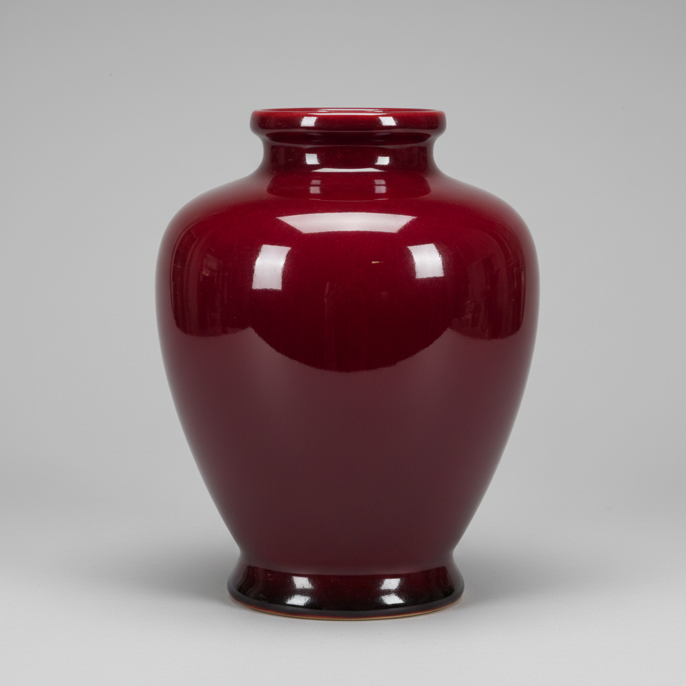

# Sang de Boeuf Art 牛血红釉艺术

> "Sang de boeuf is the color of life itself captured in glass — a deep, rich oxblood red achieved through the most demanding of ceramic processes, copper oxide reduced at precisely the right temperature and atmosphere to produce a glaze so intensely red it seems to pulse with an inner warmth, a color that took Chinese potters centuries to master and European chemists decades more to understand." — Unknown

## 概述

牛血红釉艺术（Sang de Boeuf Art）是一种以深沉浓郁的牛血红色铜红釉为特征的陶瓷釉色艺术。"Sang de boeuf"是法语"牛血"之意，形容这种釉色如同新鲜牛血般深沉浓烈的红色。牛血红釉是铜红釉家族中最经典的品种——通过在高温强还原气氛中将铜元素还原为胶体铜，产生浓郁均匀的深红色。这种釉色的烧成极为困难，对温度和气氛的控制要求极高。

牛血红釉艺术的核心要素包括：1）深沉红色——浓郁均匀的牛血红；2）铜红机理——铜在还原中呈色；3）高难度——烧成控制极为困难；4）均匀性——追求均匀深沉的红色；5）流釉效果——釉层流动的自然美；6）中国起源——源自中国清代；7）珍贵稀有——成功率低而珍贵。

## 核心特征

| 特征 | 描述 |
|------|------|
| 深沉红色 | 浓郁的牛血红 |
| 铜红呈色 | 铜在还原中呈色 |
| 高难度 | 烧成极为困难 |
| 均匀深沉 | 追求均匀的红色 |
| 流釉美感 | 釉层流动之美 |
| 珍贵稀有 | 成功率低 |

## 视觉特征

- **深红色**：如牛血般浓郁的深红
- **均匀覆盖**：釉色均匀覆盖器身
- **口沿留白**：口沿处釉薄呈白色
- **底部积釉**：底部釉层较厚色深
- **玻璃质感**：深沉的玻璃质光泽
- **微妙变化**：红色中的微妙深浅变化

## 代表作品

| 作品 | 艺术家/文化 | 年代 | 意义 |
|------|-------------|------|------|
| *郎窑红瓶* | 中国清代 | 康熙 | 牛血红的经典 |
| *祭红器* | 中国明清 | 明清 | 祭祀用红釉器 |
| *欧洲仿制品* | 欧洲各窑 | 19世纪 | 欧洲的模仿尝试 |
| *Bernard Moore* | 英国 | 20世纪初 | 英国牛血红大师 |
| *当代牛血红* | 各地陶艺家 | 当代 | 当代的探索实践 |

## 历史时间线

| 时期 | 事件 |
|------|------|
| 明代 | 中国祭红釉的发展 |
| 清康熙 | 郎窑红的辉煌成就 |
| 18世纪 | 欧洲开始尝试复制 |
| 19世纪 | 欧洲陶艺家成功烧制 |
| 当代 | 牛血红釉的全球实践 |

## 中国语境

牛血红釉是中国陶瓷最珍贵的釉色之一。清代康熙年间的郎窑红是牛血红釉的巅峰之作——传说郎廷极督造的红釉瓷器"脱口垂足郎不流"，形容其釉色浓郁流动却恰好停在足部不溢出。中国的祭红釉更早——明代永乐、宣德时期的祭红器是皇家祭祀的专用器物。中国古代将铜红釉视为极其珍贵的釉色——因为烧成难度极高，成功率很低，每一件成功的牛血红器都是窑工技艺和运气的结晶。"Sang de boeuf"这个法语名称本身就说明了中国铜红釉对欧洲陶瓷界的深远影响。

## AI生成概念图

## 与其他风格的关系

- **Flambé Glaze** → 窑变釉
- **Copper Red** → 铜红釉
- **Jun Ware** → 钧窑
- **Reduction Firing** → 还原烧成
- **Chinese Imperial** → 中国官窑
- **Peach Bloom** → 豇豆红

---

*浮光艺志 | Chronicle of Artistry*
